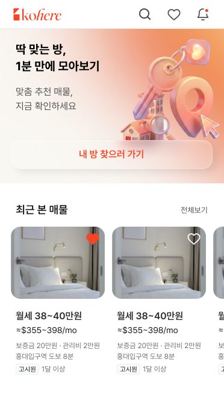
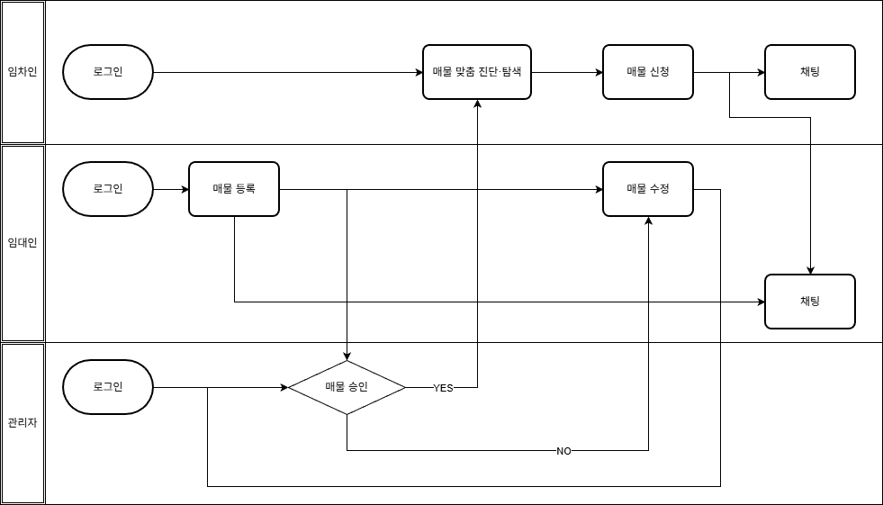
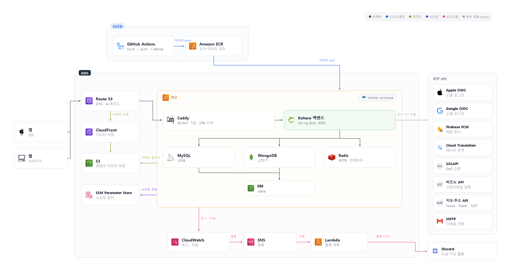
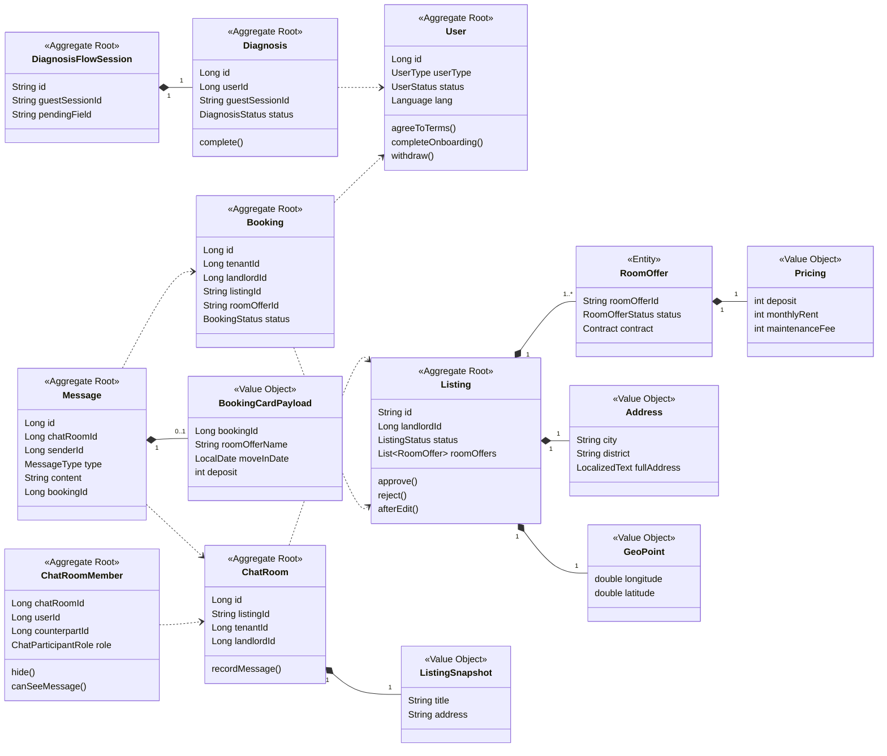

# Kohere Backend

> 한국에 거주하는 외국인의 **주거 탐색을 돕는 서비스**



---

## 주요 기능



- **임차인**
  - 소셜 로그인 후 맞춤 진단이나 목록·지도 탐색으로 매물을 찾는다. 매물을 신청하면 임대인과 1:1 채팅방이 열리고, 주고받는 메시지는 서로의 언어로 자동 번역된다.
- **임대인**
  - 가입 후 사진과 함께 매물을 등록한다. 관리자 승인을 받으면 탐색에 노출되고, 반려되면 사유를 확인해 수정한 뒤 다시 심사를 받는다. 신청이 들어오면 임차인과 채팅한다.
- **관리자**
  - 웹으로 로그인해 등록·수정된 매물을 심사한다. 승인하면 공개되고, 반려하면 사유가 임대인에게 전달된다.

---

## 배포 아키텍처 (dev)



**[Caddy 라우팅]**

> `/api` → Spring Boot , 그 외 → SPA 정적 파일

**[CI/CD]**

> release push → Build → **ECR** → **SSM** → app 재배포

---

## 도메인 모델 다이어그램



---

## 주요 기술 스택

| 영역               | 기술                                                                   |
| ------------------ | ---------------------------------------------------------------------- |
| 언어               | **Java 21**                                                      |
| 프레임워크         | **Spring Boot 3.5.8** · Spring MVC · **Spring Modulith** |
| 빌드               | **Gradle 9.5.1**                                                 |
| 스토리지           | **MySQL 8** · **MongoDB 7** · **Redis 7**        |
| 마이그레이션       | **Flyway** · **Mongock**                                 |
| 인프라             | **Terraform** · **Docker Compose**                       |
| 채팅               | WebSocket, STOMP, FCM(알림), Google Cloud Translation(번역)           |
| 파일 저장          | **AWS S3,** CloudFront, MinIO                                 |
| 로그인 · 회원가입 | Spring Security·JJWT, SOLAPI(SMS 인증), SMTP(이메일 인증)           |
| 위치 검색          | Kakao Local API· Naver Search API · NCP Geocoding API               |
| 로깅               | Logback                                                                |
| 테스트             | JUnit 5 ·**Testcontainers**                                     |
| 코드 품질          | **Spotless 8.6.0, google-java-format 1.35.0**                   |
| CI / CD            | GitHub Actions                                                         |
| API SPEC           | **Spring REST Docs,** **Swagger UI**                      |

---

## 프로젝트 구조

```text
Kohere-backend/
├── src/main/java/com/kohere/   
│   ├── KohereApplication.java  
│   ├── auth/                         # 로그인·회원가입, 휴대폰·이메일 인증
│   ├── user/                         # 회원 관리
│   │   └── api/  
│   ├── listing/                      # 매물 관리 · 지도 · 찜
│   │   ├── api/  
│   │   ├── presentation/v1/  
│   │   ├── application/  
│   │   ├── domain/   
│   │   └── infrastructure/
│   │       ├── external/   
│   │       └── migration/   
│   ├── diagnosis/                    # 챗봇 진단·추천
│   ├── booking/                      # 매물 신청 관리
│   ├── chat/                         # 채팅
│   │   ├── api/  
│   │   ├── presentation/stomp/   
│   │   └── infrastructure/websocket/ 
│   ├── notification/                 # 알림
│   ├── report/                       # 신고 접수
│   ├── gamification/                 # 일일 퀴즈
│   ├── lifetip/                      # 생활 팁
│   └── common/   
│       ├── security/  
│       ├── response/   
│       ├── exception/   
│       ├── logging/   
│       └── request/   
│
├── src/main/resources/
│   ├── application.yml   
│   ├── db/migration/   
│   ├── messages.properties   
│   ├── logback-spring.xml  
│   └── swagger-ui-initializer.js   
├── src/test/java/com/kohere/  
│
├── docs/  
│   ├── project/  requirements/  database/
│   ├── convention/   
│   ├── api/   
│   ├── architecture/  
│   └── adr/   
│
├── http/                             # 수동 테스트
├── infra/terraform/                  # HCL
├── .github/                          # PR/이슈 템플릿 · CI/CD
├── .claude/                          # Claude Code 설정
├── docker-compose.yml  Dockerfile  
└── build.gradle  settings.gradle  .env.example  .editorconfig  CLAUDE.md  README.md
```

---

## 로컬에서 실행확인

```bash
# 1. 인프라 기동
docker compose up -d mysql mongo redis mailhog minio minio-init

# 2. 앱 실행
./gradlew bootRun
```

---

## 협업 가이드

- **브랜치 전략**
  - `develop` 브랜치는 직접 push하지 않고 PR로만 반영한다.
  - 작업 브랜치는 `<type>/<이슈번호>-<설명>`(예: feature/153-readme-project-overview)형식으로 개인 fork에 만든다
- **커밋 컨벤션**
  - Conventional Commits. `<type>(<scope>): <subject>` 형식이고 subject는 50자 이내, 마침표 없이 작성한다
- **코드 작성 규칙**
  - 포맷은 Spotless + google-java-format(2-space)에 맞추기(`./gradlew spotlessApply`).
  - 의존성은 생성자 주입만 쓰고, null 대신 `Optional`·빈 컬렉션을, 상태는 enum을 쓴다.
- **개발 가이드**
  - 이슈 생성 → fork에 브랜치 생성 → 작업·커밋 → PR→ 코드 리뷰 → Squash merge
  - 머지는 1명 이상에게 approve 받기
