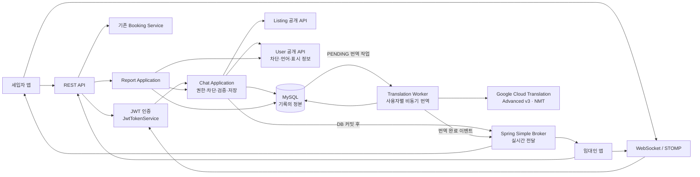

# 범위와 전체 아키텍처

## 1. 목표

Kohere의 기존 예약·인증·차단·다국어 기능을 재사용해 다음 기능을 완성한다.

- 로그인 완료 사용자 간 세입자·임대인 1:1 채팅
- 문의하기와 신청하기가 동일 채팅방을 사용하는 흐름
- MySQL 기반 메시지 영속화
- WebSocket + STOMP 실시간 송수신
- 받은 메시지의 사용자 언어별 자동 번역과 원문 보기
- 채팅방 삭제, 즉시 Undo, 차단, 채팅방 신고

현재 `chat`과 일반 `report` 모듈은 이름과 REST 골격 위주이며 핵심 서비스·저장소가 구현되지 않았다. 기존 골격은 활용하되 영속화, 인증 주체 전달, 권한 검사, STOMP, 삭제, 신고 처리는 새로 완성해야 한다.

## 2. 쉬운 용어

### WebSocket

일반 HTTP처럼 요청마다 연결을 닫지 않고, 앱과 서버가 연결을 유지하며 서로 데이터를 보낼 수 있는 통신 방식이다.

### STOMP

WebSocket 위에서 `CONNECT`, `SUBSCRIBE`, `SEND`처럼 메시지의 목적을 정하는 규칙이다. WebSocket이 통로라면 STOMP는 그 통로에서 쓰는 메시지 규약이다.

### 구독

클라이언트가 “이 채팅방에 새 메시지가 저장되면 알려 달라”고 서버에 등록하는 것이다. 예를 들어 10번 방은 `/topic/chat-rooms/10`을 구독한다.

구독은 DB 저장 기능이 아니다. 실시간 알림을 받을 경로를 등록할 뿐이며, 과거 메시지와 연결이 끊긴 동안의 메시지는 REST로 MySQL에서 조회한다.

### Message Broker

서버가 발행한 메시지를 destination과 구독 정보에 맞춰 클라이언트에 전달하는 중간 전달자다. 이번 구조에서 broker는 권한·차단·본문 길이를 검사하거나 메시지를 영구 보관하지 않는다.

### 원문과 번역본

원문은 사용자가 실제로 전송해 MySQL에 저장된 메시지다. 번역본은 수신자의 `users.lang`에 맞춰 Google Cloud Translation이 만든 파생 데이터다.

- 원문은 수정하거나 번역본으로 덮어쓰지 않는다.
- 받은 메시지는 번역본을 먼저 표시하고 원문 보기를 제공한다.
- 내가 보낸 메시지는 원문을 먼저 표시한다.
- 번역 실패는 원문 메시지의 저장 성공을 취소하지 않는다.

## 3. 채팅방의 기준

채팅방의 비즈니스 키는 다음 세 값이다.

```text
(listingId, tenantId, landlordId)
```

따라서 다음 규칙이 성립한다.

- 같은 매물에서 문의와 신청을 해도 같은 방이다.
- 같은 매물의 여러 `roomOfferId`를 신청해도 같은 방이다.
- 같은 임대인이어도 다른 `listingId`이면 다른 방이다.
- 클라이언트는 `tenantId`나 `landlordId`를 결정하지 않는다.
- 동시 요청에서도 MySQL UNIQUE 제약으로 방은 하나만 생성한다.

## 4. 전체 구조



### 책임 분리

1. REST는 방 생성·목록·방 정보·과거/누락 메시지 조회·삭제·Undo·차단·신고를 담당한다.
2. STOMP는 연결 중 새 텍스트 메시지의 실시간 송수신을 담당한다.
3. Chat Application은 인증 사용자, 참여 권한, 차단, 본문, 중복을 검사한다.
4. MySQL은 방·메시지·상태의 정본이다.
5. Simple Broker는 MySQL 커밋이 끝난 메시지만 구독자에게 전달한다.
6. 예약 생성은 기존 Booking Service가 계속 소유한다.
7. 전역 사용자 차단은 기존 user 모듈이 계속 소유한다.
8. Translation Worker는 원문 커밋 후 수신자의 `users.lang`으로 번역하고 결과를 별도 저장한다.
9. Google 번역 지연·실패는 메시지 저장과 원문 실시간 전달에 영향을 주지 않는다.
10. 신고 접수·운영 처리는 report 모듈이 소유하고 chat 모듈은 방·증거 조회 API를 제공한다.

## 5. 기존 코드 재사용

| 기능 | 재사용 대상 | 적용 방법 |
| --- | --- | --- |
| JWT | `JwtTokenService` | REST와 STOMP CONNECT가 같은 검증 규칙 사용 |
| 사용자 신원 | `AuthPrincipal` | userId를 API 요청자와 메시지 발신자로 사용 |
| 신청 | 기존 Booking API·`BookingService` | chat 안에 예약 로직을 복제하지 않음 |
| 차단 | `UserBlockService`, `user_blocks` | 서버가 방의 상대를 도출해 호출 |
| 언어 | `UserAccountService.getLanguage` | 채팅 번역 대상 언어와 신고 사유 label 결정 |
| 공통 응답 | `ApiResponse`, `PageResponse`, `CursorResponse` | 기존 REST 응답 형식 유지 |
| DB | Flyway, JPA, MySQL | 새 migration과 JPA adapter 작성 |
| 외부 API adapter | 기존 port/adapter·timeout·stub 패턴 | Google 번역 adapter를 provider 독립 port 뒤에 배치 |
| 테스트 | MySQL·Redis Testcontainers, MockMvc | 기존 통합 테스트 패턴 확장 |

다음 기존 골격은 완성 대상이다.

- `InquiryController`, `ChatRoomController`, `ChatService`
- `ChatRoom`, `Message`, repository port와 adapter
- `ReportController`, `ReportService`, `Report` 골격

기존 `/read` endpoint와 `unreadCount` DTO는 이번 범위에서 노출하지 않는다. 카드·푸시용 `BookingEventHandler` TODO는 활성화하지 않고, 필요하면 신청 후 방을 보장하는 보상 handler로 재정의한다.

## 6. 모듈 의존 방향

- `chat -> listing::api`: 매물·임대인·표시용 사본 정보 확인
- `chat -> user::api`: 차단 검사, 상대 표시 정보, 수신자의 번역 대상 언어
- `report -> chat::api`: 방 참여자, 상대, 증거 범위 확인
- `report -> user::api`: 로그인 사용자의 언어 확인
- `booking -> 공개 BookingCreatedEvent`: chat에 직접 의존하지 않음
- `chat -> booking 공개 event`: 지연된 신청 이벤트로 누락된 방의 존재만 보장하고 사용자별 숨김 상태는 변경하지 않음

필요한 작은 공개 interface:

- `ChatListingQueryService`: `listingId`로 공개 상태·landlordId·제목·대표 이미지 조회
- `ChatCounterpartQueryService`: userId로 채팅 표시 이름 조회
- `ChatReportQueryService`: 방 참여자·상대·증거 사본 조회
- `MessageTranslationPort`: 원문과 대상 언어를 받아 번역 결과 반환

매물이나 상대 계정이 나중에 사라져도 기존 방 헤더를 표시할 수 있도록 방 생성 시 매물 표시 정보의 사본을 저장한다. 현재 사용자 프로필 이미지 계약은 없으므로 초기 방 목록에 억지로 포함하지 않는다.

## 7. 외부 예제 참고 범위

[spring_vue_chatting/chatserver](https://github.com/kimseonguk197/spring_vue_chatting/tree/main/chatserver)에서는 endpoint/prefix 분리, inbound interceptor, DB 저장 후 실시간 fan-out이라는 개념만 참고한다.

다음은 가져오지 않는다.

- 클라이언트의 `senderEmail`을 발신자로 신뢰하는 방식
- SUBSCRIBE만 검사하고 SEND 권한을 검사하지 않는 방식
- 메시지마다 참여자별 `ReadStatus` 행을 생성하는 방식
- 전체 메시지 이력을 한 번에 조회하는 방식
- DB UNIQUE 없이 방을 생성하는 방식
- 예제의 JWT 파싱·secret·환경 설정

Kohere에는 JWT 검증 정본이 있으므로 예제의 JWT 코드를 복사하지 않는다. STOMP interceptor도 기존 `JwtTokenService`를 호출해 동일한 사용자 신원을 만든다.

## 8. 자동 번역 원칙

| 전송 방향 | 기본 동작 |
| --- | --- |
| 외국인 세입자 → 한국인 임대인 | 임대인에게 한국어 번역본 우선 표시 |
| 한국인 임대인 → 외국인 세입자 | 세입자의 `en` 또는 `ja` 번역본 우선 표시 |

- 번역 대상 언어는 클라이언트 요청값이 아니라 수신자의 `users.lang`으로 정한다.
- `users.lang`은 화면 표시 언어이며 원문의 작성 언어로 간주하지 않는다.
- 원문 언어는 Google 번역 요청에서 자동 감지한다.
- Google 호출은 메시지 저장 transaction 밖에서 비동기로 수행한다.
- 한 메시지·대상 언어 조합은 한 번 번역하고 MySQL 결과를 재사용한다.
- 사용자가 언어를 바꾸면 이후 새 메시지부터 적용하고 과거 메시지는 자동 일괄 재번역하지 않는다.
- 번역본은 수신자 전용 STOMP queue로 전달하며 공용 room topic의 원문을 바꾸지 않는다.
- 신고 증거와 메시지 무결성의 기준은 항상 원문이다.
- Google credential은 서버만 보유하고 앱에는 노출하지 않는다.
