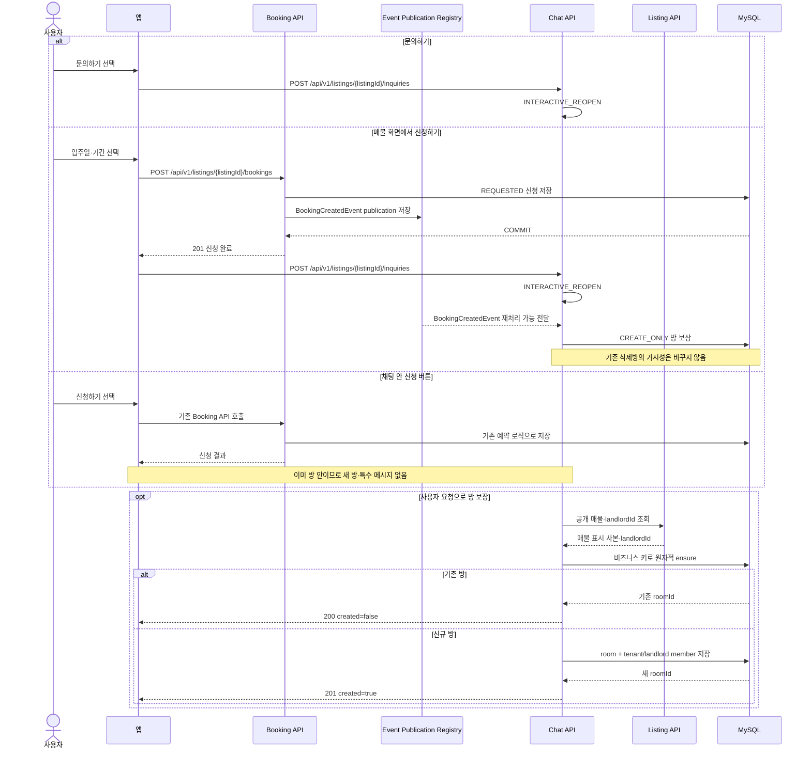
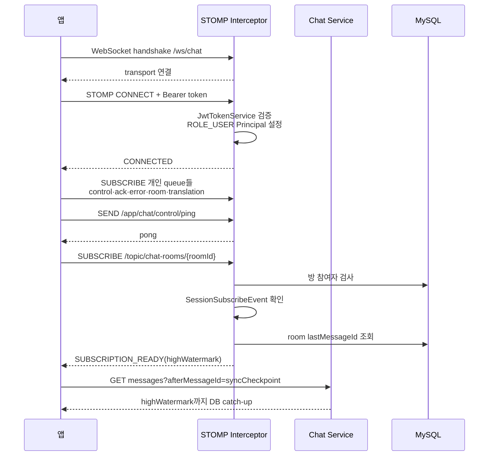
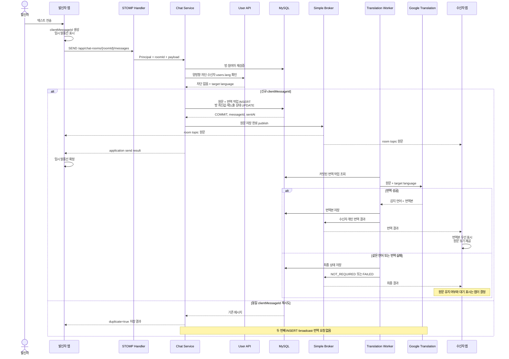
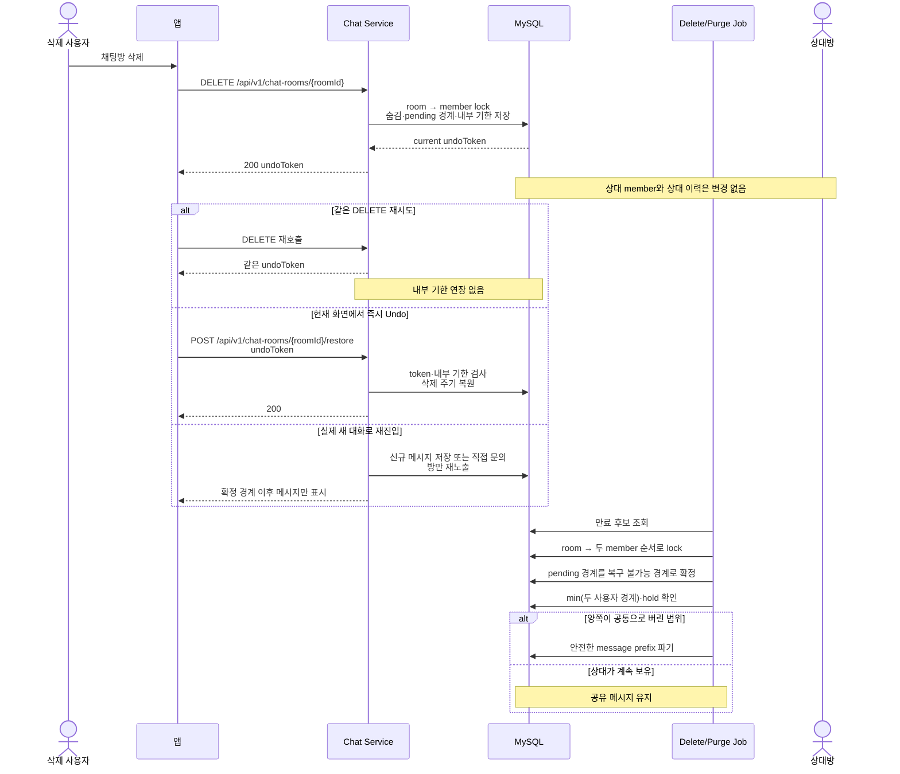
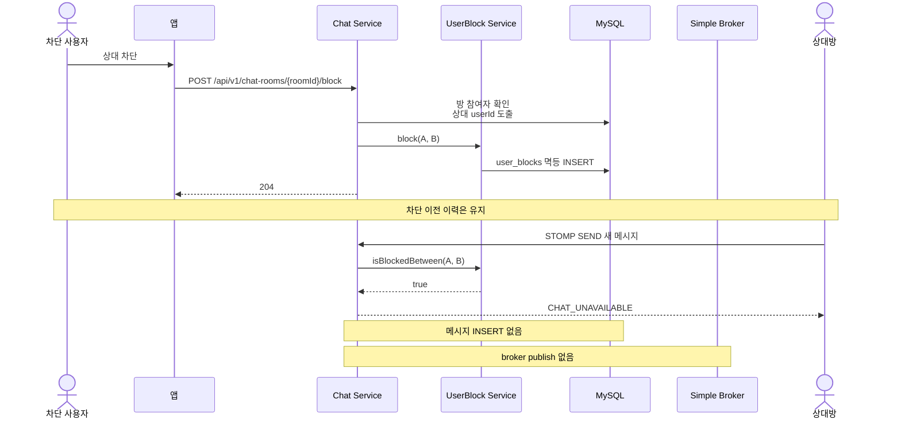
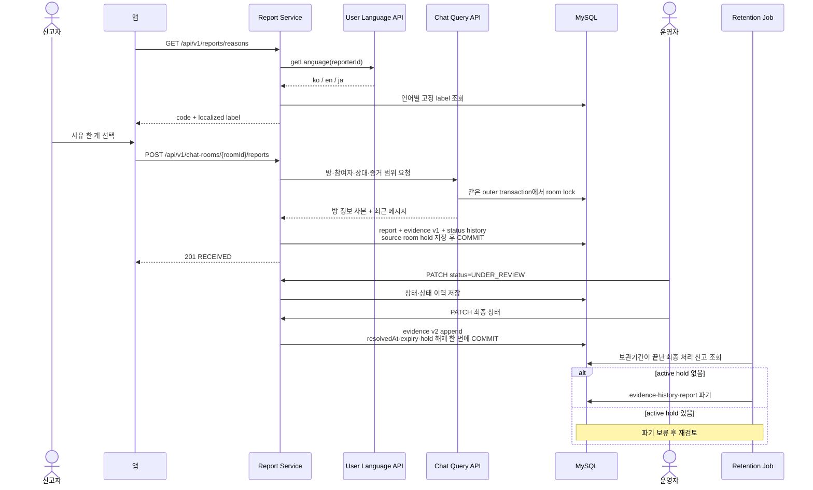

# 시퀀스 다이어그램

이 파일의 그림은 흐름을 쉽게 이해하기 위한 설명 자료다. 세부 요청·응답은 [API 계약](02-api-contracts.md), STOMP는 [실시간 계약](03-websocket-stomp.md), 삭제·신고 내부 상태는 [데이터 모델](06-data-model-and-retention.md)이 우선한다.

## 1. 문의와 신청이 같은 방을 사용하는 흐름

## 2. WebSocket 연결과 구독 준비

## 3. 메시지 저장과 자동 번역

## 4. 삭제·재진입·Undo·물리 파기

## 5. 차단과 차단 후 전송

## 6. 채팅방 신고·운영 처리·만료

## 7. 그림에서 생략한 분기

그림을 읽기 쉽게 하기 위해 다음 상세 분기는 표시하지 않았다.

- `BOOKING_ALREADY_EXISTS` 뒤 기존 방 진입
- 열린 신고 재시도의 `200 OK`
- 직전 신고 뒤 새 메시지가 없는 재신고 거부
- `GET /api/v1/reports/{reportId}`의 신고자 소유권 검사
- 오류별 STOMP user queue payload
- 삭제 token 만료·stale 요청 오류

이 분기는 [API 계약](02-api-contracts.md)과 [보안·동시성](07-security-and-concurrency.md)을 따른다.
