# 시퀀스 다이어그램

이 파일은 **다이어그램 하나에 하나의 시나리오만 표현한다.** 서로 다른 사용자 행동이나 서로 다른 시간대의 백그라운드 작업을 한 그림의 `alt`로 섞지 않는다.

- 같은 요청에서 기존 데이터가 있는 경우와 없는 경우처럼 결과만 달라지는 분기는 한 그림에 표시할 수 있다.
- 세부 요청·응답은 [API 계약](02-api-contracts.md), STOMP는 [실시간 계약](03-websocket-stomp.md), 삭제·신고 내부 상태는 [데이터 모델](06-data-model-and-retention.md)이 우선한다.

## 1. 방 진입과 신청

### 매물에서 문의하기

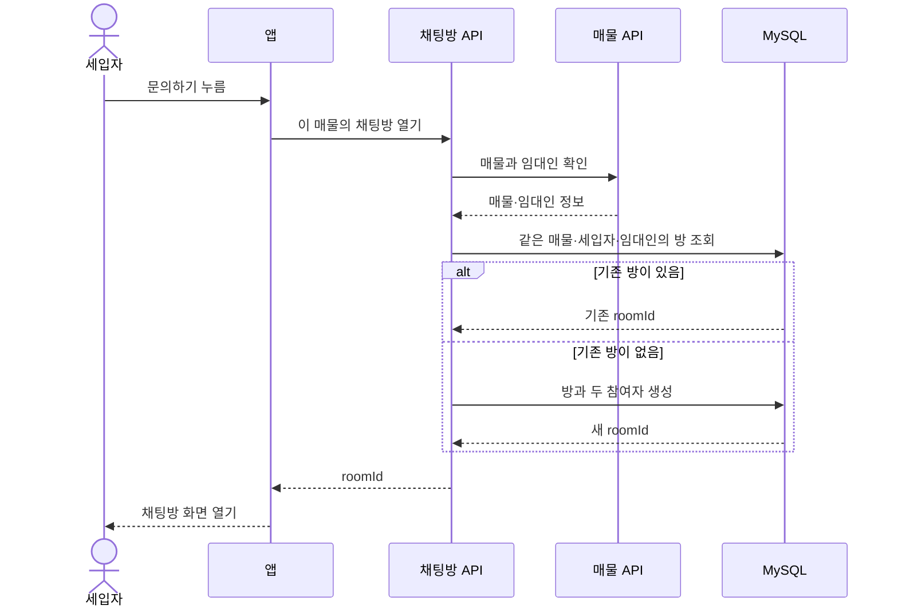
```mermaid
sequenceDiagram
    actor U as 세입자
    participant APP as 앱
    participant CHAT as 채팅방 API
    participant LIST as 매물 API
    participant DB as MySQL

    U->>APP: 문의하기 누름
    APP->>CHAT: 이 매물의 채팅방 열기
    CHAT->>LIST: 매물과 임대인 확인
    LIST-->>CHAT: 매물·임대인 정보
    CHAT->>DB: 같은 매물·세입자·임대인의 방 조회

    alt 기존 방이 있음
        DB-->>CHAT: 기존 roomId
    else 기존 방이 없음
        CHAT->>DB: 방과 두 참여자 생성
        DB-->>CHAT: 새 roomId
    end

    CHAT-->>APP: roomId
    APP-->>U: 채팅방 화면 열기
```

결과: 같은 매물·세입자·임대인 조합은 항상 같은 채팅방을 사용한다.

### 매물에서 신청한 뒤 채팅방 열기

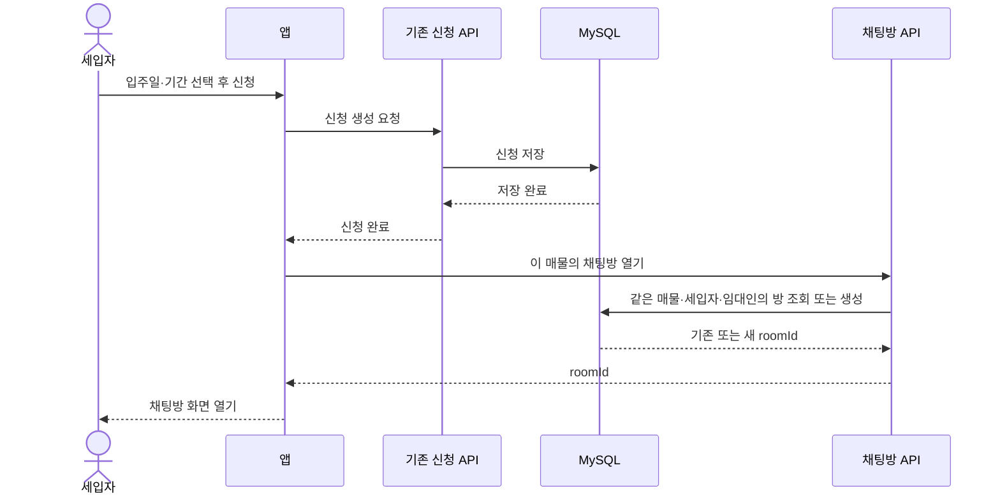
```mermaid
sequenceDiagram
    actor U as 세입자
    participant APP as 앱
    participant BOOK as 기존 신청 API
    participant DB as MySQL
    participant CHAT as 채팅방 API

    U->>APP: 입주일·기간 선택 후 신청
    APP->>BOOK: 신청 생성 요청
    BOOK->>DB: 신청 저장
    DB-->>BOOK: 저장 완료
    BOOK-->>APP: 신청 완료
    APP->>CHAT: 이 매물의 채팅방 열기
    CHAT->>DB: 같은 매물·세입자·임대인의 방 조회 또는 생성
    DB-->>CHAT: 기존 또는 새 roomId
    CHAT-->>APP: roomId
    APP-->>U: 채팅방 화면 열기
```

결과: 신청은 기존 Booking 기능이 처리하고, 신청 완료 후 문의하기와 같은 채팅방으로 이동한다.

### 채팅방 안에서 신청하기

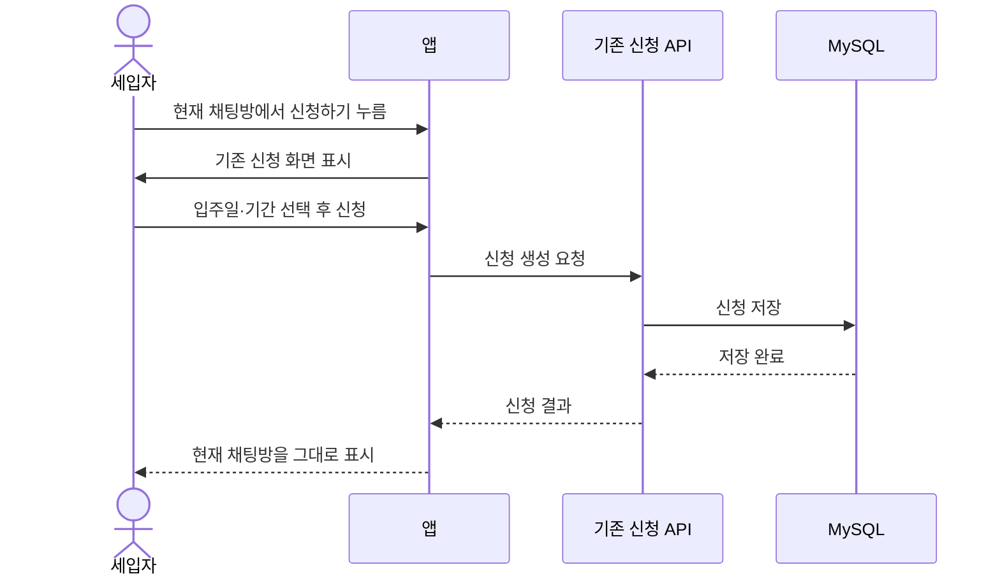
```mermaid
sequenceDiagram
    actor U as 세입자
    participant APP as 앱
    participant BOOK as 기존 신청 API
    participant DB as MySQL

    U->>APP: 현재 채팅방에서 신청하기 누름
    APP->>U: 기존 신청 화면 표시
    U->>APP: 입주일·기간 선택 후 신청
    APP->>BOOK: 신청 생성 요청
    BOOK->>DB: 신청 저장
    DB-->>BOOK: 저장 완료
    BOOK-->>APP: 신청 결과
    APP-->>U: 현재 채팅방을 그대로 표시
```

결과: 이미 채팅방 안에 있으므로 새 방이나 특수 메시지를 만들지 않는다.

### 사용자가 삭제한 채팅방에 다시 들어가기

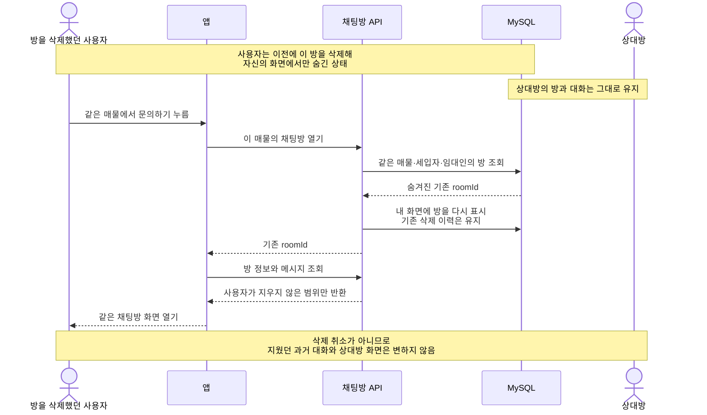
```mermaid
sequenceDiagram
    actor U as 방을 삭제했던 사용자
    participant APP as 앱
    participant CHAT as 채팅방 API
    participant DB as MySQL
    actor O as 상대방

    Note over U,DB: 사용자는 이전에 이 방을 삭제해<br/>자신의 화면에서만 숨긴 상태
    Note over O,DB: 상대방의 방과 대화는 그대로 유지

    U->>APP: 같은 매물에서 문의하기 누름
    APP->>CHAT: 이 매물의 채팅방 열기
    CHAT->>DB: 같은 매물·세입자·임대인의 방 조회
    DB-->>CHAT: 숨겨진 기존 roomId
    CHAT->>DB: 내 화면에 방을 다시 표시<br/>기존 삭제 이력은 유지
    CHAT-->>APP: 기존 roomId
    APP->>CHAT: 방 정보와 메시지 조회
    CHAT-->>APP: 사용자가 지우지 않은 범위만 반환
    APP-->>U: 같은 채팅방 화면 열기

    Note over U,O: 삭제 취소가 아니므로<br/>지웠던 과거 대화와 상대방 화면은 변하지 않음
```

결과: 같은 방을 다시 표시할 뿐 새 방·새 메시지·번역 작업은 만들지 않는다.

### 신청 저장 뒤 누락된 채팅방 보완하기

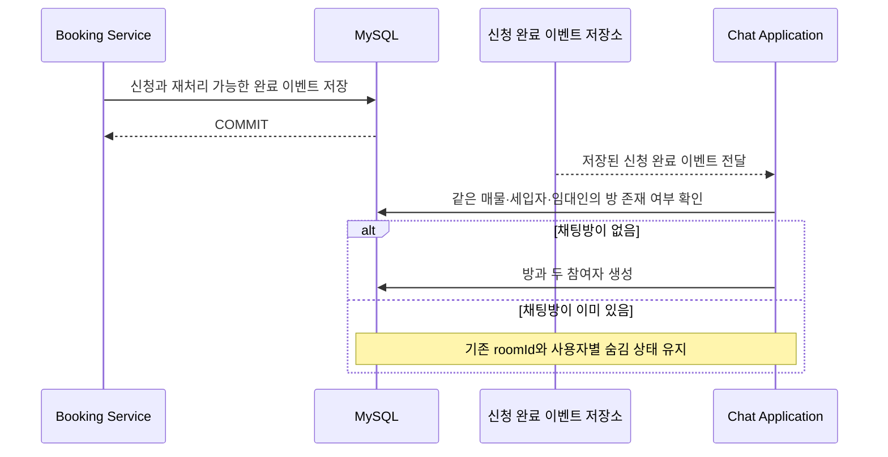
```mermaid
sequenceDiagram
    participant BOOK as Booking Service
    participant DB as MySQL
    participant EVENTS as 신청 완료 이벤트 저장소
    participant CHAT as Chat Application

    BOOK->>DB: 신청과 재처리 가능한 완료 이벤트 저장
    DB-->>BOOK: COMMIT
    EVENTS-->>CHAT: 저장된 신청 완료 이벤트 전달
    CHAT->>DB: 같은 매물·세입자·임대인의 방 존재 여부 확인

    alt 채팅방이 없음
        CHAT->>DB: 방과 두 참여자 생성
    else 채팅방이 이미 있음
        Note over CHAT,DB: 기존 roomId와 사용자별 숨김 상태 유지
    end
```

결과: 신청 뒤 방이 누락되지 않게 보완하지만, 오래된 이벤트가 사용자가 숨긴 방을 다시 보여 주지는 않는다.

## 2. WebSocket 연결과 메시지

### WebSocket에 접속하고 JWT로 인증하기

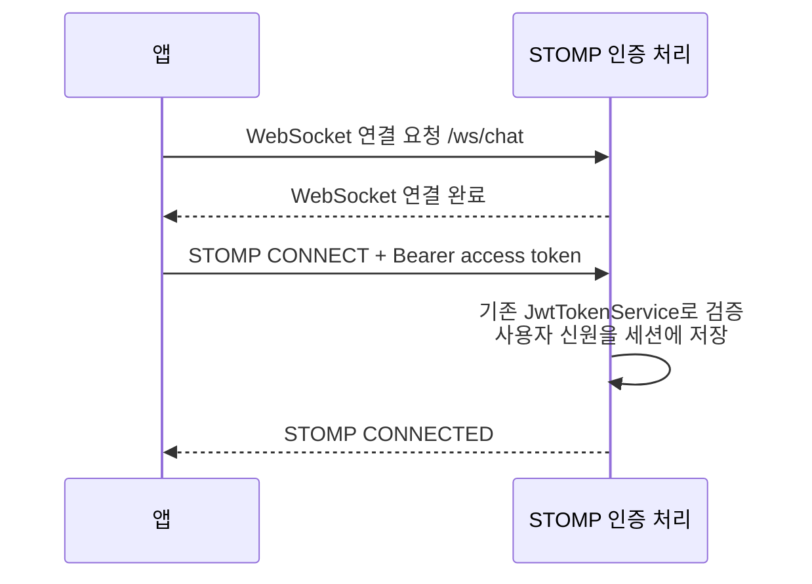
```mermaid
sequenceDiagram
    participant APP as 앱
    participant WS as STOMP 인증 처리

    APP->>WS: WebSocket 연결 요청 /ws/chat
    WS-->>APP: WebSocket 연결 완료
    APP->>WS: STOMP CONNECT + Bearer access token
    WS->>WS: 기존 JwtTokenService로 검증<br/>사용자 신원을 세션에 저장
    WS-->>APP: STOMP CONNECTED
```

결과: 이후 STOMP 요청은 연결된 세션의 검증된 userId를 사용한다.

### 채팅방을 구독하고 누락 메시지 보충하기

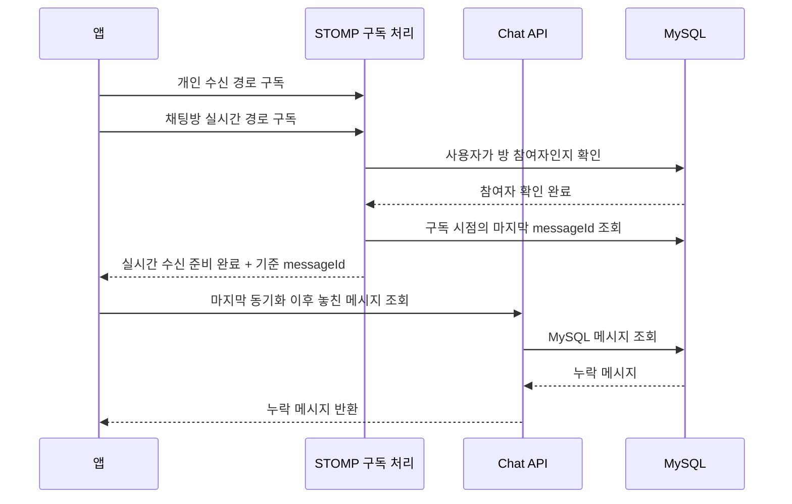
```mermaid
sequenceDiagram
    participant APP as 앱
    participant WS as STOMP 구독 처리
    participant CHAT as Chat API
    participant DB as MySQL

    APP->>WS: 개인 수신 경로 구독
    APP->>WS: 채팅방 실시간 경로 구독
    WS->>DB: 사용자가 방 참여자인지 확인
    DB-->>WS: 참여자 확인 완료
    WS->>DB: 구독 시점의 마지막 messageId 조회
    WS-->>APP: 실시간 수신 준비 완료 + 기준 messageId
    APP->>CHAT: 마지막 동기화 이후 놓친 메시지 조회
    CHAT->>DB: MySQL 메시지 조회
    DB-->>CHAT: 누락 메시지
    CHAT-->>APP: 누락 메시지 반환
```

결과: 마지막 동기화 이후부터 구독 기준 시점까지 빠진 메시지도 MySQL에서 보충한다.

### 새 메시지를 저장하고 실시간 전달하기

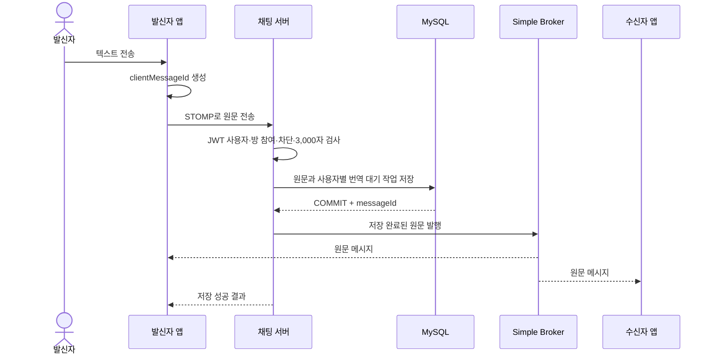
```mermaid
sequenceDiagram
    actor S as 발신자
    participant APP as 발신자 앱
    participant CHAT as 채팅 서버
    participant DB as MySQL
    participant BR as Simple Broker
    participant OTHER as 수신자 앱

    S->>APP: 텍스트 전송
    APP->>APP: clientMessageId 생성
    APP->>CHAT: STOMP로 원문 전송
    CHAT->>CHAT: JWT 사용자·방 참여·차단·3,000자 검사
    CHAT->>DB: 원문과 사용자별 번역 대기 작업 저장
    DB-->>CHAT: COMMIT + messageId
    CHAT->>BR: 저장 완료된 원문 발행
    BR-->>APP: 원문 메시지
    BR-->>OTHER: 원문 메시지
    CHAT-->>APP: 저장 성공 결과
```

결과: 원문 저장과 전달은 Google 번역 완료를 기다리지 않는다.

### 저장된 메시지를 자동 번역하기

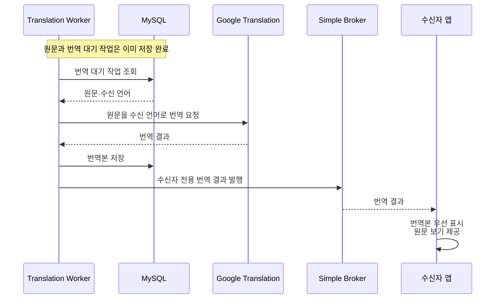
```mermaid
sequenceDiagram
    participant WORKER as Translation Worker
    participant DB as MySQL
    participant GOOGLE as Google Translation
    participant BR as Simple Broker
    participant APP as 수신자 앱

    Note over WORKER,DB: 원문과 번역 대기 작업은 이미 저장 완료
    WORKER->>DB: 번역 대기 작업 조회
    DB-->>WORKER: 원문·수신 언어
    WORKER->>GOOGLE: 원문을 수신 언어로 번역 요청
    GOOGLE-->>WORKER: 번역 결과
    WORKER->>DB: 번역본 저장
    WORKER->>BR: 수신자 전용 번역 결과 발행
    BR-->>APP: 번역 결과
    APP->>APP: 번역본 우선 표시<br/>원문 보기 제공
```

결과: 저장된 원문은 바꾸지 않고 수신자용 번역본만 추가한다.

### 자동 번역이 최종 실패한 경우

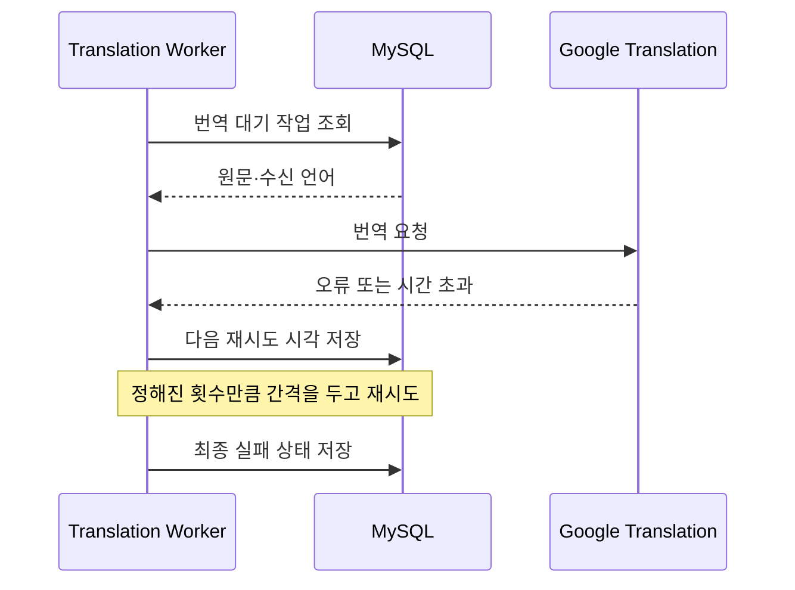
```mermaid
sequenceDiagram
    participant WORKER as Translation Worker
    participant DB as MySQL
    participant GOOGLE as Google Translation

    WORKER->>DB: 번역 대기 작업 조회
    DB-->>WORKER: 원문·수신 언어
    WORKER->>GOOGLE: 번역 요청
    GOOGLE-->>WORKER: 오류 또는 시간 초과
    WORKER->>DB: 다음 재시도 시각 저장
    Note over WORKER,DB: 정해진 횟수만큼 간격을 두고 재시도
    WORKER->>DB: 최종 실패 상태 저장
```

결과: 번역에 실패해도 이미 저장·전달된 원문 메시지는 그대로 유지한다.

### 네트워크 오류로 같은 메시지를 다시 보낸 경우

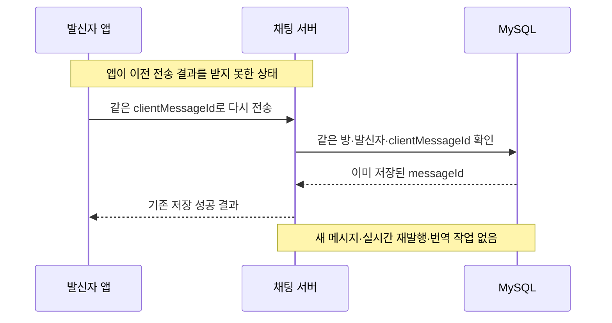
```mermaid
sequenceDiagram
    participant APP as 발신자 앱
    participant CHAT as 채팅 서버
    participant DB as MySQL

    Note over APP,CHAT: 앱이 이전 전송 결과를 받지 못한 상태
    APP->>CHAT: 같은 clientMessageId로 다시 전송
    CHAT->>DB: 같은 방·발신자·clientMessageId 확인
    DB-->>CHAT: 이미 저장된 messageId
    CHAT-->>APP: 기존 저장 성공 결과
    Note over CHAT,DB: 새 메시지·실시간 재발행·번역 작업 없음
```

결과: 네트워크 재시도에도 메시지는 한 번만 저장된다.

## 3. 삭제와 물리 파기

### 사용자가 채팅방을 삭제하기

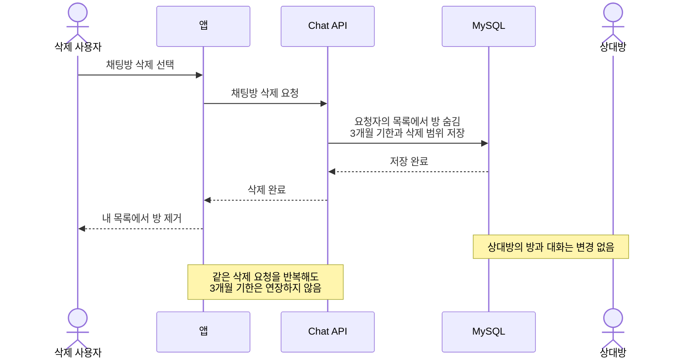
```mermaid
sequenceDiagram
    actor U as 삭제 사용자
    participant APP as 앱
    participant CHAT as Chat API
    participant DB as MySQL
    actor O as 상대방

    U->>APP: 채팅방 삭제 선택
    APP->>CHAT: 채팅방 삭제 요청
    CHAT->>DB: 요청자의 목록에서 방 숨김<br/>3개월 기한과 삭제 범위 저장
    DB-->>CHAT: 저장 완료
    CHAT-->>APP: 삭제 완료
    APP-->>U: 내 목록에서 방 제거
    Note over O,DB: 상대방의 방과 대화는 변경 없음
    Note over APP,CHAT: 같은 삭제 요청을 반복해도<br/>3개월 기한은 연장하지 않음
```

결과: 삭제는 요청자에게만 적용되며 공유 메시지는 바로 물리 삭제하지 않는다.

### 삭제 직후 되돌리기

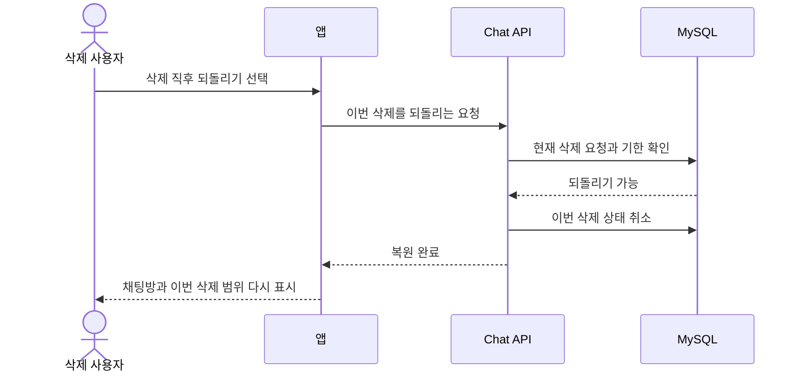
```mermaid
sequenceDiagram
    actor U as 삭제 사용자
    participant APP as 앱
    participant CHAT as Chat API
    participant DB as MySQL

    U->>APP: 삭제 직후 되돌리기 선택
    APP->>CHAT: 이번 삭제를 되돌리는 요청
    CHAT->>DB: 현재 삭제 요청과 기한 확인
    DB-->>CHAT: 되돌리기 가능
    CHAT->>DB: 이번 삭제 상태 취소
    CHAT-->>APP: 복원 완료
    APP-->>U: 채팅방과 이번 삭제 범위 다시 표시
```

결과: 현재 삭제 주기만 취소하며 이전에 이미 확정된 삭제 범위는 복구하지 않는다.

### 숨긴 방에 실제 새 메시지가 도착하기

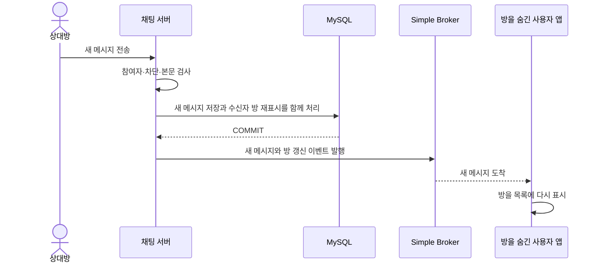
```mermaid
sequenceDiagram
    actor S as 상대방
    participant CHAT as 채팅 서버
    participant DB as MySQL
    participant BR as Simple Broker
    participant APP as 방을 숨긴 사용자 앱

    S->>CHAT: 새 메시지 전송
    CHAT->>CHAT: 참여자·차단·본문 검사
    CHAT->>DB: 새 메시지 저장과 수신자 방 재표시를 함께 처리
    DB-->>CHAT: COMMIT
    CHAT->>BR: 새 메시지와 방 갱신 이벤트 발행
    BR-->>APP: 새 메시지 도착
    APP->>APP: 방을 목록에 다시 표시
```

결과: 실제 새 메시지가 생긴 경우에만 방이 다시 나타나며, 사용자가 지운 과거 범위는 복원하지 않는다.

### 한 사용자의 3개월 삭제 기한이 끝나기

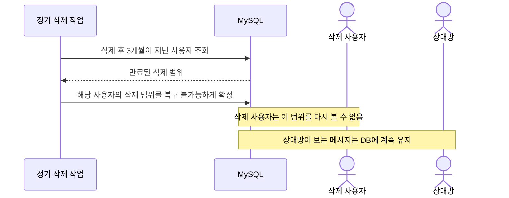
```mermaid
sequenceDiagram
    participant JOB as 정기 삭제 작업
    participant DB as MySQL
    actor U as 삭제 사용자
    actor O as 상대방

    JOB->>DB: 삭제 후 3개월이 지난 사용자 조회
    DB-->>JOB: 만료된 삭제 범위
    JOB->>DB: 해당 사용자의 삭제 범위를 복구 불가능하게 확정
    Note over U,DB: 삭제 사용자는 이 범위를 다시 볼 수 없음
    Note over O,DB: 상대방이 보는 메시지는 DB에 계속 유지
```

결과: 한쪽의 3개월 만료는 그 사용자의 접근만 끝내며 상대방 기록을 삭제하지 않는다.

### 양쪽 모두 버린 메시지를 물리 삭제하기

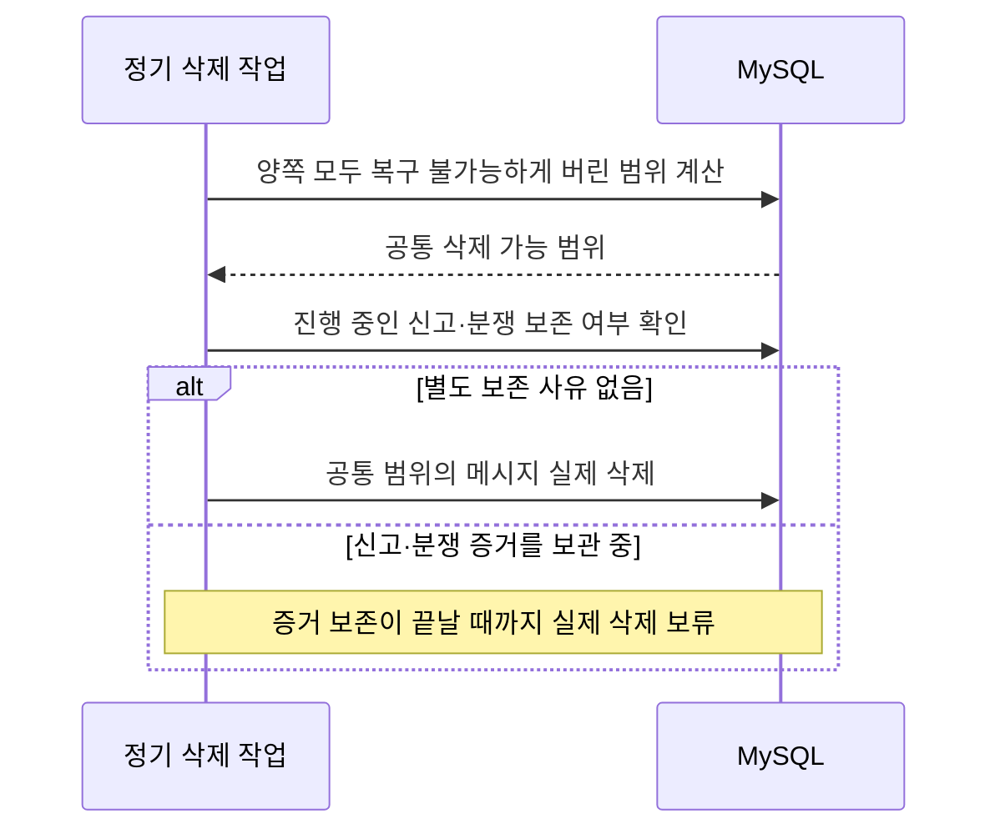
```mermaid
sequenceDiagram
    participant JOB as 정기 삭제 작업
    participant DB as MySQL

    JOB->>DB: 양쪽 모두 복구 불가능하게 버린 범위 계산
    DB-->>JOB: 공통 삭제 가능 범위
    JOB->>DB: 진행 중인 신고·분쟁 보존 여부 확인

    alt 별도 보존 사유 없음
        JOB->>DB: 공통 범위의 메시지 실제 삭제
    else 신고·분쟁 증거를 보관 중
        Note over JOB,DB: 증거 보존이 끝날 때까지 실제 삭제 보류
    end
```

결과: 양쪽 모두 필요 없고 별도 보존 사유도 없는 메시지만 MySQL에서 물리 삭제한다.

## 4. 차단

### 채팅방에서 상대방 차단하기

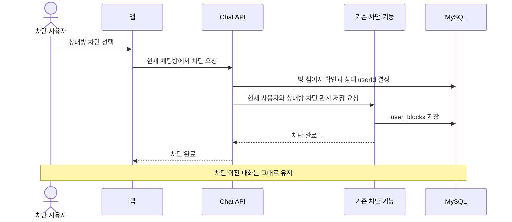
```mermaid
sequenceDiagram
    actor U as 차단 사용자
    participant APP as 앱
    participant CHAT as Chat API
    participant BLOCK as 기존 차단 기능
    participant DB as MySQL

    U->>APP: 상대방 차단 선택
    APP->>CHAT: 현재 채팅방에서 차단 요청
    CHAT->>DB: 방 참여자 확인과 상대 userId 결정
    CHAT->>BLOCK: 현재 사용자와 상대방 차단 관계 저장 요청
    BLOCK->>DB: user_blocks 저장
    BLOCK-->>CHAT: 차단 완료
    CHAT-->>APP: 차단 완료
    Note over U,DB: 차단 이전 대화는 그대로 유지
```

결과: 클라이언트가 상대 userId를 지정하지 않고 서버가 방 정보로 상대를 결정한다.

### 차단된 관계에서 메시지 보내기

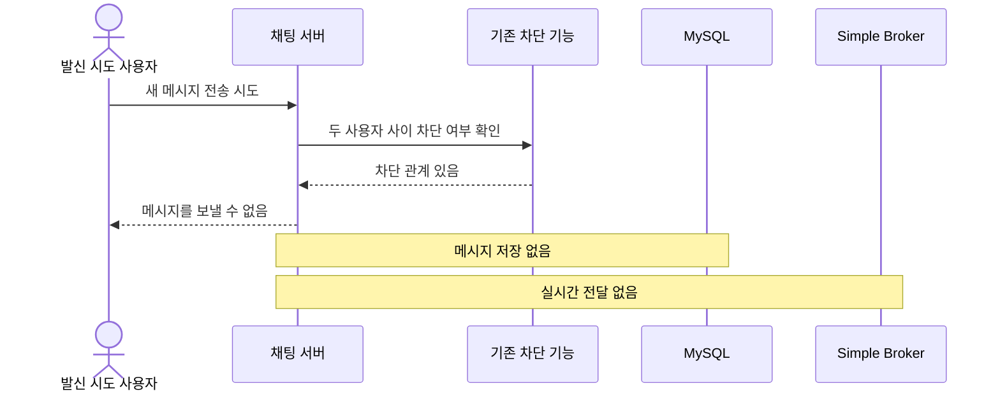
```mermaid
sequenceDiagram
    actor S as 발신 시도 사용자
    participant CHAT as 채팅 서버
    participant BLOCK as 기존 차단 기능
    participant DB as MySQL
    participant BR as Simple Broker

    S->>CHAT: 새 메시지 전송 시도
    CHAT->>BLOCK: 두 사용자 사이 차단 여부 확인
    BLOCK-->>CHAT: 차단 관계 있음
    CHAT-->>S: 메시지를 보낼 수 없음
    Note over CHAT,DB: 메시지 저장 없음
    Note over CHAT,BR: 실시간 전달 없음
```

결과: 차단 이후 메시지는 저장하거나 상대방에게 전달하지 않는다.

## 5. 신고

### 채팅방 신고 접수하기

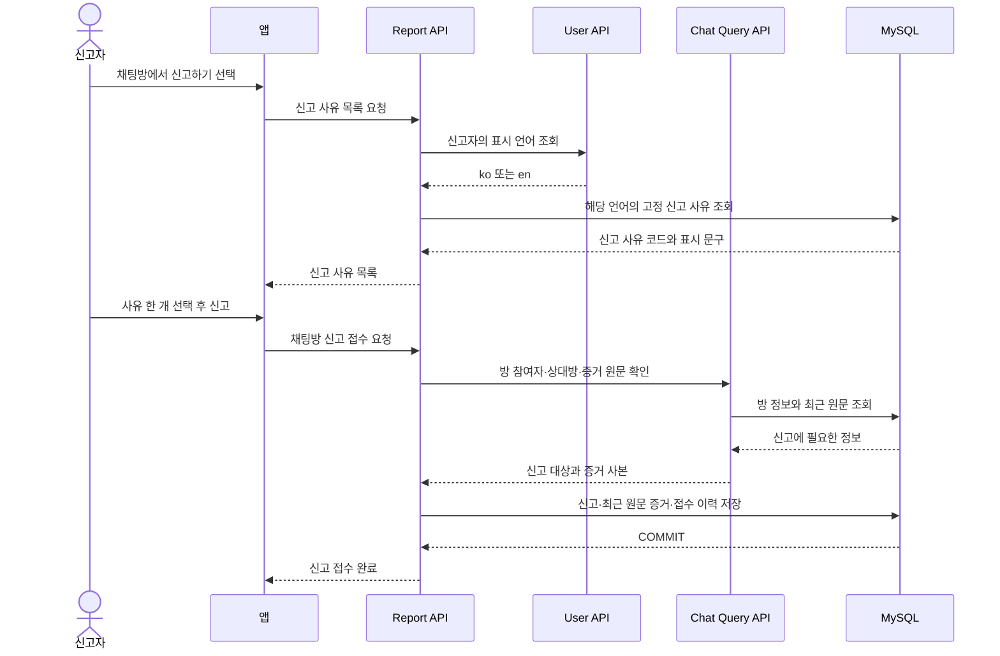
```mermaid
sequenceDiagram
    actor U as 신고자
    participant APP as 앱
    participant REPORT as Report API
    participant USER as User API
    participant CHAT as Chat Query API
    participant DB as MySQL

    U->>APP: 채팅방에서 신고하기 선택
    APP->>REPORT: 신고 사유 목록 요청
    REPORT->>USER: 신고자의 표시 언어 조회
    USER-->>REPORT: ko 또는 en
    REPORT->>DB: 해당 언어의 고정 신고 사유 조회
    DB-->>REPORT: 신고 사유 코드와 표시 문구
    REPORT-->>APP: 신고 사유 목록
    U->>APP: 사유 한 개 선택 후 신고
    APP->>REPORT: 채팅방 신고 접수 요청
    REPORT->>CHAT: 방 참여자·상대방·증거 원문 확인
    CHAT->>DB: 방 정보와 최근 원문 조회
    DB-->>CHAT: 신고에 필요한 정보
    CHAT-->>REPORT: 신고 대상과 증거 사본
    REPORT->>DB: 신고·최근 원문 증거·접수 이력 저장
    DB-->>REPORT: COMMIT
    REPORT-->>APP: 신고 접수 완료
```

결과: 앱은 고정 사유만 보내며 신고자·상대방·방·접수 시각·증거는 서버가 결정한다.

### 운영자가 신고를 처리하기 — 후속 구현

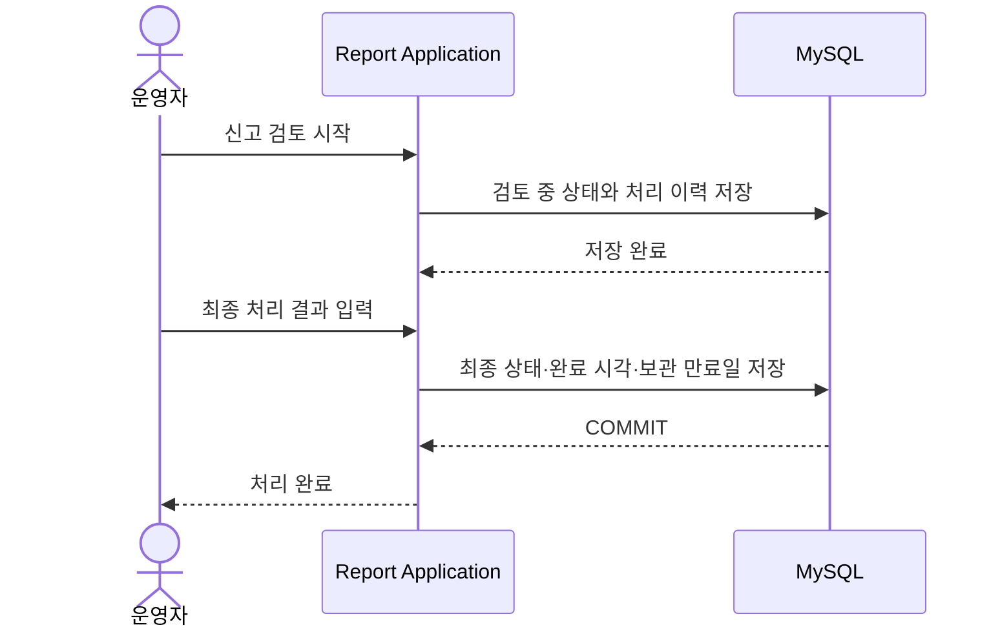
```mermaid
sequenceDiagram
    actor ADMIN as 운영자
    participant REPORT as Report Application
    participant DB as MySQL

    ADMIN->>REPORT: 신고 검토 시작
    REPORT->>DB: 검토 중 상태와 처리 이력 저장
    DB-->>REPORT: 저장 완료
    ADMIN->>REPORT: 최종 처리 결과 입력
    REPORT->>DB: 최종 상태·완료 시각·보관 만료일 저장
    DB-->>REPORT: COMMIT
    REPORT-->>ADMIN: 처리 완료
```

결과: 운영자 API는 후속 범위이며 현재 구현에서는 필요한 필드와 상태 구조만 준비한다.

### 보관기간이 끝난 신고 자료 정리하기 — 후속 구현

```mermaid
sequenceDiagram
    participant JOB as 신고 자료 정리 작업
    participant DB as MySQL

    JOB->>DB: 처리 완료 후 보관기간이 지난 신고 조회
    DB-->>JOB: 만료된 신고 목록
    JOB->>DB: 진행 중인 법적·분쟁 보존 여부 확인

    alt 별도 보존 사유 없음
        JOB->>DB: 신고 증거·처리 이력·신고 자료 삭제
    else 별도 보존 사유 있음
        Note over JOB,DB: 보존 사유가 끝날 때까지 삭제 보류
    end
```

결과: 보관 만료일이 지나고 별도 보존 사유가 없는 신고 자료만 삭제한다.

## 6. 그림에서 생략한 상세

그림은 한 시나리오의 핵심 흐름만 보여 준다. 다음 세부 규칙은 정본 문서에서 확인한다.

- 동시 방 생성과 메시지 중복 저장을 막는 MySQL UNIQUE 처리
- STOMP destination, 개인 queue payload, heartbeat와 재연결 규칙
- 삭제 token 만료와 오래된 되돌리기 요청 오류
- 신고 중복 접수와 재신고 조건
- 번역 재시도 횟수·간격과 Google API 오류 분류
- 트랜잭션 lock 순서와 물리 파기 batch 상세
