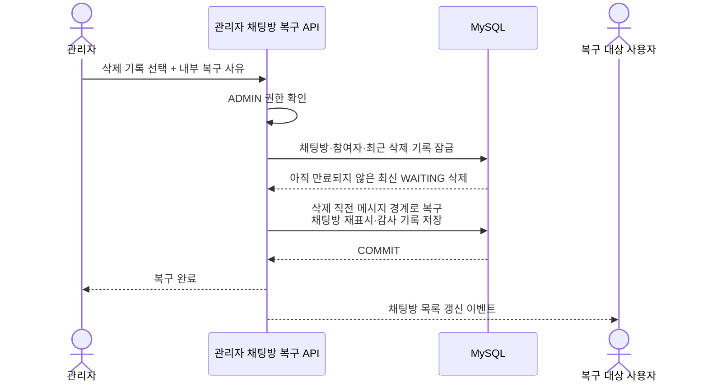
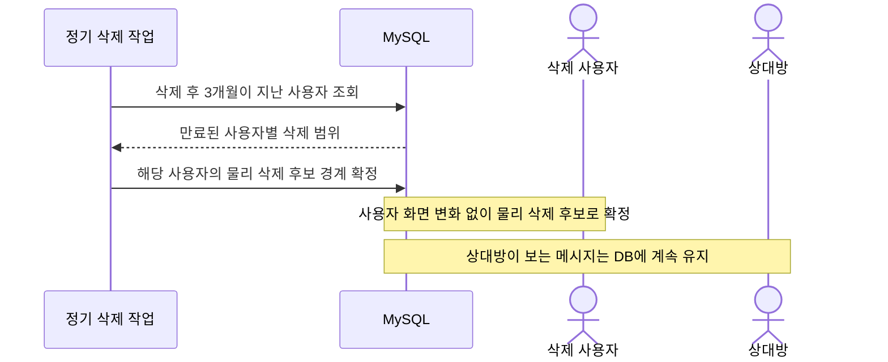
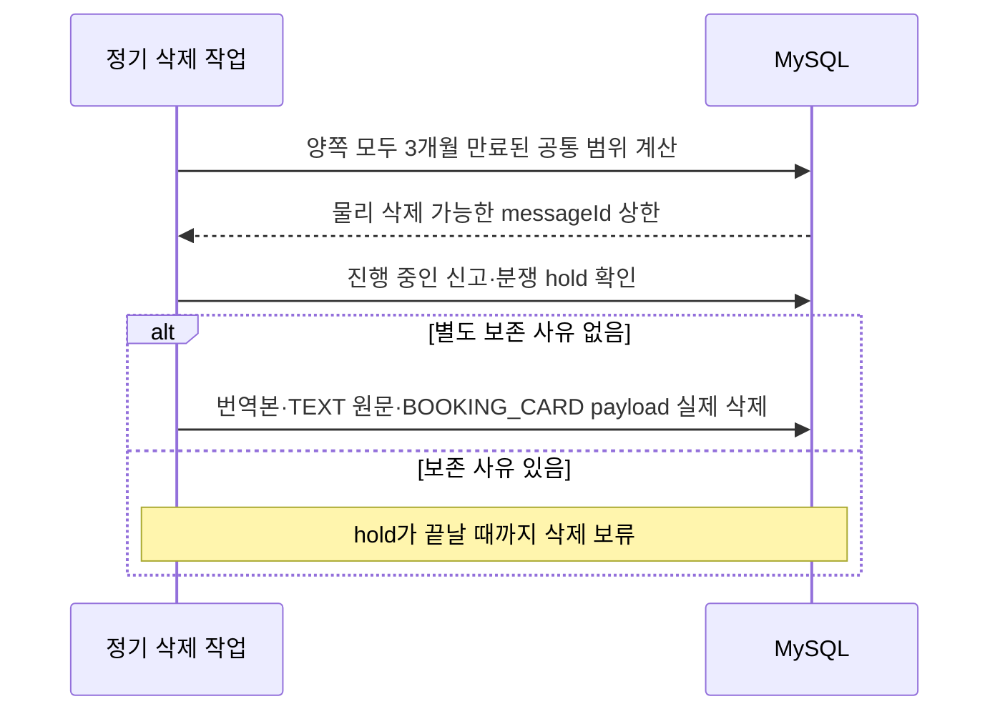
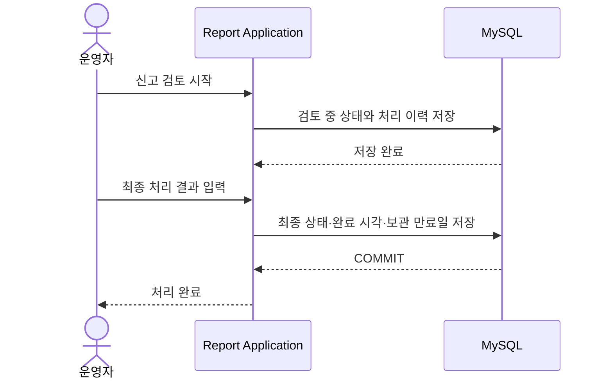
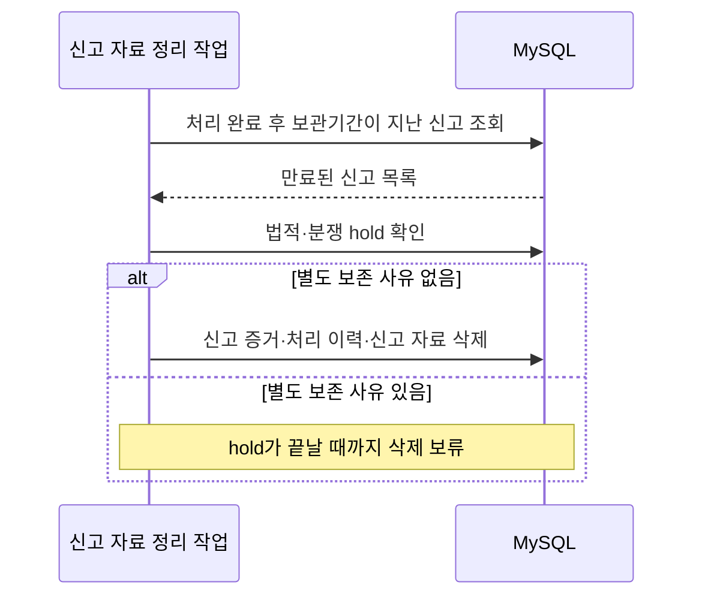

# 후속 고도화 시퀀스 다이어그램

이 파일도 **다이어그램 하나에 하나의 시나리오만 표현한다.** 현재 구현 시퀀스는 [상위 문서](../05-sequence-diagrams.md)를 따른다.

## 관리자가 사용자의 최근 삭제를 복구하기

**쉽게 설명하면:** 일반 사용자가 직접 누르는 복원 버튼은 없다. 관리자가 고객 지원 절차로 가장 최근 삭제 기록을 선택하면, 서버가 삭제 당시 저장한 직전 경계로 해당 사용자 화면만 되돌리고 누가 왜 복구했는지 감사 기록을 남긴다.

**결과:** 만료·물리 삭제 전의 최신 삭제만 관리자가 제한적으로 복구하며 상대방·차단·신고 상태는 바뀌지 않는다.

## 한 사용자의 3개월 삭제 기한이 끝나기

**쉽게 설명하면:** 사용자가 호출하는 API가 아니라 서버 정기 작업의 흐름이다. 사용자는 삭제 직후부터 과거 이력을 볼 수 없으며, 3개월이 지나면 서버가 그 범위를 물리 삭제 후보로 확정한다. 상대방이 아직 보는 메시지는 지우지 않는다.

**결과:** 한쪽의 3개월 만료만으로 공유 메시지를 물리 삭제하지 않는다.

## 양쪽 모두 버린 메시지를 물리 삭제하기

**쉽게 설명하면:** 서버는 두 사용자가 모두 버렸고 각자의 3개월 기한도 지난 공통 메시지만 계산한다. 신고나 분쟁 때문에 보관해야 하면 지우지 않고 다음 정리 작업으로 미룬다.

**결과:** 양쪽 모두 필요 없고 별도 보존 사유도 없는 데이터만 MySQL에서 삭제한다.

## 운영자가 신고를 처리하기

**쉽게 설명하면:** 운영자가 접수된 신고를 보고 검토 상태와 최종 결과를 기록하는 관리자 전용 흐름이다. 일반 사용자의 신고 접수 API와는 별개이며 관리자 인증이 준비된 뒤 구현한다.

**결과:** 신고 처리 결과, 완료 시각과 이후 자료 정리에 사용할 만료일이 기록된다.

## 보관기간이 끝난 신고 자료 정리하기

**쉽게 설명하면:** 이것도 사용자가 호출하는 API가 아니라 서버 정기 작업이다. 보관 만료일이 지났더라도 법적 분쟁 등 추가 보존 사유가 있으면 자료를 유지한다.

**결과:** 만료일이 지났고 별도 hold가 없는 신고 자료만 삭제한다.
