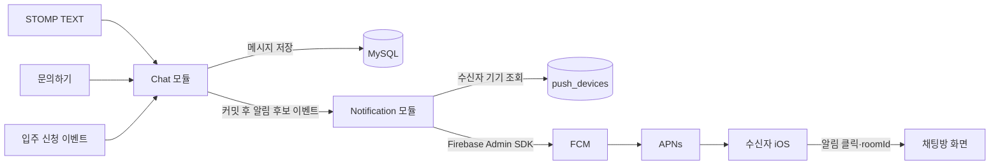

# 채팅 FCM 푸시 알림 계획

> 작성일: 2026-08-28
>
> 최종 수정: 2026-08-29
>
> 상태: 백엔드 코드 구현 — 실제 Firebase/APNs 연결과 iPhone E2E 검증 전
>
> 범위: iOS 앱의 1:1 채팅 `TEXT`·`INQUIRY_CARD`·`BOOKING_CARD` FCM 푸시와 채팅방 딥링크

이 문서에서 말하는 기능은 예약 시각에 울리는 `alarm`이 아니라 새 채팅을 알려 주는 `notification`, 즉 **알림**이다.

iOS 프론트엔드가 바로 적용할 호출 시점·오류 처리·딥링크 순서는 [11-frontend-push-notification-guide.md](../11-frontend-push-notification-guide.md)를 따른다.

현재 채팅은 MySQL 저장, REST 이력 조회, STOMP 실시간 전달을 제공한다. 하지만 앱이 백그라운드이거나 종료되면 WebSocket 연결만으로 사용자를 알릴 수 없다. 이 문서는 새 `TEXT`, `INQUIRY_CARD`, `BOOKING_CARD`가 저장됐을 때 FCM과 APNs를 거쳐 iOS 상단 알림을 표시하고, 사용자가 알림을 누르면 해당 채팅방으로 이동하는 기능을 정의한다.

알림 목록을 서버에 저장하거나 읽음 상태를 관리하는 기능은 이번 범위에 포함하지 않는다. 푸시는 새 채팅이 있다는 힌트이며, 실제 메시지의 정본은 항상 MySQL의 채팅 메시지다.

## 1. 핵심 결정

| 항목 | 결정 |
| --- | --- |
| 지원 플랫폼 | 첫 구현은 iOS만 지원 |
| 발송 대상 | 새로 저장된 `TEXT`, `INQUIRY_CARD`, `BOOKING_CARD` |
| 제외 메시지 | 중복 `TEXT`, 저장되지 않은 연속 문의 카드, 이미 처리된 신청 카드 |
| 외부 전달 경로 | 백엔드 → FCM → APNs → iOS |
| 발송 시점 | 채팅 메시지 트랜잭션 커밋 이후 |
| 수신자 | `TEXT`는 상대 참여자, 문의·신청 카드는 임대인 |
| 여러 기기 | 수신자의 등록된 활성 iOS 기기 모두 발송 |
| 표시 제목 | `CHAT_MESSAGE`이면 `채팅` |
| 표시 본문 | 일반 메시지·문의·신청 종류별 고정 문구에 `listingTitle` 조합 |
| 표시 시각 | 원인 메시지가 MySQL에 실제 저장된 `sentAt` |
| 메시지 미리보기 | 원문과 번역문을 푸시에 포함하지 않음 |
| 알림 클릭 | `data.type`과 `data.roomId`를 이용해 채팅방 이동 |
| 알림 목록 | 만들지 않음 |
| 알림 읽음 처리 | 만들지 않음 |
| 알림 전용 WebSocket | 만들지 않음 |
| 메시지 정본 | MySQL 채팅 메시지 |

`type`은 현재 `CHAT_MESSAGE` 한 값만 사용한다. 향후 다른 종류의 푸시가 추가되더라도 iOS 앱이 안전하게 분기할 수 있도록 payload에 명시한다. 세 채팅 메시지 종류는 모두 클릭 후 같은 채팅방 화면을 열기 때문에 FCM `data`에 별도 `messageType`을 보내지 않는다.

FCM이나 iOS가 `CHAT_MESSAGE`를 `채팅`으로 자동 변환하지는 않는다. 백엔드는 내부 `ChatMessageCreatedEvent.messageType`으로 알림 본문을 고르고, `notification`과 `data`를 각각 완성한다. 내부 `messageType`은 프론트 payload 계약이 아니다.

```text
type = CHAT_MESSAGE
→ notification.title = "채팅"

listingTitle = "고시원 3"
messageType = TEXT
→ notification.body = "\"고시원 3\"으로부터 새 메시지가 도착했어요"

messageType = INQUIRY_CARD
→ notification.body = "\"고시원 3\"에 새로운 문의가 도착했어요"

messageType = BOOKING_CARD
→ notification.body = "\"고시원 3\"에 새로운 신청이 도착했어요"
```

## 2. 이번 범위

### 2.1 구현하는 기능

- iOS 앱 설치본별 FCM 토큰 등록·갱신·삭제
- 사용자 한 명의 여러 iOS 기기 지원
- 같은 기기에서 로그인 계정이 바뀔 때 토큰 소유권 변경
- 새 `TEXT`·`INQUIRY_CARD`·`BOOKING_CARD` 커밋 후 수신자 결정
- 수신자의 활성 FCM 토큰 조회
- Firebase Admin SDK를 이용한 FCM 발송
- 앱이 background·종료 상태일 때 APNs 알림 표시
- 알림 클릭 후 `roomId` 채팅방 딥링크
- 만료되거나 잘못된 FCM 토큰 정리
- Firebase 비활성화 환경의 안전한 no-op 처리

### 2.2 구현하지 않는 기능

- 알림 테이블과 알림 목록 API
- 알림 읽음 여부, `readAt`, 읽지 않은 알림 개수
- 채팅 메시지 읽음 커서와 안 읽음 수
- 앱 아이콘 배지
- 인앱 알림함과 알림 전용 WebSocket
- 전역 알림 on/off와 방별 음소거
- Android Push와 Web Push
- 약관 변경, 매물 승인·반려 등 채팅 외 알림
- 메시지 원문·번역문 미리보기

읽음·안 읽음, 배지, 음소거와 통합 알림함은 필요성이 다시 확인될 때 별도 설계와 이슈로 다룬다. 이번 구현에 미리 포함하지 않는다.

## 3. 전체 구조



STOMP와 FCM은 역할이 다르다.

- STOMP는 앱이 실행 중이고 연결돼 있을 때 채팅 화면을 실시간으로 갱신한다.
- FCM/APNs는 앱이 백그라운드이거나 종료돼 WebSocket 연결이 없을 때도 OS 알림을 표시한다.

푸시를 위해 별도의 알림 WebSocket을 만들지 않는다.

## 4. 선행 조건

### 4.1 백엔드

- Firebase Admin SDK 의존성과 초기화 설정
- 기존 Google Cloud 프로젝트 ID 재사용
- 기존 ADC/WIF 인증 재사용
- `FirebaseMessaging` 준비
- dev에서 `APP_FIREBASE_ENABLED=true` 반영
- Terraform에서 FCM API 활성화

서비스 계정 JSON 개인키는 새로 다운로드하지 않는다. 채팅 번역에서 사용하는 WIF 인증과 Google Cloud 프로젝트를 공유한다.

### 4.2 iOS와 Firebase Console

- iOS 앱이 Firebase 프로젝트에 등록돼 있어야 한다.
- Firebase Console에 APNs 인증키가 등록돼 있어야 한다.
- iOS 앱에 Push Notifications capability가 활성화돼 있어야 한다.
- 앱이 사용자에게 알림 권한을 요청해야 한다.
- 앱이 Firebase SDK로 FCM 토큰을 발급받아야 한다.

백엔드 설정만으로는 휴대폰 상단 알림이 완성되지 않는다. APNs와 iOS 앱 설정이 함께 준비돼야 실제 기기로 전달할 수 있다.

## 5. 기기 토큰 등록

### 5.1 installationId

`installationId`는 실제 아이폰의 하드웨어 ID가 아니다. iOS 앱이 설치본을 구분하기 위해 생성하고 보관하는 UUID다.

FCM 토큰은 앱 재설치, 복원 또는 Firebase 정책에 따라 변경될 수 있다. `installationId`를 함께 사용하면 같은 앱 설치본의 토큰을 새 행으로 계속 추가하지 않고 기존 행에서 갱신할 수 있다.

이번 구현에서는 `installationId`를 사용한다. FCM 토큰만 저장하면 토큰이 바뀌었을 때 백엔드가 이전 토큰과 새 토큰이 같은 설치본의 것인지 알 수 없어 오래된 행이 남을 수 있다. `installationId`를 기준으로 기존 행의 토큰을 교체하면 FCM 발송 실패를 기다리지 않고 오래된 토큰을 정리할 수 있다.

### 5.2 등록·갱신 API

```text
PUT /api/v1/users/me/push-devices/{installationId}
```

```json
{
  "fcmToken": "opaque-fcm-registration-token",
  "platform": "IOS"
}
```

- `userId`는 요청에서 받지 않고 JWT의 `AuthPrincipal`에서 가져온다.
- `installationId`는 URL path variable로 받는다.
- `fcmToken`과 `platform`은 요청 body로 받는다.
- 같은 요청을 반복해도 행이 중복되지 않는 멱등 `PUT`으로 처리한다.
- 같은 `installationId`의 토큰이 변경되면 기존 행을 갱신한다.
- 다른 사용자가 같은 installation에서 로그인하면 소유자를 현재 인증 사용자로 원자적으로 변경한다.
- 성공 응답은 `204 No Content`로 한다.

`installationId`를 URL과 body에 중복해서 받지 않는다. 두 값이 다를 때 어느 값을 신뢰할지 모호해지는 것을 막는다.

### 5.3 삭제 API

```text
DELETE /api/v1/users/me/push-devices/{installationId}
```

- 앱은 로그아웃 전에 현재 installation을 삭제한다.
- 현재 사용자의 해당 installation만 삭제한다.
- 다른 기기의 토큰은 유지한다.
- 이미 없는 installation을 삭제해도 `204 No Content`로 멱등 처리한다.
- 회원 탈퇴 시에는 그 사용자의 모든 기기 토큰을 삭제한다.

### 5.4 저장 모델

`push_devices` 테이블을 사용한다.

| 필드 | 의미 |
| --- | --- |
| `id` | 내부 식별자 |
| `user_id` | 토큰 소유 사용자 |
| `installation_id` | 앱 설치본 UUID |
| `fcm_token` | FCM 발송 대상 토큰 |
| `platform` | 현재 허용값 `IOS` |
| `last_seen_at` | 앱이 마지막으로 토큰을 등록·갱신한 시각 |
| `created_at` | 생성 시각 |
| `updated_at` | 수정 시각 |

정합성 규칙:

- `installation_id`는 전체 테이블에서 UNIQUE다.
- `fcm_token`은 전체 테이블에서 UNIQUE다.
- `user_id`에는 사용자의 모든 활성 기기를 찾기 위한 인덱스를 둔다.
- 토큰 전체 값을 애플리케이션 로그, 오류 응답, APM에 남기지 않는다.
- FCM이 영구 무효 토큰이라고 응답하면 해당 행을 삭제한다.

FCM은 Kohere의 `userId`를 알지 못한다. 새 채팅이 발생했을 때 백엔드가 수신자의 휴대폰 주소를 찾을 수 있도록 사용자와 FCM 토큰의 관계를 DB에 보관한다.

## 6. 채팅 메시지와 푸시 연결

### 6.1 발송 후보 생성

새 `TEXT`, `INQUIRY_CARD`, `BOOKING_CARD`를 실제로 저장한 경우에만 chat 모듈이 `ChatMessageCreatedEvent`를 발행한다. 세 종류는 하나의 공개 이벤트 계약을 공유하되, notification 모듈이 알림 문구를 고를 수 있도록 내부 이벤트에 `messageType`을 포함한다.

이벤트가 가지는 정보:

- `eventId`
- `messageType`: `TEXT`, `INQUIRY_CARD`, `BOOKING_CARD`
- `roomId`
- `messageId`
- `recipientUserId`
- `listingId`
- `listingTitle`
- `sentAt`

종류별 발행 위치와 수신자는 다음과 같다.

| 저장 종류 | 이벤트 발행 조건 | `recipientUserId` |
| --- | --- | --- |
| `TEXT` | 같은 `clientMessageId`의 기존 정본이 아닌 새 메시지를 저장함 | 메시지를 보낸 사용자의 상대 참여자 |
| `INQUIRY_CARD` | 새 방의 첫 문의 카드 또는 기존 방의 새 문의 카드를 저장함 | 해당 매물의 임대인 |
| `BOOKING_CARD` | 같은 `bookingId`의 기존 카드가 아닌 새 신청 카드를 저장함 | 해당 매물의 임대인 |

알림 후보 이벤트는 메시지 저장 트랜잭션 안에서 발행하고, notification 모듈은 커밋 이후 처리한다. 기존 Spring Modulith Event Publication Registry를 사용해 외부 FCM 장애가 채팅 메시지 저장과 STOMP ACK를 실패시키지 않도록 분리한다.

`sentAt`은 FCM 요청을 시도한 시각이 아니라 푸시 원인이 된 채팅 메시지가 MySQL에 처음 저장된 시각이다. 신청 카드에서는 예약 신청 시각이 아니라 `BOOKING_CARD` 저장 시각을 사용한다. 외부 장애로 이벤트를 재처리하더라도 이 값은 바뀌지 않아 앱의 상대 시간 표시가 재시도 시점으로 밀리지 않는다.

### 6.2 발송하지 않는 경우

- 채팅 메시지 저장 실패
- 방 참여자 또는 전송 권한 검증 실패
- 차단 관계 때문에 저장 자체가 거절됨
- 같은 `clientMessageId` 재시도로 기존 메시지를 반환함
- 연속 중복 문의로 `INQUIRY_CARD`를 새로 저장하지 않음
- 같은 `bookingId`의 `BOOKING_CARD`가 이미 저장돼 있음
- 발신자 자신의 기기
- 수신자에게 등록된 활성 FCM 토큰이 없음
- Firebase가 비활성화된 local/test 환경

서버는 첫 구현에서 수신자 앱의 foreground 여부를 정확하게 추적하지 않는다. 적격 기기에는 푸시를 보내고, 앱이 현재 같은 채팅방을 보고 있다면 iOS 클라이언트가 화면 상태를 보고 시스템 알림 표시를 생략할 수 있다.

## 7. FCM payload

```json
{
  "notification": {
    "title": "채팅",
    "body": "\"고시원3\"으로부터 새 메시지가 도착했어요"
  },
  "data": {
    "type": "CHAT_MESSAGE",
    "roomId": "10",
    "messageId": "125",
    "listingId": "68f1c7...",
    "listingTitle": "고시원3",
    "sentAt": "2026-08-29T06:30:00Z"
  }
}
```

### 7.1 notification 영역

`notification`은 iOS가 휴대폰 상단과 알림 센터에 표시할 문구다.

| 내부 메시지 종류 | `title` | `body` |
| --- | --- | --- |
| `TEXT` | `채팅` | `"{listingTitle}"으로부터 새 메시지가 도착했어요` |
| `INQUIRY_CARD` | `채팅` | `"{listingTitle}"에 새로운 문의가 도착했어요` |
| `BOOKING_CARD` | `채팅` | `"{listingTitle}"에 새로운 신청이 도착했어요` |

앱이 종료돼 있어도 APNs가 이 영역을 사용해 OS 알림을 표시한다.

백엔드는 `data`를 FCM에 먼저 보내고 FCM이 `notification`을 생성하게 하지 않는다. 내부 채팅 이벤트의 `messageType`과 `listingTitle`로 `notification.title`, `notification.body`, `data`를 한 번에 조립한 뒤 완성된 payload를 FCM으로 보낸다. `messageType`은 문구 선택에만 사용하고 `data`에는 넣지 않는다.

### 7.2 data 영역

`data`는 화면에 직접 표시하는 메시지가 아니라, 앱이 알림 클릭 후 사용할 부가 정보다.

| 필드 | 필수 | 사용 목적 |
| --- | --- | --- |
| `type` | 예 | 현재 값은 `CHAT_MESSAGE`; 앱의 푸시 처리 분기 |
| `roomId` | 예 | 클릭 후 이동할 채팅방 |
| `messageId` | 예 | 푸시를 발생시킨 메시지 식별과 중복 방지 |
| `listingId` | 예 | 채팅방의 매물 식별 |
| `listingTitle` | 예 | 알림 문구와 앱의 매물 문맥 표시 |
| `sentAt` | 예 | 푸시 원인 메시지가 서버에 저장된 UTC 시각과 상대 시간 표시 |

FCM data 값은 모두 문자열로 보낸다. 숫자 ID는 `"10"`, `"125"`처럼, 시각은 `"2026-08-29T06:30:00Z"`처럼 ISO-8601 문자열로 직렬화한다.

payload에 넣지 않는 값:

- JWT와 refresh token
- FCM 토큰
- 사용자 이메일·전화번호 등 개인정보
- 메시지 원문과 자동 번역문
- `INQUIRY_CARD`·`BOOKING_CARD` 전체 payload
- 백엔드 내부 문구 선택용 `messageType`
- 알림 목록용 `notificationId`, `readAt`, `isRead`

## 8. 알림 클릭과 채팅방 이동

`data` 자체가 화면을 이동시키는 것은 아니다. iOS 앱의 알림 클릭 handler가 값을 읽어 이동한다.

```text
사용자가 푸시 클릭
→ iOS가 앱 실행 또는 foreground 전환
→ 앱이 data.type 확인
→ CHAT_MESSAGE이면 roomId 확인
→ 로그인과 앱 초기화 완료
→ 기존 채팅방 조회 API로 접근 권한 확인
→ 메시지 이력·STOMP 연결
→ 해당 채팅방 화면 표시
```

- 알 수 없는 `type`은 무시하고 앱 기본 화면을 연다.
- 로그인이 풀렸다면 로그인 완료 후 한 번만 원래 `roomId` 이동을 복원할 수 있다.
- 방이 삭제됐거나 사용자가 더 이상 참여자가 아니면 채팅 목록 또는 기본 화면으로 이동한다.
- push payload만 신뢰해 말풍선을 만들지 않고, 실제 메시지는 REST 이력에서 다시 조회한다.
- 알림 목록을 저장하지 않으므로 알림 클릭에 대한 별도 읽음 API는 호출하지 않는다.

## 9. 앱 상태별 동작

| 앱 상태 | 동작 |
| --- | --- |
| 현재 채팅방을 foreground에서 보고 있음 | STOMP로 메시지를 표시하고 iOS 앱이 중복 시스템 알림을 억제할 수 있음 |
| foreground의 다른 화면 | 앱이 푸시를 수신하고 배너 표시 여부를 결정 |
| background | APNs가 iOS 상단 알림 표시 |
| 앱 종료 | APNs가 iOS 상단 알림 표시 |
| 알림 권한 거부 | OS 알림을 표시하지 못하지만 채팅 메시지는 DB에 정상 저장 |
| 로그아웃 | 해당 installation 토큰 삭제 후 사용자 푸시 중단 |

푸시는 전송 보장 채널이 아니다. FCM이 요청을 수락해도 기기가 반드시 표시했다는 뜻은 아니다. 푸시를 놓쳐도 앱을 열면 MySQL에 저장된 채팅 메시지를 REST 이력으로 확인할 수 있다.

## 10. 실패 처리

### 10.1 채팅과 외부 발송 분리

- 채팅 메시지 저장 성공 여부는 FCM 성공 여부와 무관하다.
- FCM timeout, 429, 5xx가 발생해도 이미 저장된 메시지와 STOMP ACK를 되돌리지 않는다.
- FCM이 토큰별 결과를 전혀 반환하지 못한 listener 전체 실패는 Event Publication Registry의 미완료 이벤트로 남겨 운영에서 확인·재처리한다.
- 같은 이벤트가 다시 처리될 수 있으므로 iOS 앱은 `messageId`를 중복 식별자로 사용할 수 있다.

### 10.2 토큰별 처리

| 결과 | 처리 |
| --- | --- |
| 성공 | 구조화 로그와 지표에 provider 수락 결과 기록 |
| 영구 무효·미등록 토큰 | DB에서 토큰 삭제, 재시도하지 않음 |
| 일시적 provider 오류 | 토큰 유지, 상태별 집계 로그 기록; 첫 구현에서는 토큰별 자동 재시도하지 않음 |
| 권한·프로젝트 설정 오류 | 운영 오류로 기록하고 토큰은 삭제하지 않음 |

한 사용자의 여러 토큰 중 하나가 실패해도 다른 기기 발송은 계속한다.

## 11. 보안과 개인정보

- 기기 등록·삭제 API는 인증된 앱 사용자만 호출한다.
- 사용자 ID는 요청 body에서 받지 않고 JWT에서만 가져온다.
- FCM 토큰은 비밀번호는 아니지만 특정 앱 설치본의 발송 주소이므로 민감하게 취급한다.
- 토큰 원문을 로그, 에러 응답, 추적 태그에 남기지 않는다.
- 다른 사용자의 installation을 삭제할 수 없게 소유권을 확인한다.
- 1:1 채팅 수신에는 사용자별 FCM topic을 사용하지 않고 소유 토큰에 개별 발송한다.
- 메시지 내용과 자동 번역문을 외부 push provider로 보내지 않는다.
- local/test는 Firebase 네트워크를 호출하지 않는 no-op 또는 fake sender를 사용한다.
- dev와 prod의 Firebase/APNs 설정과 토큰을 섞지 않는다.

## 12. 테스트 계획

### 12.1 기기 토큰

- 새 installation 등록
- 같은 요청 반복 시 중복 행 없음
- 같은 installation의 FCM 토큰 갱신
- 한 사용자의 여러 기기 등록
- 같은 installation에서 계정 변경 시 소유자 교체
- 로그아웃 시 현재 installation만 삭제
- 회원 탈퇴 시 모든 토큰 삭제
- 다른 사용자의 installation 삭제 거부
- 인증되지 않은 등록·삭제 요청 거부
- 토큰 원문이 로그와 오류 응답에 노출되지 않음

### 12.2 채팅 이벤트

- 새 상대 `TEXT` 저장 시 상대 참여자 이벤트 한 건
- 새 `INQUIRY_CARD` 저장 시 임대인 이벤트 한 건
- 새 `BOOKING_CARD` 저장 시 임대인 이벤트 한 건
- 내가 보낸 메시지에 내 푸시 없음
- 중복 `clientMessageId` 재시도에 추가 푸시 없음
- 연속 중복 문의 카드와 같은 `bookingId` 재처리에 추가 푸시 없음
- 이벤트 `sentAt`이 저장된 `Message.sentAt`과 같고 재처리에도 바뀌지 않음
- 저장·권한·차단 실패 시 이벤트 없음
- 번역 성공·실패가 푸시 발송 조건에 영향 없음

### 12.3 Firebase adapter

- notification title/body가 계약과 일치
- `CHAT_MESSAGE`를 `notification.title=채팅`으로 매핑
- 내부 메시지 종류와 `listingTitle`을 사용해 세 가지 notification body 조립
- data의 여섯 필드가 모두 문자열
- data에 내부 `messageType`이 포함되지 않음
- data의 `sentAt`이 원래 메시지 저장 시각과 일치
- 수신자의 모든 활성 토큰에 발송
- 한 토큰 실패가 다른 토큰을 막지 않음
- 영구 무효 토큰 삭제
- 일시 오류와 설정 오류 구분
- Firebase 비활성화 환경에서 외부 호출 없음
- payload에 메시지 원문·번역문·인증정보가 없음

### 12.4 iOS 통합

- background 상태에서 상단 알림 표시
- 앱 종료 상태에서 상단 알림 표시
- 푸시 클릭 시 올바른 `roomId` 채팅방 진입
- 로그인 만료 후 재로그인 시 딥링크 복원
- 접근할 수 없는 방의 안전한 fallback
- foreground 현재 방에서 중복 시스템 알림 억제
- FCM 토큰 회전과 앱 재설치 후 새 토큰 등록
- 로그아웃한 기기로 이전 사용자의 푸시가 가지 않음

## 13. 단계별 구현 계획

각 단계는 별도 이슈 또는 PR로 나누고 자동 테스트를 통과한 뒤 다음 단계로 진행한다.

| 단계 | 백엔드 구현 | 완료 조건 |
| --- | --- | --- |
| 0. Firebase 초기 설정 | Admin SDK, WIF, 프로젝트 ID, FCM API, Docker 환경변수 | 완료: Firebase on/off 초기화 테스트와 Terraform 검증 통과 |
| 1. 기기 토큰 관리 | `push_devices`, 등록·갱신·삭제 API, 사용자별 조회 | 멱등 등록·계정 변경·로그아웃 테스트 통과 |
| 2. 채팅 이벤트 | 신규 `TEXT`·`INQUIRY_CARD`·`BOOKING_CARD` 커밋 후 수신자 알림 후보 이벤트 발행 | 완료: 종류별 수신자·중복·실패 테스트 통과 |
| 3. FCM 발송 | Firebase sender, payload 조립, 토큰별 결과·무효 토큰 정리 | 코드·fake adapter 테스트 완료, dev 실제 발송 확인 전 |
| 4. iOS 연동 | 권한·토큰 등록·foreground 처리·딥링크 | background·종료 상태 실제 기기 E2E 통과 |
| 5. 운영 보강 | 미완료 이벤트 재처리, 지표·알람, stale token 정리 | 장애·재시작 시나리오와 runbook 확인 |

Firebase 초기 설정과 아래 두 백엔드 구현 단위가 준비됐다. 남은 완료 조건은 dev Firebase/APNs 연결과 실제 iPhone 검증이다.

### 13.1 PR 1: 기기 토큰 관리 — 구현됨

- 다음 Flyway 번호로 `push_devices` 테이블을 만든다.
- notification 모듈에 `PushDevice`, `PushPlatform`, repository와 JPA adapter를 추가한다.
- `PushDeviceService`가 `installationId` 기준 등록·토큰 갱신·계정 변경·삭제를 담당한다.
- `PUT/DELETE /api/v1/users/me/push-devices/{installationId}`와 요청 DTO를 추가한다.
- `SecurityConfig`에서 두 경로를 `ROLE_USER` 전용으로 고정한다.
- 회원 탈퇴 이벤트를 구독해 해당 사용자의 모든 기기 토큰을 삭제한다.
- API 문서, 멱등성, 여러 기기, 계정 변경, 소유권과 인증 테스트를 추가한다.

### 13.2 PR 2: 채팅 이벤트와 FCM 발송 — 구현됨, 실제 기기 검증 전

- chat 모듈에 공통 `ChatMessageCreatedEvent`와 이벤트 발행기를 추가한다.
- `ChatTextMessageService`가 신규 `TEXT` 저장 시 상대 참여자 이벤트를 발행한다.
- `ChatRoomCreator`와 `InquiryCardWriter`가 신규 `INQUIRY_CARD` 저장 시 임대인 이벤트를 발행한다.
- `BookingCardWriter`가 신규 `BOOKING_CARD` 저장 시 임대인 이벤트를 발행한다.
- 중복 `TEXT`, 저장되지 않은 연속 문의 카드, 이미 처리한 신청 카드에는 이벤트를 발행하지 않는다.
- notification 모듈의 listener가 수신자 기기들을 조회한다.
- `PushMessageSender` port와 Firebase/no-op 구현을 추가한다.
- 백엔드가 내부 `messageType`, `listingTitle`, `sentAt`으로 최종 notification/data payload를 조립하되 `data`에는 `messageType`을 넣지 않는다.
- FCM의 영구 무효 토큰 응답만 삭제하고 일시 오류와 프로젝트 설정 오류에는 토큰을 유지한다.
- 채팅 저장과 FCM 실패 분리, payload 계약, 다중 기기 부분 실패, Firebase 비활성화 테스트를 추가한다.

### 13.3 iOS와 배포 확인

- 앱이 알림 권한을 요청하고 `installationId`와 FCM 토큰을 등록한다.
- 로그아웃 전에 현재 installation 삭제 API를 호출한다.
- 앱이 `data.type=CHAT_MESSAGE`와 `data.roomId`로 채팅방을 연다.
- dev에서 Firebase를 활성화하고 APNs 인증키·Bundle ID가 연결된 실제 iPhone으로 background·종료 상태를 확인한다.

## 14. 구현 전 확인 사항

- [ ] Firebase Console에 iOS APNs 인증키가 등록됐는지 확인
- [ ] iOS 앱의 Bundle ID와 Firebase 등록 앱이 일치하는지 확인
- [x] 백엔드 기기 식별에 `installationId` 사용
- [ ] iOS 앱이 `installationId`를 생성·보관하는 방식 확정
- [ ] 기기 등록·삭제 API 계약을 앱 개발자와 공유
- [x] `CHAT_MESSAGE → title=채팅`과 세 메시지 종류별 `listingTitle` 기반 body 문구 확정
- [x] 내부 이벤트에는 `messageType`을 두고 FCM `data`에서는 제외
- [x] 원래 메시지 저장 시각을 `data.sentAt`으로 전달
- [ ] 알림 클릭 시 로그인 복원과 채팅방 fallback UX 확인
- [ ] dev 실제 기기에서 background·종료 상태 smoke test 준비
