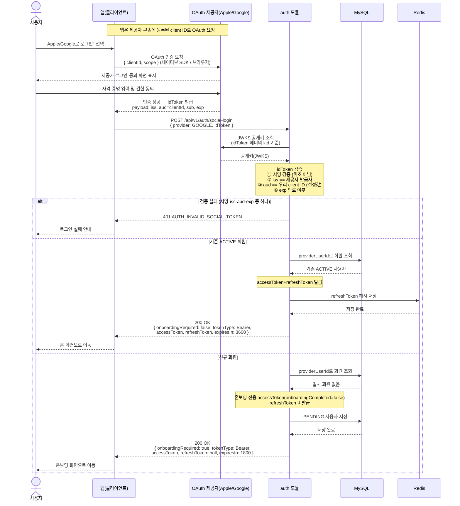

# US-1-1 — 소셜 로그인으로 진입해 서버 토큰 발급받기

> 모듈: 소셜 로그인 · 온보딩 · [유저 스토리](../../../requirements/user-stories.md) · [API 스펙](../../../api/specs/01-auth-onboarding.md)
>
> 참고: 백엔드는 관여하는 **모듈**(이 흐름은 `auth 모듈`)로 표기한다. OAuth 로그인 과정을 보이기 위해 이 다이어그램에 한해 **OAuth 제공자(Apple/Google)** 도 참가자로 둔다.

## 흐름 요약

- 사용자가 "Apple/Google로 로그인"을 선택하면 앱이 OAuth 제공자에 인증을 요청하고(네이티브 SDK/브라우저), 사용자가 제공자 화면에서 로그인·동의하면 앱이 `idToken`을 받는다.
- 앱은 이 `idToken`을 `POST /api/v1/auth/social-login`으로 전달하고, 서버는 **JWKS 공개키로 서명을 검증**한 뒤 클레임 **`iss`(발급자)·`aud`(= 우리 client ID)·`exp`(만료)** 를 검증한다. `aud`가 우리 client ID가 아니면(예: 타 앱에서 받은 토큰) 거부하며, 실패 시 `401 AUTH_INVALID_SOCIAL_TOKEN`.
- `aud`와 대조할 **우리 client ID는 제공자 콘솔(Google Cloud / Apple Developer)에 앱을 등록하면 발급**되는 값이다. 앱은 이 client ID로 OAuth를 요청하고(→ 제공자가 토큰 `aud`에 박아 발급), 백엔드는 같은 값을 설정에 두고 대조한다.
- 검증을 통과하면 MySQL에서 `providerUserId`로 회원을 조회한다. 기존 ACTIVE 회원이면 발급한 **refreshToken 해시를 Redis에 저장**하고 `200 OK`로 access+refresh 토큰과 `onboardingRequired=false`를, 신규면 MySQL에 **PENDING 사용자를 저장**하고 온보딩 전용 access 토큰과 `onboardingRequired=true`(`refreshToken=null`)를 반환한다. 앱은 그 값으로 홈/온보딩 화면을 분기한다.
