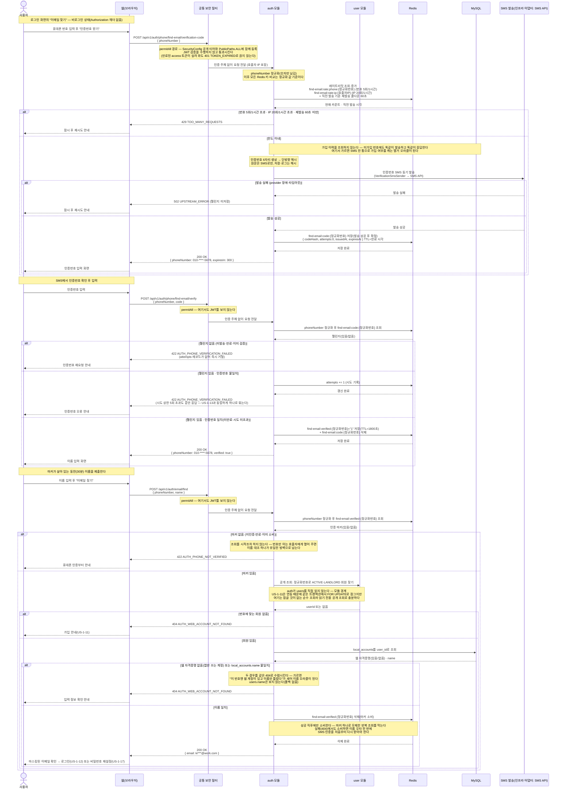

# US-1-16 — 가입한 이메일 찾기 (임대인 웹 전용, 비로그인)

> 모듈: 소셜 로그인 · 온보딩 · [유저 스토리](../../../requirements/user-stories.md) · [API 스펙](../../../api/specs/01-auth-onboarding.md)
>
> 웹 로그인([US-1-12](us-1-12-web-login.md))의 ID인 이메일을 잊은 임대인이 **휴대폰 번호로 자기 계정의 로그인 ID를 되찾는** 흐름이다. 비밀번호 재설정([US-1-17](us-1-17-password-reset.md))과 함께 `local`·`dev`에만 배포한다 — **prod 범위 밖**이다.
>
> **확인 축이 SMS인 이유**: 웹 계정의 다른 축인 이메일은 지금 찾으려는 대상 자체라 쓸 수 없고, `local_accounts`가 소유를 증명해 둔 축은 가입 때 인증한 휴대폰 번호뿐이다. 그래서 발송·확인 두 단계는 가입용 휴대폰 인증([US-1-13](us-1-13-signup-phone-verification.md))과 정책(6자리 · 코드 TTL 5분 · 검증 마커 30분 · 시도 5회 · 재발송 60초)도 발송 포트(`VerificationSmsSender`)도 그대로 재사용하되 **Redis 키 접두사만 `find-email:*`로 가른다** — 가입용 마커(`signup-phone:verified:*`)를 공유하면 이메일 찾기로 받은 인증이 **가입 제출(US-1-11)을 통과시키는** 데 쓰이고, 반대로 가입용 인증이 남의 이메일 조회를 열어 준다. 버킷 하나를 아끼는 대가로 마커의 의미가 무너진다.
>
> **마지막 조회는 이름을 실제로 대조한다.** 번호는 해지 후 재배정되고 SMS 인증은 *지금 그 번호를 들고 있다*는 것만 증명하므로, 번호 하나로 남의 로그인 ID가 나오면 [US-1-17](us-1-17-password-reset.md)의 재설정 링크 요청까지 그대로 이어진다. 대조 대상은 `local_accounts.name` **단독**이며 `users.name` 폴백을 두지 않는다 — 앱 이름(`Kim Imdae`)과 웹 이름(`김임대`)이 다른 것은 정상이고(US-1-11), 둘 중 아무거나 맞으면 통과하게 두면 대조가 있으나 마나 해진다.

## 흐름 요약

- **세 엔드포인트가 전부 permitAll이다.** `POST /api/v1/auth/phone/find-email/verification-code` · `/auth/phone/find-email/verify` · `/auth/email/find` 모두 로그인 전 호출이므로 `SecurityConfig` 공개 티어와 [`PublicPaths.ALL`](../../../../src/main/java/com/kohere/common/security/PublicPaths.java) **두 곳에 함께** 등록한다. 한쪽만 등록하면 만료된 access 토큰이 남은 브라우저에서만 `401 TOKEN_EXPIRED`가 나고 토큰 없이 부르는 로컬·테스트는 전부 초록이라, 잡히지 않은 채 배포된다 — 이미 한 번 겪은 사고 유형이다.
- **키는 정규화한 번호이고 접두사가 용도를 가른다.** 챌린지는 `find-email:code:{정규화번호}`, 마커는 `find-email:verified:{정규화번호}`(TTL 1800초), 한도는 `find-email:rate:phone:*`·`find-email:rate:ip:*`다. 정책값은 US-1-13과 같지만 **버킷을 공유하지 않는다** — 공유하면 한 용도의 인증이 다른 용도의 게이트를 통과시키고, 한도도 서로를 잡아먹는다.
- **발송·확인 단계는 계정 존재를 전혀 드러내지 않는다.** 가입 이력을 조회하지 않고 발송하며, 확인 실패는 챌린지 없음·불일치·만료·시도 상한 초과를 **모두 `422 AUTH_PHONE_VERIFICATION_FAILED` 하나로** 묶는다(US-1-13과 같은 이유 — 응답 차이 자체가 번호별 시도 잔량과 챌린지 존재를 알려주는 신호가 된다).
- **반대로 조회 단계는 존재를 드러낸다(`404`) — 의도한 것이다.** 이 단계는 SMS 마커 뒤에 있어 호출자는 **소유를 증명한 자기 번호**로만 물을 수 있고, 남의 번호를 넣으면 마커가 없어 `422`에서 끊긴다. 열거 표면이 「번호 소유」로 이미 닫혀 있으므로 여기서까지 응답을 뭉개면 "가입을 안 한 것인지, 이름을 틀린 것인지, 인증이 풀린 것인지" 구분이 사라져 정작 본인만 막힌다.
- **이름 불일치와 계정 미존재는 같은 `404`다.** 웹 자격증명이 없는 앱 전용 계정도 같은 `404`로 수렴시킨다. 세 경우를 가르면 번호 소유자가 그 번호로 가입된 **계정의 이름을 한 글자씩 확인**할 수 있게 되고, 이름은 곧 이 흐름의 유일한 방벽이라 그 오라클을 열어 줄 수 없다.
- **번호 → `userId`는 `user` 모듈의 읽기 전용 공개 조회를 거친다.** `auth`가 `users`를 직접 읽지 않는다는 모듈 경계 규칙([ADR-0001](../../../adr/0001-bounded-context-module-decomposition.md))을 새 경로에서 어기지 않기 위해서다. US-1-11이 같은 조회를 `auth`에서 직접 하는 것은 연동을 위해 그 행을 **`FOR UPDATE`로 잠근 채 같은 트랜잭션에서 써야** 하기 때문이고, 이 흐름은 잠글 것도 쓸 것도 없는 순수 조회라 그 예외가 성립하지 않는다.
- **성공했을 때만 마커를 소비한다.** 조회에 성공하면 `find-email:verified:{정규화번호}`를 삭제해 마커 하나로 무제한 반복 조회하는 것을 막는다. 실패에서 소비하지 않는 것도 의도적이다 — 이름 오타 한 번에 SMS 인증을 처음부터 다시 받게 만들면 공격자가 아니라 본인이 못 들어온다(그 대가는 아래 「알려진 제약」).
- **응답 이메일은 마스킹한다.** `ki***@work.com` 형태로만 내려 어깨너머·화면 캡처로 로그인 ID 전체가 새지 않게 한다([error-response-guide §6](../../../api/error-response-guide.md)). 전체 주소가 기억나지 않으면 [US-1-17](us-1-17-password-reset.md)로 넘어가 재설정 메일을 받으면 되므로, 마스킹이 복구를 막지 않는다.
- 인증번호 원문은 저장·로그하지 않고 해시만 보관하며, `phoneNumber`도 응답·로그에서 마스킹(`010-****-5678`)한다.

## 실패 응답 정리

| 경우 | 응답 | 부수효과 |
| --- | --- | --- |
| 번호·IP 한도 초과, 재발송 60초 미만 | `429 TOO_MANY_REQUESTS` | 없음(SMS 미발송, 챌린지 미변경) |
| SMS 발송 실패(provider 장애·타임아웃) | `502 UPSTREAM_ERROR` | **없음 — 챌린지를 저장하지 않는다** |
| 챌린지 없음(미발송·만료·이미 검증) | `422 AUTH_PHONE_VERIFICATION_FAILED` | 없음(올릴 `attempts` 레코드가 없다) |
| 인증번호 불일치 | `422 AUTH_PHONE_VERIFICATION_FAILED` | `attempts += 1` |
| 시도 상한(5회) 초과 | `422 AUTH_PHONE_VERIFICATION_FAILED` | 없음 — **US-1-13과 같이 한 코드로 묶는다** |
| 조회 시 인증 마커 없음(미인증·만료·이미 소비) | `422 AUTH_PHONE_NOT_VERIFIED` | 없음 — **회원 조회를 시작하지 않는다** |
| 번호에 맞는 `ACTIVE`·`LANDLORD` 회원 없음 | `404 AUTH_WEB_ACCOUNT_NOT_FOUND` | 없음 — **마커를 소비하지 않는다** |
| 회원은 있으나 `local_accounts` 행 없음(앱 전용 계정) | `404 AUTH_WEB_ACCOUNT_NOT_FOUND` | 없음 — 같은 응답으로 수렴 |
| `local_accounts.name` 불일치 | `404 AUTH_WEB_ACCOUNT_NOT_FOUND` | 없음 — 같은 응답으로 수렴 |
| 형식 위반(`phoneNumber` 형식 · `code` 6자리 · `name` 누락) | `400 INVALID_INPUT` | 없음(Bean Validation 단계에서 차단) |
| 본문 JSON이 깨짐 | `400 MALFORMED_REQUEST` | 없음 |

## 알려진 제약

- **마커가 살아 있는 30분 동안 이름을 반복 시도할 수 있다.** 실패가 마커를 소비하지 않으므로 이름 추측 오라클이 열려 있다. 대상은 **호출자가 소유를 증명한 그 번호로 가입된 계정 하나**뿐이고 얻는 것도 마스킹된 이메일이라 받아들인다 — 시도 카운터를 마커에 얹는 대안은 오타 한 번에 SMS를 다시 받게 하는 비용이 막는 위험보다 커서 버렸다.
- **번호가 해지·재배정되면 이전 소유자의 계정이 조회 대상이 된다.** 새 소유자가 이름까지 맞혀야 넘어가므로 이름 대조가 유일한 방벽이고, 번호 재배정 사실을 서버가 알 방법은 없다. 통신사 명의 대조 같은 추가 확인 수단은 이번 범위 밖이다.
- **번호 정규화 백필이 없다.** 정규화는 입력 경로에서만 하고 기존 데이터는 손대지 않으므로, `users.phone_number`에 하이픈을 포함해 저장된 기존 임대인 행은 조회에서 누락돼 **정상 계정인데 `404`** 가 날 수 있다(US-1-11·[US-1-15](us-1-15-landlord-account-merge.md)의 매칭 누락과 같은 뿌리다).
- **앱스토어 심사용 고정 인증번호 우회(`FixedVerificationPolicy`)는 이 경로에 적용되지 않는다.** 그 우회는 `userId` + Google 소셜 계정으로 판정하는데 비로그인 경로에는 둘 다 없다(US-1-13과 동일). 로컬 개발에서는 `LoggingVerificationSmsSender`가 콘솔에 인증번호를 찍는다.
- **prod에 배포하지 않는다.** 이번 범위는 `local`·`dev` 한정이라, prod에서 로그인 ID를 잊은 임대인은 여전히 운영 문의로 처리한다.
