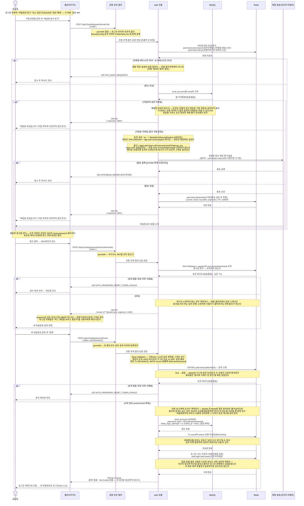

# US-1-17 — 비밀번호 재설정으로 로그인 복구하기 (임대인 웹 전용, 비로그인)

> 모듈: 소셜 로그인 · 온보딩 · [유저 스토리](../../../requirements/user-stories.md) · [API 스펙](../../../api/specs/01-auth-onboarding.md)
>
> 비밀번호를 잊었거나 10회 실패로 잠긴([US-1-12](us-1-12-web-login.md)) 임대인이 **메일로 받은 일회용 링크로 자격증명을 새로 세우는** 흐름이다. **「비밀번호 찾기」와 「계정 잠금 해제」는 화면만 둘이고 API는 하나다** — 잠금 해제란 결국 「본인임을 다시 증명하고 로그인할 수 있는 상태로 되돌리는 것」인데, 해제 전용 API를 따로 두면 비밀번호를 여전히 모르는 사람이 잠금만 풀린 채 다시 10회 틀려 곧바로 잠긴다. 해제와 재설정을 한 동작으로 묶어야 복구가 실제로 끝난다.
>
> **요청은 이메일 하나만 받는다.** 이름을 같이 받아도 방벽이 늘지 않는다 — 이 흐름의 유일한 실질 관문은 **그 메일함을 열 수 있는가**이고, 이름은 메일함을 여는 사람에게는 이미 아는 값이고 못 여는 사람에게는 어차피 소용이 없다. 반대로 이메일 찾기([US-1-16](us-1-16-find-email.md))는 SMS 인증 뒤에서도 번호 재배정이라는 구멍이 남아 이름 대조가 필요했다 — 두 흐름의 입력이 다른 이유다.
>
> 토큰은 **일회용 불투명 토큰**이다. 서명 토큰(JWT)을 쓰면 발급 후 무효화할 수단이 없어 「한 번 쓰면 죽는다」를 만들 수 없다. 형식은 `"pr_" + Base64Url(SecureRandom 32바이트)`로 refresh(`rt_`)와 같은 모양이고, 서버는 **`SHA-256(token + pepper)` 해시만** Redis에 30분 TTL로 보관한다(pepper는 기존 `app.auth.email-pepper` 재사용 — 새 시크릿을 배선하지 않는다). Redis가 통째로 새도 링크를 복원할 수 없다.
>
> **prod 범위 밖이다.** `app.auth.web.password-reset.enabled`가 base `false`이고 `local`·`dev`만 `true`이며, **토글이 켜졌을 때만** 기동 시 `app.web.base-url` 형식을 검증한다 — 값이 빈 채로 켜지면 메일에 깨진 링크가 나가고, 그 사실은 메일을 받은 사용자만 알게 된다.

## 흐름 요약

- **세 엔드포인트가 전부 permitAll이다.** `POST /api/v1/auth/password/reset-link` · `/auth/password/reset-token/verify` · `/auth/password/reset` 모두 로그인 전(또는 잠긴 채) 호출되므로 `SecurityConfig` 공개 티어와 [`PublicPaths.ALL`](../../../../src/main/java/com/kohere/common/security/PublicPaths.java)에 **함께** 등록한다. 한쪽만 넣으면 만료된 access 토큰이 남은 브라우저에서만 `401 TOKEN_EXPIRED`가 나는데, 정작 이 흐름을 찾는 사람이 바로 그 브라우저를 쓰고 있는 사람이다.
- **「비밀번호 찾기」와 「계정 잠금 해제」는 같은 API다.** 진입 화면만 둘이고 요청·응답·부수효과가 완전히 같다. 재설정 확정이 `password_hash`를 바꾸면서 **`failed_login_attempts = 0`과 `locked_at = NULL`을 같은 UPDATE에서** 처리하므로, 잠긴 계정은 이 경로 하나로 복구된다([US-1-12](us-1-12-web-login.md)의 잠금 정책을 이 문서가 완결한다). 잠금 해제 전용 API·화면을 만들지 않는 이유는 위 리드 문단에 있다.
- **가입되지 않은 이메일도 같은 `200`을 받는다.** 토큰도 만들지 않고 메일만 보내지 않을 뿐, status·본문·문구가 가입 계정과 동일하다. 이 경로에는 SMS 마커 같은 선행 게이트가 없어 임의의 이메일 목록을 그대로 밀어 넣을 수 있고, 응답을 가르면 그 자체가 **완전한 계정 열거 오라클**이 된다. 이메일 찾기([US-1-16](us-1-16-find-email.md))의 조회가 `404`로 존재를 드러내도 되는 것은 그쪽에 마커 게이트가 있기 때문이다 — 게이트가 없는 이 경로에 같은 규칙을 복사하면 안 된다.
- **링크 base URL은 설정값이며 요청 헤더로 조립하지 않는다.** `Host`·`X-Forwarded-Host`는 호출자가 자유롭게 채워 보낼 수 있으므로, 그것으로 링크를 만들면 공격자가 자기 도메인이 박힌 재설정 메일을 **피해자 주소로** 보내고 클릭 한 번에 토큰을 회수한다(호스트 헤더 포이즈닝 계정 탈취). 그래서 `app.web.base-url`만 쓰고, 값이 비면 기능을 켤 수 없게 기동 시 검증한다.
- **토큰은 해시로만 남고 소비는 원자적이다.** 저장 키는 `pwd-reset:{tokenHash}`이고 값은 `userId`·`email`·발급·만료 시각이다. 확정 단계는 `GETDEL`(또는 Lua) 한 연산으로 읽고 지운다 — `find → 검증 → delete`로 나누면 같은 링크를 두 번 클릭하거나 두 창에서 동시에 제출했을 때 둘 다 통과한다.
- **사전 확인(`reset-token/verify`)은 토큰을 소비하지 않는다.** 메일 클라이언트·회사 보안 게이트웨이가 본문 링크를 미리 여는 것은 예외가 아니라 기본 동작에 가깝고, 소비형으로 만들면 **사용자가 클릭하기 전에 링크가 죽어** 재설정이 영원히 안 되는 계정이 생긴다. 대신 이 단계는 마스킹된 이메일과 **남은 초**(`expiresIn`)를 돌려줘 화면이 "어느 계정을, 언제까지" 바꿀 수 있는지 보여준다.
- **확정의 처리 순서는 계약이다 — 토큰 소비 → 비밀번호 교체(MySQL) → refresh 전량 무효화(Redis) → 로그인 시도 카운터 삭제(Redis).** MySQL과 Redis에 걸친 원자성은 만들 수 없으므로, 중간에 끊겼을 때 남는 상태가 **「토큰만 소비됨 = 링크만 다시 받으면 된다」** 가 되도록 소비를 맨 앞에 둔다. 반대로 비밀번호부터 바꾸면 교체와 소비 사이가 토큰 재사용 창이고, 그 창이 열려 있는 동안 링크를 손에 넣은 제3자가 다시 쓸 수 있다.
- **refresh 전량 무효화가 순서상 비밀번호 교체 바로 뒤인 이유.** 재설정을 하는 이유의 절반은 "누가 내 계정을 쓰고 있다"이고, 비밀번호만 바꾸고 세션을 남기면 탈취자의 refresh가 회전으로 **14일 더** 살아남는다. 잠금 카운터 삭제보다 앞에 두는 것은 이쪽이 보안이고 저쪽이 편의라, 하나만 성공한다면 보안 쪽이 성공해야 하기 때문이다.
- **마지막 단계는 로그인 시도 레이트리밋 카운터를 지운다 — 단 이메일 축 하나만.** 10회 틀려 잠긴 사람은 이미 `web-login:rate:email:{소문자이메일}`(20회/시간)의 절반을 태웠다. 지우지 않으면 새 비밀번호를 쥐고도 로그인 화면에서 `429`를 맞는다 — 복구를 끝내 놓고 문 앞에서 막는 셈이다. **IP 축(`web-login:rate:ip:*`)은 지우지 않는다**: 이메일 축은 방금 토큰으로 메일함 소유를 증명한 **그 계정 하나**에 매인 카운터라 비워도 새는 것이 없지만, IP 축은 **그 IP를 쓰는 모든 호출자가 공유**한다. 재설정 완주로 IP 예산이 초기화되면 계정 하나를 가진 공격자가 자기 계정을 재설정하는 것만으로 **남의 계정을 향한 시도 예산을 원하는 만큼 되살릴 수 있다**. IP 축이 `X-Forwarded-For` 위조로 이미 반쯤 우회되는 비용 가드인 것은 사실이지만, 불완전한 가드에 **정식 초기화 버튼**을 달아 주는 것은 다른 문제다.
- **성공 응답은 `204`이고 새 세션을 발급하지 않는다.** refresh 쿠키를 싣지 않고 로그인 화면으로 보낸다. 링크 하나가 곧바로 로그인 세션이 되면 **메일 열람 = 즉시 계정 접근**이 되어 방금 무효화한 세션을 스스로 다시 열어 주는 셈이고, 새 비밀번호로 한 번 로그인하게 하는 편이 사용자에게도 "무엇이 바뀌었는지"를 확인시킨다.
- **SMTP 타임아웃 3종을 이번에 처음 설정한다.** `connectiontimeout`·`timeout`·`writetimeout`이 지금 전부 미설정(무한 대기)이라, 메일 서버가 응답하지 않으면 **permitAll 경로가 요청 스레드를 무한정 물고 있다**. 각 5초를 걸어 실패를 `502 UPSTREAM_ERROR`로 빨리 확정한다.

## 실패 응답 정리

| 경우 | 응답 | 부수효과 |
| --- | --- | --- |
| 이메일 5회/시간 또는 IP 20회/시간 초과 | `429 TOO_MANY_REQUESTS` | 없음(조회·발송 전에 끊는다) |
| 가입되지 않은 이메일 | **`200 OK`** · `{ expiresIn: 1800 }` | **없음 — 메일도 토큰도 없다**(가입 계정과 같은 응답) |
| 메일 발송 실패(provider 장애·타임아웃) | `502 UPSTREAM_ERROR` | **없음 — 토큰을 저장하지 않는다** |
| 사전 확인 시 토큰 없음·만료·이미 사용됨 | `422 AUTH_PASSWORD_RESET_TOKEN_INVALID` | 없음 — **유효해도 소비하지 않는다** |
| 확정 시 토큰 없음·만료·이미 사용됨 | `422 AUTH_PASSWORD_RESET_TOKEN_INVALID` | 없음(`GETDEL`이 빈 값을 돌려준 것) |
| 새 비밀번호가 정책 위반 | `400 INVALID_INPUT` (`errors[].field=newPassword`) | **없음 — 검증이 토큰 소비보다 먼저다** |
| `token`·`email` 누락, 이메일 형식 위반 | `400 INVALID_INPUT` | 없음(Bean Validation 단계에서 차단) |
| 본문 JSON이 깨짐 | `400 MALFORMED_REQUEST` | 없음 |

> **비밀번호 정책 검증이 토큰 소비보다 먼저인 것이 중요하다.** 순서를 뒤집으면 오타 하나(예: 7자 입력)에 토큰이 소비돼 링크를 다시 받아야 하고, 사용자는 자기가 무엇을 잘못했는지도 모른 채 메일함을 두 번 오간다.

## 알려진 제약

- **응답 시간과 status 분포로 계정 존재가 드러난다.** 본문·status는 같아도 가입 계정은 SMTP 왕복 시간이 걸리고 발송 실패 시 `502`가 나가는 반면, 미가입은 즉시 `200`이다. 비동기 발송으로 옮기면 시간 차는 사라지지만 `502`를 사용자에게 알려 줄 방법도 함께 사라져, 「메일을 보냈다」고 해 놓고 실제로 못 보낸 경우를 누구도 알 수 없게 된다. 이번 범위에서는 동기 발송을 유지하고 **이 노출을 받아들인다** — 레이트리밋은 발송비·남용 방어일 뿐 이 구멍의 완화책이 아니다.
- **공유 IP에서는 복구 직후에도 `429`가 날 수 있다.** 마지막 단계가 이메일 축만 비우므로, 같은 출구 IP(사무실·모바일 NAT)에서 이미 시간당 60회를 태운 창에서는 재설정을 마쳐도 로그인이 막힌다. 그래도 IP 축을 비우지 않는 이유는 위 처리 순서 항목에 적었다 — 창은 한 시간이면 지나가고, 그 불편은 공유 IP 한도의 정상 동작이다.
- **사전 확인은 토큰을 소비하지 않으므로 대입 표면이 된다.** 유효한 토큰을 찾을 때까지 두드릴 수 있고 별도 레이트리밋도 두지 않는다 — `SecureRandom` 32바이트라 추측 비용이 성립하지 않는다는 데 기댄다.
- **한 계정에 여러 링크가 동시에 살아 있을 수 있다.** 키가 `pwd-reset:{tokenHash}`라 새 링크를 발급해도 이전 링크가 죽지 않는다(먼저 쓰는 쪽이 이기고 나머지는 TTL로 소멸한다). 계정당 최신 하나만 남기려면 이메일 → 토큰 역인덱스가 필요한데, 30분 TTL과 시간당 5회 한도면 동시 생존 수가 애초에 묶여 있어 그 복잡도를 사지 않았다.
- **확정 도중 Redis 단계가 실패하면 응답과 실제 상태가 어긋난다.** 비밀번호 교체까지 끝난 뒤 무효화·카운터 삭제에서 터지면 **새 비밀번호는 이미 유효한데** 사용자는 오류 화면을 보고, 같은 링크로 재시도해도 토큰이 이미 소비돼 `422`다. 남는 위험은 옛 refresh가 최대 14일 살아 있는 것이며, 사용자는 새 비밀번호로 그냥 로그인하면 된다. 「토큰만 소비되고 비밀번호는 안 바뀜」쪽이 더 흔하고 덜 위험하도록 순서를 잡은 결과다.
- **메일함 접근이 곧 계정 접근이다.** 메일 계정이 털린 임대인은 이 경로로 계정을 통째로 넘겨준다. 일회용·30분 TTL·기존 세션 전량 무효화·마스킹 표시가 피해 창을 줄일 뿐 구조 자체는 바꾸지 못한다 — 링크 토큰 방식의 고전적 한계이며, 2단계 인증은 이번 범위 밖이다.
- **토큰 원문은 메일 본문에 평문으로 남는다.** 서버는 해시만 보관하지만 메일함·중계 서버 로그에는 링크가 그대로 남아 있고, 30분이 지나기 전에 그 메일을 읽을 수 있는 사람은 누구나 쓸 수 있다.
- **prod에 배포하지 않는다.** 토글이 `local`·`dev`에서만 켜지므로 **prod의 잠긴 계정에는 아직 이 복구 경로가 없다** — 그때까지는 운영자가 DB에서 `locked_at`을 비우는 것이 유일한 수단이다([US-1-12](us-1-12-web-login.md) 「알려진 제약」).
