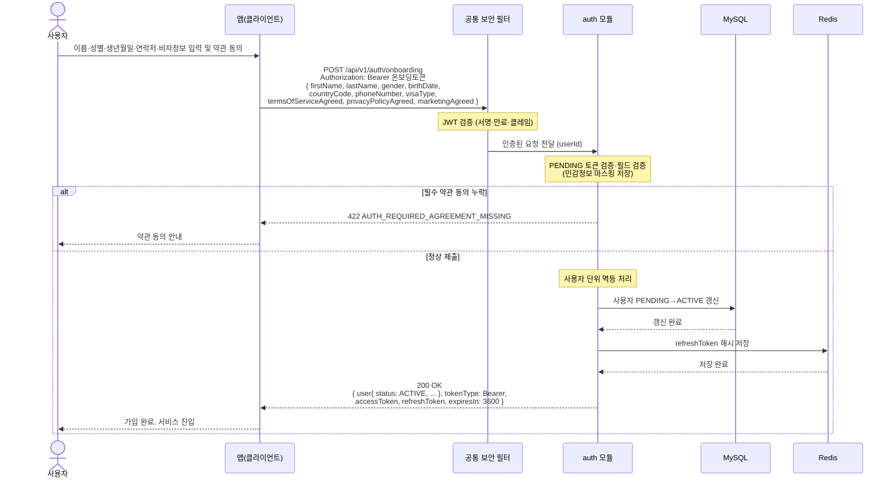

# US-1-2 — 필수 온보딩 정보·약관 동의 제출하기

> 모듈: 소셜 로그인 · 온보딩 · [유저 스토리](../../../requirements/user-stories.md) · [API 스펙](../../../api/specs/01-auth-onboarding.md)

## 흐름 요약

- PENDING 사용자가 온보딩 토큰으로 필수 프로필과 약관 동의를 담아 `auth 모듈`의 `POST /api/v1/auth/onboarding`을 호출하며, 공통 보안 필터(SEC)가 컨트롤러 앞단에서 JWT를 검증한 뒤 모듈로 전달한다.
- 필수 약관(`termsOfServiceAgreed`/`privacyPolicyAgreed`) 미동의면 `422 AUTH_REQUIRED_AGREEMENT_MISSING`으로 거절한다.
- 정상이면 **MySQL에서 사용자 상태를 PENDING→ACTIVE로 갱신하고 Redis에 refreshToken 해시를 저장**한 뒤 `200 OK`로 완성 프로필과 정식 access/refresh 토큰을 발급한다.
