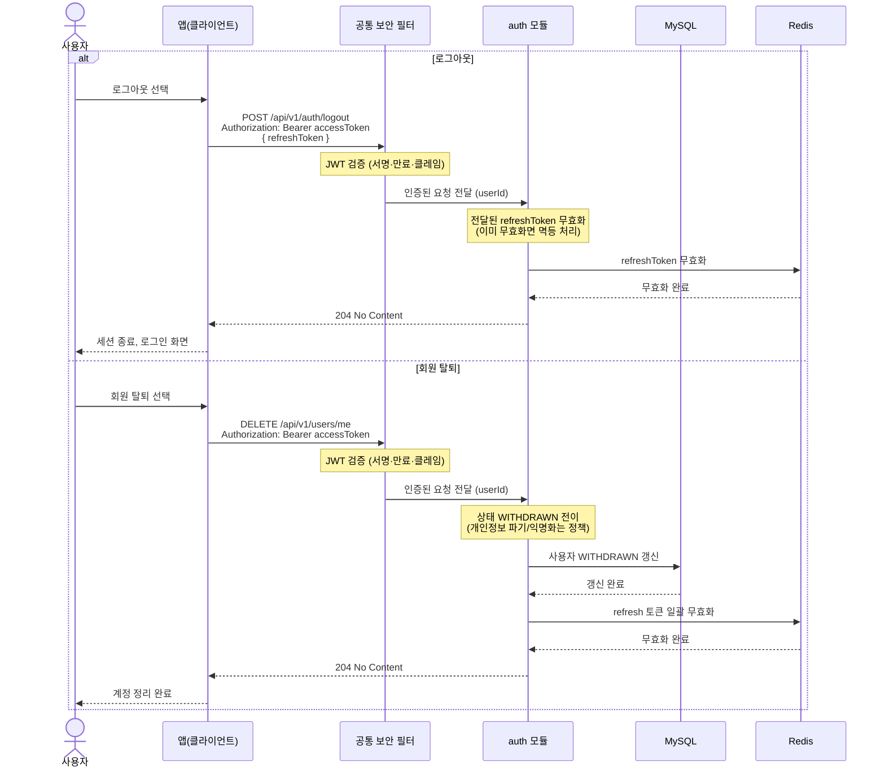

# US-1-4 — 로그아웃·회원 탈퇴로 세션과 계정 정리하기

> 모듈: 소셜 로그인 · 온보딩 · [유저 스토리](../../../requirements/user-stories.md) · [API 스펙](../../../api/specs/01-auth-onboarding.md)

## 흐름 요약

- 로그아웃은 access 토큰으로 `auth 모듈`의 `POST /api/v1/auth/logout`에 `refreshToken`을 담아 호출하면 Redis에서 해당 **refreshToken을 무효화**하고 `204 No Content`를 반환한다(이미 무효화면 멱등).
- 회원 탈퇴는 `auth 모듈`의 `DELETE /api/v1/users/me` 호출 시 MySQL에서 **사용자 상태를 WITHDRAWN으로 갱신**하고 Redis에서 **모든 refresh 토큰을 일괄 무효화**한 뒤 `204 No Content`를 반환한다.
- 두 동작 모두 인증 필수이며, 공통 보안 필터(SEC)가 컨트롤러 앞단에서 JWT를 검증한 뒤 모듈로 전달한다. PENDING 사용자도 탈퇴는 허용된다.
