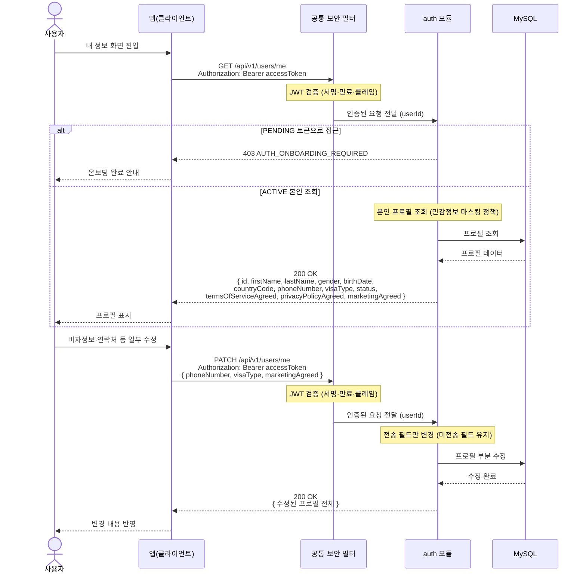

# US-1-5 — 내 프로필 조회·수정하기

> 모듈: 소셜 로그인 · 온보딩 · [유저 스토리](../../../requirements/user-stories.md) · [API 스펙](../../../api/specs/01-auth-onboarding.md)

## 흐름 요약

- ACTIVE 사용자가 `auth 모듈`의 `GET /api/v1/users/me`로 본인 프로필(이름·성별·생년월일·연락처·`visaType`·약관 동의 상태)을 MySQL에서 **프로필 조회**해 `200 OK`로 반환하며, 공통 보안 필터(SEC)가 컨트롤러 앞단에서 JWT를 검증한 뒤 모듈로 전달한다.
- 온보딩 미완료(PENDING) 토큰으로 접근하면 `403 AUTH_ONBOARDING_REQUIRED`를 반환한다.
- `auth 모듈`의 `PATCH /api/v1/users/me`에 변경 필드만 담아 보내면 미전송 필드는 유지한 채 MySQL에서 **프로필을 부분 수정**한 뒤 `200 OK`로 수정된 프로필을 반환한다.
