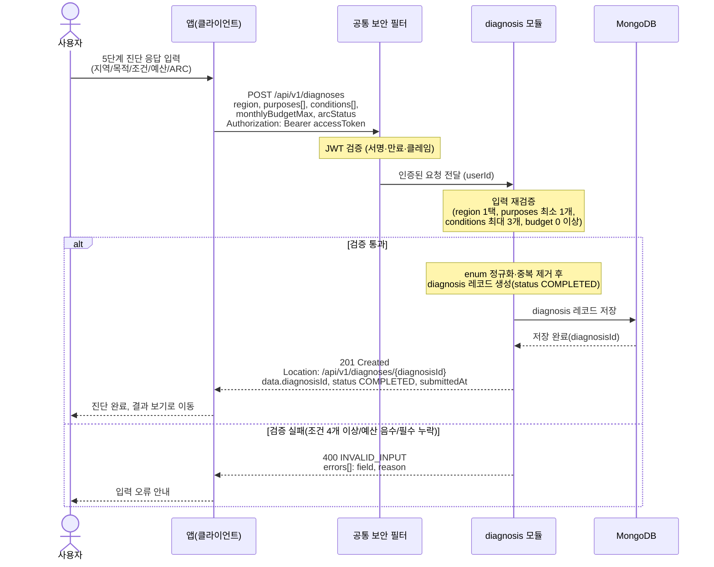

# US-2-1 — 5단계 진단 제출 및 저장

> 모듈: 맞춤 진단 & 매물 추천 · [유저 스토리](../../../requirements/user-stories.md) · [API 스펙](../../../api/specs/02-diagnosis-recommendation.md)

## 흐름 요약

- 사용자가 입력한 5단계 응답을 `POST /api/v1/diagnoses`로 제출하면 공통 보안 필터(SEC)가 컨트롤러 앞단에서 JWT를 검증한 뒤 diagnosis 모듈로 전달하고, diagnosis 모듈이 입력을 재검증한다.
- 검증 통과 시 diagnosis 모듈이 새 진단 레코드(status `COMPLETED`)를 MongoDB에 저장하고 `201 Created` + `Location` 헤더와 `diagnosisId`를 반환한다.
- 조건 4개 이상·예산 음수·필수값 누락 등은 `400 INVALID_INPUT` + `errors[]`로 응답한다.
