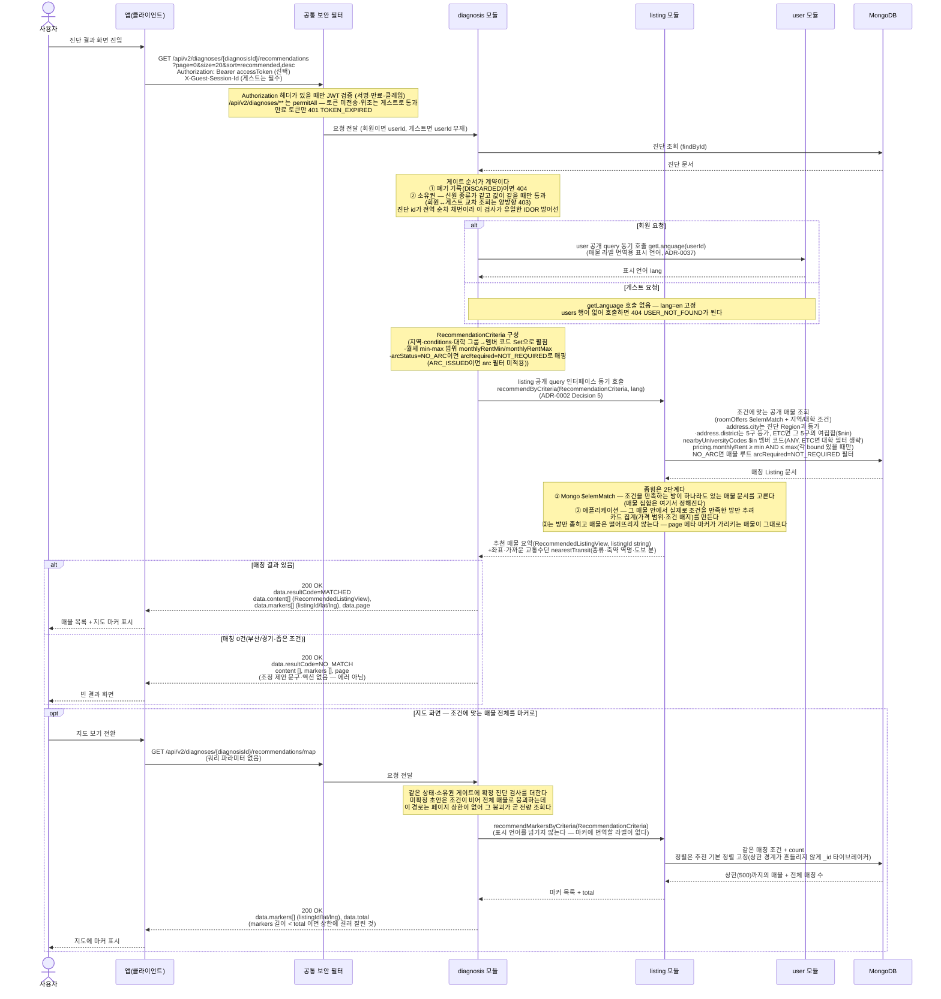

# US-2-2 — 진단 결과(추천 매물 + 지도 마커) 조회

> 모듈: 맞춤 진단 & 매물 추천 · [유저 스토리](../../../requirements/user-stories.md) · [API 스펙](../../../api/specs/02-diagnosis-recommendation.md)

## 흐름 요약

- `GET /api/v2/diagnoses/{diagnosisId}/recommendations`로 본인 진단 조건에 맞는 매물과 지도 마커를 조회한다(공통 보안 필터(SEC)가 컨트롤러 앞단을 지나고, diagnosis 모듈이 상태·소유권을 확인, 기본 정렬 `recommended,desc`). **이 호출 자체가 "매물을 받겠다"는 클라이언트의 결정**이며 조회 시점·페이지·정렬을 클라이언트가 정한다([us-2-7](us-2-7-v2-server-driven-flow.md)).
- diagnosis 모듈이 MongoDB에서 진단 조건을 조회한 뒤 `RecommendationCriteria`(지역·`conditions`·대학 멤버 코드·월세 min-max 범위·`arcStatus`) 값객체를 만들어 listing 모듈의 **공개 query 인터페이스를 동기 호출**한다(`recommendByCriteria`, ADR-0002 Decision 5). 선택된 `UniversityGroup`은 diagnosis가 `includedUniversityCodes: Set<String>`으로 펼쳐 전달하고(`ETC`는 목록 전체를 `excludedUniversityCodes`로 넘겨 여집합 매칭), 월세는 `monthlyRentMin`/`monthlyRentMax`(nullable)로 전달한다. ⑥ `arcStatus=NO_ARC`면 listing이 매물 루트 `arcRequired=NOT_REQUIRED`로 거르고 `ARC_ISSUED`면 arc 필터를 걸지 않는다. 진단과 매물은 값 집합을 일치시키지 않고 **매핑**으로 잇는다([ADR-0039](../../../adr/0039-listing-schema-v4-registration-form.md)) — 진단 `Region`과 매물 `address.city`는 등가 비교, `district`는 5구가 등가이고 `ETC`는 그 5구의 여집합(`$nin`)이다. listing은 공개 건물 매물 중 같은 ACTIVE `roomOffers[]` 원소가 조건과 월세 범위를 만족하도록 `$elemMatch`하고, 추천 전용 요약 `RecommendedListingView`를 반환하며, 카드에 표시할 가까운 교통수단 `nearestTransit`(종류·이름·도보 소요 시간)을 함께 싣는다(역명은 매물 목록 카드와 같은 축약 표기다). 응답의 가격 범위·조건 배지는 진단 조건(월세 범위·주거 조건 태그)을 통과한 ACTIVE 방 상품만을 기준으로 계산한다 — 조건에 맞는 방이 있어 매칭된 매물이어도 조건에 맞지 않는 방의 가격·태그는 카드에 실리지 않는다. 이 좁힘은 표시 값에만 적용되고 매물을 고르는 조건은 바꾸지 않는다 — 목록과 지도 마커는 같은 조건으로 매물을 고르되, 한 페이지에는 `size`만큼만 실려 마커 전체와 같은 매물이 담기지는 않는다.
- 결과가 있으면 `200 OK` + `resultCode=MATCHED`·`content[]`(`RecommendedListingView`)·`markers[]`(listingId/lat/lng)·`page` 메타를, **0건이면 `resultCode=NO_MATCH` + 빈 목록**을 동일하게 `200 OK`로 반환한다(에러가 아니며 **조정 제안 문구·액션은 주지 않는다**). 정렬 키는 `recommended`·`price` 둘뿐이다 — `recommended`는 찜 수 내림차순 + 최근 수정 내림차순(`favoriteCount desc, updatedAt desc`)의 기본 정렬이고, `price`는 진단 조건을 통과한 방의 최저 월세 오름차순으로 카드의 `monthlyRentMin`과 같은 값이다. 방향 접미사(`,asc`/`,desc`)는 두 키 모두에서 무시되며, `distance`처럼 허용 목록에 없는 키는 `400 INVALID_INPUT`이다.
- 타인 진단은 `403 FORBIDDEN`, 없는 진단과 폐기 기록은 `404 DIAGNOSIS_NOT_FOUND`로 처리된다.
- **회원·비회원 모두 호출한다**(#181): `permitAll` 매처의 대상이 `/api/v2/diagnoses/**`라 토큰 없이도 도달하며, 게스트는 `POST /api/v2/diagnoses/start`가 발급한 세션 키를 `X-Guest-Session-Id`로 에코해 소유를 증명한다. **응답 계약은 신원과 무관하게 같고** 게스트는 label 언어만 `en`이다.
- `getLanguage` 호출은 **회원 요청에서 매 요청 한 번**이다 — 공유 `DiagnosisRecommendationReader`가 매물 라벨 번역용 표시 언어를 `recommendByCriteria(criteria, language)`에 넘기느라 매칭 유무와 무관하게 부른다([ADR-0037](../../../adr/0037-listing-localization-and-code-catalog.md)). **게스트는 부르지 않는다** — `users` 행이 없어 호출 자체가 `404 USER_NOT_FOUND`가 되므로 분기의 요점은 기본값이 아니라 호출 회피다.
- **지도 화면은 마커 전용 경로를 쓴다** — `GET /api/v2/diagnoses/{diagnosisId}/recommendations/map`은 페이지 없이 `markers[]`·`total`만 준다(매물 카드 정보는 상세에서 가져간다). 매칭 조건은 위 목록 조회와 **완전히 동일**하고, 표시 언어를 listing에 넘기지 않는다(마커에 번역할 라벨이 0개다). **상한은 500건이고 초과분은 잘라서 준다** — 진단은 조건이 고정이라 사용자가 범위를 좁힐 수단이 없어 `400`으로 끊지 않는다(매물 지도 조회는 bbox가 있어 끊는다). 잘렸는지는 `markers` 길이와 `total`을 비교해 안다. 이 경로만 **확정 진단을 요구**한다(미확정 404) — 페이지 상한이 없어 조건이 빈 초안이 곧 전량 조회가 되기 때문이다.
- 소유권 검사는 **신원 종류가 같고 값이 같을 때만** 통과한다 — 게스트가 만든 진단(`userId` 비어 있음)을 회원 토큰으로 조회해도 `403`이고 그 반대도 같다. 진단 id가 전역 순차 채번이라 이 검사가 유일한 IDOR 방어선이다. 소유권 판정에 `listing` 모듈은 관여하지 않는다 — `recommendByCriteria`가 애초에 신원(userId)을 받지 않는다(표시 언어는 신원이 아니라 문자열로 넘어간다).
