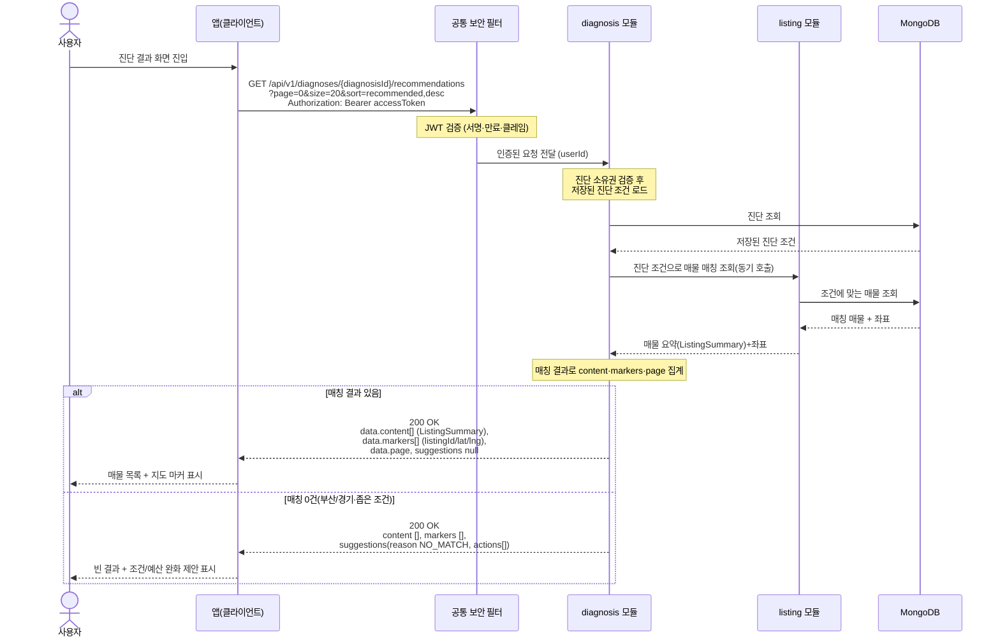

# US-2-2 — 진단 결과(추천 매물 + 지도 좌표) 조회

> 모듈: 맞춤 진단 & 매물 추천 · [유저 스토리](../../../requirements/user-stories.md) · [API 스펙](../../../api/specs/02-diagnosis-recommendation.md)

## 흐름 요약

- `GET /api/v1/diagnoses/{diagnosisId}/recommendations`로 본인 진단 조건에 맞는 매물과 지도 좌표를 조회한다(공통 보안 필터(SEC)가 컨트롤러 앞단에서 JWT를 검증한 뒤 diagnosis 모듈로 전달하고, diagnosis 모듈이 소유권을 확인, 기본 정렬 `recommended,desc`).
- diagnosis 모듈이 MongoDB에서 진단 조건을 조회한 뒤 listing 모듈을 동기 호출(`진단 조건으로 매물 매칭 조회`)하고, listing 모듈은 MongoDB에서 조건에 맞는 매물을 조회해 매물 요약(`ListingSummary`)과 좌표를 반환하며 diagnosis 모듈이 결과를 집계한다.
- 결과가 있으면 `200 OK` + `content[]`(매물 요약)·`markers[]`(listingId/lat/lng)·`page` 메타를, 0건이면 빈 목록 + `suggestions`(조정 제안)를 동일하게 `200 OK`로 반환한다.
- 타인 진단은 `403 FORBIDDEN`, 없는 진단은 `404 DIAGNOSIS_NOT_FOUND`로 처리된다.
