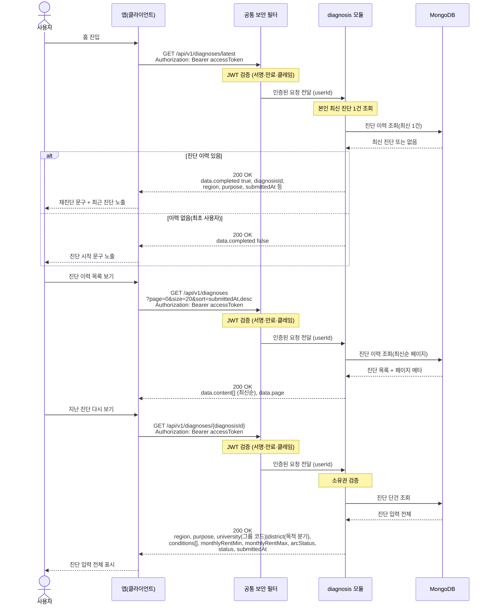

# US-2-3 — 진단 이력 조회 및 최근 진단 다시 보기

> 모듈: 맞춤 진단 & 매물 추천 · [유저 스토리](../../../requirements/user-stories.md) · [API 스펙](../../../api/specs/02-diagnosis-recommendation.md)

## 흐름 요약

- 홈에서 `GET /api/v1/diagnoses/latest`로 diagnosis 모듈이 MongoDB에서 최신 1건을 조회해 `completed` 값으로 "진단 시작/재진단" 문구를 분기한다(이력 없음도 `200 OK`). 모든 요청은 공통 보안 필터(SEC)가 컨트롤러 앞단에서 JWT를 검증한 뒤 모듈로 전달한다.
- `GET /api/v1/diagnoses`로 diagnosis 모듈이 MongoDB에서 진단 이력을 최신순(`submittedAt,desc`) 오프셋 페이지네이션으로 조회한다.
- `GET /api/v1/diagnoses/{diagnosisId}`로 diagnosis 모듈이 소유권을 검증한 뒤 MongoDB에서 본인 소유 진단의 입력 전체(6단계 — `region`/`purpose`/대학·지역 선택(목적 분기 `university`(그룹 코드)|`district`)/`conditions`/월세 범위 `monthlyRentMin`·`monthlyRentMax`/`arcStatus`)를 조회해 다시 본다(타인 `403 FORBIDDEN`, 부재·폐기 기록·미확정 진단 `404 DIAGNOSIS_NOT_FOUND` — 상태 검사가 소유권 검사보다 먼저 돌아, 타인의 폐기·미확정 진단도 존재를 드러내지 않고 404다).
- **읽는 대상은 서버 주도 흐름([us-2-7](us-2-7-v2-server-driven-flow.md))이 확정해 `diagnoses`에 저장한 진단이다** — 진단을 시작하고 문항에 답하고 확정하는 경로는 이 다이어그램에 없다.
- **이 세 조회는 회원 전용이다**(#181): `permitAll` 매처의 대상은 `/api/v2/diagnoses/**` 하나이고 이 세 경로에는 매처를 두지 않으므로 토큰 없이 호출하면 그대로 `401 UNAUTHENTICATED`다 — 그래서 위 다이어그램에 게스트 분기가 없다. **게스트용 이력·최근 시맨틱을 새로 정의하지 않는다** — 게스트 세션 키가 `/start`마다 새로 발급돼 한 키에 달리는 종료 진단이 최대 1건이라 이력이라는 개념이 성립하지 않고, 게스트 진단은 `userId`가 없어 사용자 id 기준 질의에 애초에 걸리지 않는다. 게스트가 나중에 로그인해도 게스트 진단이 이 이력에 합쳐지지 않는다(게스트→회원 결과 이관은 #181 범위 밖이다).
- 단건 상세의 소유권 검사(`requireOwner`)는 **신원 종류가 같고 값이 같을 때만** 통과하도록 확장되므로, v2에서 게스트가 만든 진단(`userId` 비어 있음)은 회원 토큰으로도 열리지 않는다 — 진단 id가 전역 순차 채번이라 이 검사가 유일한 IDOR 방어선이다.
