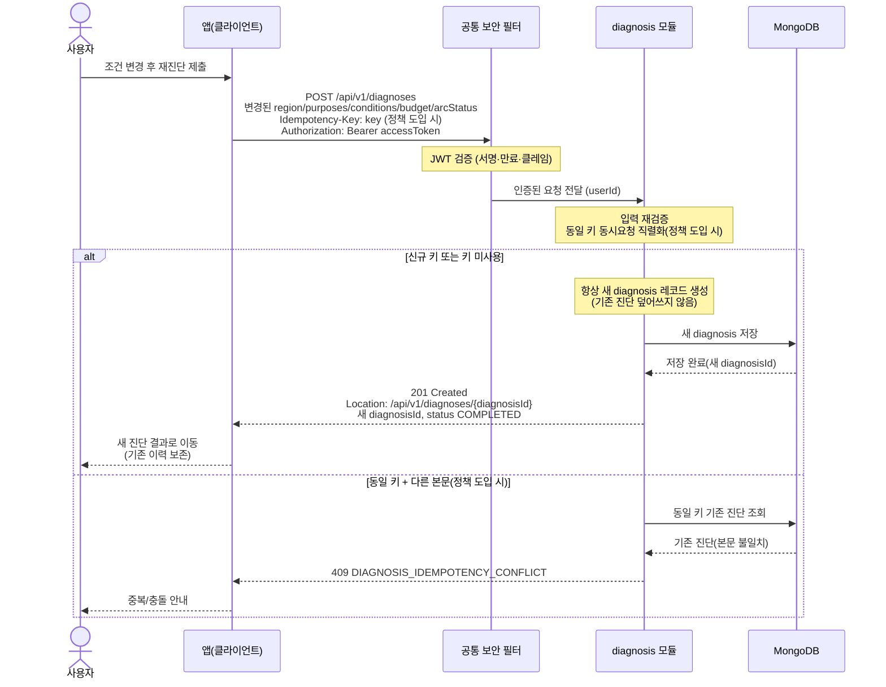

# US-2-4 — 재진단(새 진단 생성)과 중복 제출 방지

> 모듈: 맞춤 진단 & 매물 추천 · [유저 스토리](../../../requirements/user-stories.md) · [API 스펙](../../../api/specs/02-diagnosis-recommendation.md)

## 흐름 요약

- 재진단도 US-2-1과 동일한 `POST /api/v1/diagnoses`이며, 공통 보안 필터(SEC)가 컨트롤러 앞단에서 JWT를 검증한 뒤 diagnosis 모듈로 전달하고 diagnosis 모듈이 항상 새 diagnosis를 MongoDB에 저장해 새 `diagnosisId`를 발급하며 기존 진단을 덮어쓰지 않고 이력을 보존한다(`201 Created`). 멱등 충돌 판정 시에는 동일 키의 기존 진단을 MongoDB에서 조회한다.
- 더블탭·재시도 중복 방지를 위해 diagnosis 모듈이 `Idempotency-Key` 헤더를 검토하며, 동일 키 동시 제출은 1건만 생성하고 같은 결과를 반환한다(정책 미확정 — 확인 필요).
- 동일 키 + 다른 본문은 `409 DIAGNOSIS_IDEMPOTENCY_CONFLICT`로 응답한다(정책 도입 시).
