# US-2-7 (v2) — 서버 주도 진단 흐름 + 지역 매물 부재 시 재질의·종료

> 모듈: 맞춤 진단 & 매물 추천 · [유저 스토리](../../../requirements/user-stories.md) · [API 스펙](../../../api/specs/02-diagnosis-recommendation.md) · 결정: [ADR-0036](../../../adr/0036-diagnosis-v2-server-driven-flow.md)
>
> **범위**: 기존 v1(`/api/v1/diagnoses/*`, 클라이언트가 `step`을 지정하는 흐름)은 그대로 두고, **서버 주도 대화형 흐름을 `/api/v2`로 신설**한다(issue #157). **서버는 질문과 분기만 주도한다** — 클라이언트가 **`POST /api/v2/diagnoses/start`** 로 진단을 시작하고 **`POST /api/v2/diagnoses/next`** 로 답을 이어 보내면, 서버가 **직전에 낸 문항**(`pendingField`)에서 다음 질문·확정 시점을 판단한다. ① 지역 답 직후 매칭 매물이 0건이면 서버가 예외적으로 미리 필터링해 **"다른 지역 방을 찾아보시겠어요?"** 문항(카탈로그의 일반 질문 `field=regionRetry`)을 끼워 넣고, **"예" → `RESTART`(클라가 `/start`로 처음부터 재시도) / "아니오" → `TERMINATED`(진단 종료)**. 6단계가 다 채워지면 서버가 **자동 확정**하고 `COMPLETED`와 **`diagnosisId`만** 반환한다 — 이때 **매칭 유무조차 확인하지 않는다**(그러려면 클라가 요청한 적 없는 추천 쿼리를 돌려야 한다). **추천 매물은 클라이언트가 정한 시점에 `GET /api/v2/diagnoses/{id}/recommendations`로 별도 조회**하며, **매칭 0건은 그 응답의 `resultCode: NO_MATCH`로 드러난다**(흐름 응답엔 그 코드가 없다 — 조회 전이라 모르기 때문. 조정 제안 문구·액션은 없다).

```mermaid
sequenceDiagram
    actor U as 사용자
    participant C as 앱(클라이언트)
    participant SEC as 공통 보안 필터
    participant DIAG as diagnosis 모듈
    participant USER as user 모듈
    participant LIST as listing 모듈
    participant FS as MongoDB · diagnosisFlowSessions
    participant DB as MongoDB · diagnoses·diagnosisQuestions

    U->>C: 진단 시작
    Note over C: 시작 시점은 클라이언트가 정한다 — 먼저 /start를 건다<br/>클라는 step 번호를 모른다 — 이후 next만 호출<br/>진행 위치·다음 질문·확정 시점은 서버가 판단

    rect rgb(245,245,245)
    Note over C,DB: ── ⓪ 진단 시작(클라 주도) — 언제나 처음부터 ──
    C->>SEC: POST /api/v2/diagnoses/start (요청 본문 없음)<br/>Authorization: Bearer accessToken
    Note over SEC: JWT 검증 (서명·만료·클레임)
    SEC->>DIAG: 인증된 요청 전달 (userId)
    Note over DIAG,FS: 진행 중 세션이 있어도 무조건 덮어쓴다(원자적 upsert)<br/>(진단하다 홈으로 갔다 다시 시작해도 서버는<br/>기존 진행 정보를 보지 않는다 — 언제나 처음부터)
    DIAG->>FS: 새 세션 저장 upsertByUserId(DiagnosisFlowSession.start(userId))<br/>draft=빈 초안, pendingField=region
    FS-->>DIAG: 새 세션
    Note over DIAG,FS: 덮어쓰는 이전 세션은 기록하지 않고 버린다 —<br/>이탈은 돌아왔을 때에야 알 수 있어(영영 안 오면 누락,<br/>시각도 재시작 시각) 집계가 편향되기 때문
    DIAG->>USER: getLanguage(userId) (표시 언어)
    USER-->>DIAG: lang
    DIAG->>DB: diagnosisQuestions에서 field=region 문항 조회(findByField)
    DB-->>DIAG: ① 지역 문항(카탈로그)
    DIAG-->>C: 200 OK, resultCode=NEXT_QUESTION<br/>question(step=1, field=region, select, options)
    C-->>U: ① 지역 질문·선택지 표시
    end

    loop 대화 루프 — 매 호출이 resultCode 중 정확히 하나로 응답
        U->>C: 현재 문항 답 선택
        C->>SEC: POST /api/v2/diagnoses/next<br/>body: AnswerRequest (현재 문항 답 1개 — 필수)<br/>Authorization: Bearer accessToken
        Note over SEC: JWT 검증 (서명·만료·클레임)
        SEC->>DIAG: 인증된 요청 전달 (userId, answer)

        DIAG->>FS: 진행 세션 조회 findByUserId(userId)
        FS-->>DIAG: 세션(draft, pendingField) 또는 없음

        rect rgb(245,245,245)
        Note over DIAG: ── ① 세션 확인 + 답 디스패치(상태별) ──
        alt 진행 중 세션 없음 (앱 재시작·터미널 후 재전송·만료)
            DIAG-->>C: 400 DIAGNOSIS_SESSION_NOT_FOUND<br/>"진행 중인 진단이 없습니다. 진단을 다시 시작해 주세요."
            Note over DIAG: 서버가 임의로 흐름을 되살리지 않는다<br/>(재개·암묵적 새 시작 없음 — 시작은 클라 주도)
            C->>SEC: POST /api/v2/diagnoses/start (클라가 복구 → ⓪로)
            C-->>U: 처음부터 다시 시작(① 지역 질문)
            Note over U,DB: ↑ 에러 응답 — 이번 루프의 이후 단계는 수행하지 않음
        else 답(field) 없음
            DIAG-->>C: 400 INVALID_INPUT<br/>(next는 현재 문항 답이 반드시 있어야 한다 — 무답 호출 없음)
            Note over U,DB: ↑ 에러 응답 — 이번 루프의 이후 단계는 수행하지 않음
        else pendingField = regionRetry — ① 지역 예외질문에 답함
            Note over DIAG: 입력 검증 — field=regionRetry & code∈{YES,NO}만 허용<br/>(그 외 = 400 INVALID_INPUT)
            Note over DIAG,DB: 예/아니오 어느 쪽이든 이 시도는 끝난다 —<br/>세션을 지우기 전에 부분 답을 DISCARDED 진단으로 남긴다<br/>("이 지역을 원했는데 매물이 없었다" 수요 신호)
            DIAG->>DB: draft.discard(now) 저장(diagnoses, status=DISCARDED)
            alt code = YES (다른 지역으로 재시도)
                DIAG->>FS: 세션 삭제 deleteByUserId(userId)
                DIAG-->>C: 200 OK, resultCode=RESTART<br/>(코드만 — 프론트가 행할 행위=재시도)
                C-->>U: 다시 시작 안내
                C->>SEC: POST /api/v2/diagnoses/start (클라가 처음부터 재시도 → ⓪로)
                Note over U,DB: ↑ 터미널 응답 — 이번 루프의 이후 단계는 수행하지 않음
            else code = NO (진단 종료)
                DIAG->>FS: 세션 삭제 deleteByUserId(userId)
                DIAG-->>C: 200 OK, resultCode=TERMINATED<br/>(코드만 — 프론트가 행할 행위=진단종료, question 없음)
                C-->>U: 진단 종료 화면
                Note over U,DB: ↑ 터미널 응답 — 이번 루프의 이후 단계는 수행하지 않음
            end
        else pendingField = 정본 슬롯 field — 6단계 답
            Note over DIAG: 직전에 낸 문항(pendingField)과 일치 검증<br/>(UNIVERSITY_OR_DISTRICT(3)는 저장된 purpose로 university|district 계산)<br/>불일치 = 400 INVALID_INPUT (순서 강제)
            Note over DIAG: 공유 답적용(applyAnswer)으로 draft 갱신<br/>(⑥ arcStatus=NO_ARC면 파생 조건 NO_ARC를 conditions에 주입)
            Note over DIAG: 답 적용 (아직 저장 전 — region이면 ② 게이트 대상)
        end
        end

        rect rgb(245,245,245)
        Note over DIAG: ── ② 지역 조기 게이트 (방금 ① 지역을 답했을 때만) ──
        opt 방금 REGION 답함 (답한 field = region)
            Note over DIAG: 서버가 미리 필터링하는 유일한 지점<br/>(그 외 단계는 질문·분기만 주도)
            DIAG->>LIST: recommendByCriteria(region-only, size=1) 동기 호출<br/>(존재 확인만 — 즉시 결과 필요, 동기 공개 query, ADR-0002 D5)
            Note over LIST: listing이 자기 MongoDB만 조회<br/>(PUBLISHED + address.city(region) + ACTIVE roomOffer, cross-store 조인 없음)
            LIST-->>DIAG: 매칭 존재 여부
            opt region 매칭 0건 (있으면 그대로 ③으로)
                DIAG->>FS: pendingField=regionRetry 저장(정본 슬롯 전진 없음)
                DIAG->>USER: getLanguage(userId) (표시 언어)
                USER-->>DIAG: lang
                DIAG->>DB: diagnosisQuestions에서 field=regionRetry 문항 조회(findByField)
                DB-->>DIAG: 예외질문(카탈로그의 일반 문항, SINGLE·max 1, options YES/NO)
                DIAG-->>C: 200 OK, resultCode=NEXT_QUESTION<br/>question(step=1, field=regionRetry) — 별도 결과코드 아님
                C-->>U: "현재 지역에는 매물이 없어요. 다른 지역 방을 찾아보시겠어요?"<br/>예 / 아니오
                Note over U,DB: ↑ 응답 — 이번 루프의 이후 단계는 수행하지 않음<br/>(예/아니오는 다음 next 호출에서 위 ① 디스패치가 처리)
            end
        end
        end

        rect rgb(245,245,245)
        Note over DIAG: ── ③ 다음 질문 vs 자동 확정 (위에서 응답하지 않은 경우) ──
        DIAG->>FS: 세션 저장 (pendingField=낸 문항의 field)
        alt 다음 슬롯 있음 — ofField(답한 field).next()
            DIAG->>USER: getLanguage(userId) (표시 언어)
            USER-->>DIAG: lang
            DIAG->>DB: diagnosisQuestions에서 다음 슬롯의 field 문항 조회(findByField)
            Note over DIAG: 카탈로그는 field로 문항을 식별한다(순서는 코드)<br/>UNIVERSITY_OR_DISTRICT(step 3)는 저장된 purpose로 university|district 택일<br/>lang으로 표시 라벨 조립 (없으면 en 폴백, US-2-6 동일)
            DIAG-->>C: 200 OK, resultCode=NEXT_QUESTION<br/>question(step, field, select, options)
            C-->>U: 다음 질문/선택지 표시 → 다음 루프로
        else 다음 슬롯 없음(⑥ arcStatus 답함) — 빌더 완성 → 자동 확정
            Note over DIAG: draft.complete(now) — 저장된 답 재검증 후<br/>IN_PROGRESS → COMPLETED (확정 시점은 서버가 판단)<br/>재검증 실패 = 400 INVALID_INPUT
            DIAG->>DB: 확정 진단 저장(diagnoses 컬렉션, v1과 동일 저장/이력 경로 재사용)
            DB-->>DIAG: diagnosisId
            DIAG->>FS: 세션 삭제 (흐름 종료)
            Note over DIAG,LIST: 여기서 listing을 부르지 않는다 — 매칭 0건인지는<br/>추천을 조회해야 알 수 있고, 그 조회는 클라가 요청한 적 없다<br/>(no-match를 미리 주려면 요청 없는 쿼리를 돌려야 함)
            DIAG-->>C: 200 OK, resultCode=COMPLETED<br/>diagnosisId (매칭 유무와 무관·추천 인라인 없음)
            C-->>U: 진단 완료 안내
        end
        end
    end

    rect rgb(245,245,245)
    Note over C,DB: ── ④ 매물 조회는 클라이언트가 결정한다(여기서 처음 추천 쿼리가 돈다) ──
    opt COMPLETED를 받은 뒤 — 조회 시점은 클라가 정함
        U->>C: 진단 결과 화면 진입
        C->>SEC: GET /api/v2/diagnoses/{diagnosisId}/recommendations<br/>?page=0&size=20<br/>Authorization: Bearer accessToken
        Note over C,DIAG: 이 호출 자체가 "매물을 받겠다"는 클라의 결정<br/>v1 §7과 같은 조회지만 suggestions 필드가 없다
        SEC->>DIAG: 인증된 요청 전달 (userId, diagnosisId)
        DIAG->>DB: 확정 진단 조회(소유권 검증 — 타인 403·미존재 404)
        DB-->>DIAG: 저장된 진단 조건
        DIAG->>LIST: recommendByCriteria(전체 진단 조건, page/size) 동기 호출
        LIST-->>DIAG: 매칭 매물 요약 + 지도 좌표
        alt 매칭 있음
            DIAG-->>C: 200 OK, content[]·markers[]·page
            C-->>U: 매물 목록 + 지도 마커 표시
        else 매칭 0건
            DIAG-->>C: 200 OK, content: []·markers: [] (제안 suggestions 없음)
            Note over C,DIAG: 빈 목록이 곧 no-match — 에러도 별도 결과코드도 아니다
            C-->>U: 결과 없음 안내
        end
    end
    end
```

## 흐름 요약

- v2 진단은 앱이 `step`을 지정하지 않는 **서버 주도 대화형 흐름**이되, **서버가 주도하는 것은 질문과 분기뿐**이다 — **진단 시작**과 **확정 매물 조회 시점**은 클라이언트가 결정한다([ADR-0036](../../../adr/0036-diagnosis-v2-server-driven-flow.md)). 클라이언트는 **`POST /api/v2/diagnoses/start`**(요청 본문 없음)로 시작해 **`POST /api/v2/diagnoses/next`** 를 반복 호출하고, `next` 본문에는 **현재 문항의 답 1개**(`AnswerRequest` — v1 `POST /answers`와 동일 형식)만 담는다. 서버는 진행 위치·다음 질문·확정 시점을 판단한다. 공통 보안 필터(SEC)가 컨트롤러 앞단에서 JWT를 검증한 뒤 diagnosis 모듈로 전달한다. v1(`/api/v1/diagnoses/*`)은 이 흐름과 무관하게 그대로 유지된다.
- **`POST /start`는 언제나 처음부터 시작한다** — 진행 중 세션이 있어도 `upsertByUserId`로 **무조건 덮어써** 새 세션(`draft`=빈 초안, `pendingField=region`)을 만든 뒤 ① 지역 질문을 반환한다(시작 버튼 더블탭이 `userId` UNIQUE와 경합하지 않도록 삭제 후 삽입이 아니라 원자적 upsert다). 덮어쓰는 이전 세션은 **기록하지 않고 버린다**. 진단하다 홈으로 갔다 다시 시작해도 서버가 기존 진단 정보를 보고 이어가지 않는다.
- **세션 없이 온 `/next`는 `400 DIAGNOSIS_SESSION_NOT_FOUND`**("진행 중인 진단이 없습니다. 진단을 다시 시작해 주세요.")다 — 앱 재시작·터미널 응답 후 재전송·세션 만료 시. 서버가 임의로 흐름을 되살리지 않고 **클라이언트가 `POST /start`로 복구**한다(`DiagnosisFlowSessionNotFoundException` → 전역 핸들러). `/next`는 답(`field`)이 반드시 있어야 하며 없으면 `400 INVALID_INPUT`이다.
- 진행 상태는 **v2 전용 세션**에 담는다 — `diagnosisFlowSessions` 컬렉션의 세션 `{ userId, draft(누적 답), pendingField(직전에 낸 문항의 field) }`. v1의 진행 중 진단(`diagnoses` 컬렉션 IN_PROGRESS 초안)과 **같은 "Mongo + 리포지토리 포트로 요청 사이 상태 보존" 패턴**이지만, `pendingField` 같은 절차 필드가 v1 `Diagnosis`에는 없고 v1의 "사용자당 IN_PROGRESS 1건" 제약과 충돌하므로 **별도 컬렉션**으로 분리한다. 완료 시에만 `draft.complete()`로 정본 진단을 만들어 **기존 `diagnoses` 컬렉션에 저장**(v1 이력·상세·추천 읽기 경로 재사용)하고 세션은 삭제한다. 세션은 `/start`에서만 생기고 터미널(확정·재시도·종료)에서 삭제되므로 진행 중 세션을 되돌리는 전이는 두지 않는다.
- **① 지역 0건으로 끝난 시도는 버리지 않는다** — 세션을 지우기 전에 부분 답을 `draft.discard(now)`로 `diagnoses`에 `status=DISCARDED`로 남긴다(**재시도·종료 양쪽**). 목적은 **수요 분석**이다 — "어느 지역을 원했는데 매물이 없었나"(`DISCARDED` + `region` + `purpose=null`). 재시도까지 남기는 건, 안 남기면 사용자가 다른 지역으로 완주했을 때 원래 원했던 지역이 증발하기 때문이다. **그 외 이탈(답하다 앱 닫음)은 남기지 않는다** — 돌아왔을 때에야 알 수 있어 영영 안 온 사용자가 누락되고 시각도 재시작 시각이라 집계가 편향된다. **사용자 노출 경로를 두지 않는다** — 목록(이력·최근)은 `COMPLETED`만, v1 초안 조회는 `IN_PROGRESS`만 보므로 자동으로 빠지고(v1 흐름 무오염), **id로 직접 오는 상세·추천은 명시적으로 `404`** 다(폐기 기록은 본인 것이고 id가 순차 발급이라 소유권만으론 못 막는다). 확정과 달리 완결성 검증을 하지 않는다(부분 답이 정상).
- **정본 순서는 `pendingField`가 강제한다** — `REGION → PURPOSE → UNIVERSITY_OR_DISTRICT(저장된 purpose로 university|district) → CONDITIONS → MONTHLY_RENT → ARC_STATUS`(`DiagnosisFlowStep`의 **선언 순서**가 정본). 완료 판정을 `validateComplete`(제출 재검증)만으로 하면 `conditions`(④)가 필수가 아니어서 ④를 건너뛸 수 있고, ⑥ `arcStatus` 답이 `conditions`를 교차 기록(파생 `NO_ARC`)해 "필드 null=미답" 추론이 불안정하다. 그래서 **선형 진행·완료의 단일 정본은 `pendingField`**(직전에 낸 문항)이며 다음 문항은 `ofField(답한 field).next()`로 정한다 — 진행 슬롯 수를 따로 세지 않는 이유는 6슬롯에 없는 `regionRetry`가 끼어들면 "몇 개 답했나"와 "무엇을 물었나"가 어긋나기 때문이다. `validateComplete`는 자동 확정 시 정합 백스톱으로만 쓴다. 조건부 분기는 ③(UNIVERSITY_OR_DISTRICT) 하나뿐이고 저장된 `purpose`로 `university`/`district`를 서버가 택일한다(카탈로그 분기 메타 없음 — US-2-5·[ADR-0028](../../../adr/0028-diagnosis-questions-catalog-store.md)). 이 매핑에는 단계 번호로 슬롯을 찾는 `ofStep(step)`이 있어 **v1도 클라가 지정한 `step`의 낼 문항 `field`를 이 매핑으로 정한다**(v1 계약 `GET /questions/1 → region`은 그대로).
- 매 `start`·`next` 호출은 **정확히 하나의 `resultCode`**로 응답한다(정상 `200 OK`, 공통 래퍼 `{ success, data, error }`의 `data`에 태그드 유니온 `DiagnosisFlowResponse { resultCode, question?, diagnosisId? }` — 채워지지 않는 필드는 `NON_NULL`로 생략):
  - **`NEXT_QUESTION`** — 다음 슬롯이 남음. 그 문항 1개를 `question`으로 반환(③ UNIVERSITY_OR_DISTRICT는 저장된 `purpose`로 결정, 표시 라벨은 사용자 언어로 번역·`en` 폴백). **① 지역 0건 예외질문(`field=regionRetry`)도 이 코드로 내려간다.**
  - **`RESTART`** — 지역 예외질문에 `code=YES`. 세션을 삭제하고 **코드만** 반환한다 — 클라이언트가 `POST /start`로 처음부터 재시도한다.
  - **`TERMINATED`** — 지역 예외질문에 `code=NO`. 세션을 삭제하고 **코드만** 반환한다(챗봇 종료, `question` 없음).
  - **`COMPLETED`** — 마지막 슬롯(⑥ arcStatus)을 답해 자동 확정. **`diagnosisId`만** 반환한다(추천 매물 인라인 없음).
  - **매칭 0건(no-match)에 해당하는 결과코드는 없다** — 0건인지는 추천을 실제로 조회해야 알 수 있고(④), 그 조회 시점은 클라가 정하기 때문이다. `GET /api/v2/diagnoses/{id}/recommendations` 응답의 `resultCode: NO_MATCH`가 그걸 알려주며 **조정 제안 문구·액션은 없다**(v1의 `diagnosisSuggestions`/`suggestions`는 v1 전용으로 그대로 두고 v2는 참조하지 않는다 — v2 응답엔 그 필드가 아예 없다).
- **① 세션 확인 + 답 디스패치**: 세션을 찾고(없으면 `400 DIAGNOSIS_SESSION_NOT_FOUND`) 답 유무를 확인한 뒤(없으면 `400 INVALID_INPUT`), **`field`가 `pendingField`(서버가 직전에 낸 문항)와 일치하는지** 검증한다(불일치 `400 INVALID_INPUT`). 이 한 줄이 정본 슬롯 문항과 예외질문을 **같은 규칙**으로 막는다 — 기대 답을 정본 순서로 역산하면 예외질문 시점에 `regionRetry`가 거부되고 `purpose`가 통과해 버린다. 이후 `pendingField`로 갈린다: `regionRetry`이면 `code∈{YES,NO}`만 허용(그 외 `400 INVALID_INPUT`)하고 **둘 다 세션을 삭제**해 각각 `RESTART`·`TERMINATED`를 반환한다(흐름 제어 응답이라 `draft`에 저장하지 않고 정본 슬롯도 전진하지 않는다). 정본 슬롯 field이면 공유 `applyAnswer`로 `draft`를 갱신하고 다음 슬롯으로 진행한다(⑥ `arcStatus=NO_ARC`면 파생 조건 `NO_ARC`를 `conditions`에 주입).
- **② 지역 조기 게이트**는 방금 ① 지역을 답했을 때만 돈다(답한 field가 `region`) — **서버가 미리 필터링하는 유일한 지점**이다. `region`만 채운 경량 조건(`RecommendationCriteria`, `size=1`)으로 `listing`의 공개 query(`recommendByCriteria`)를 **동기 호출**(즉시 결과 필요 → 이벤트 아님, [ADR-0002](../../../adr/0002-inter-module-communication-via-events.md) Decision 5)해 **매칭 존재 여부만** 확인한다. `listing`은 자기 MongoDB만 조회한다(PUBLISHED + `address.city`(region) + ACTIVE `roomOffer`, cross-store 조인 없음 — [ADR-0005](../../../adr/0005-polyglot-persistence.md)). 0건이면 예외질문을 `NEXT_QUESTION`으로 내려보내며 `pendingField=regionRetry`로 기록하고(정본 슬롯은 전진하지 않는다), 있으면 그대로 ③으로 진행한다. region-only는 이후 예산·조건·대학 필터 결과의 상위집합이라(0건이면 어떤 후속 조건으로도 0건) 지역 단계 조기 차단이 논리적으로 타당하다.
- **① 지역 예외질문은 서버가 합성하지 않고 카탈로그 문항으로 관리한다** — `diagnosisQuestions`의 `field: "regionRetry"`, `select: { type: "SINGLE", max: 1 }`, `options: [{ code: "YES" }, { code: "NO" }]` 문항이다(예외질문도 채팅 질문의 일부라 문항·번역 정본을 다른 6단계와 같은 곳에 둔다). 따라서 **별도 결과코드가 아니라 일반 `NEXT_QUESTION`** 으로 내려가고, 그 예/아니오 응답에만 **프론트가 행할 행위**를 코드로 알린다(예=`RESTART` 재시도 / 아니오=`TERMINATED` 진단종료). `regionRetry`는 진단 답 필드가 아니라 흐름 제어 응답이므로 `Diagnosis`에 저장되지 않는다. 적재는 `DiagnosisCatalogSeedChangeUnit`(order 0000) 시드와 기배포 환경용 `DiagnosisRegionRetryQuestionChangeUnit`(order 0005, 멱등)이 담당한다. 카탈로그는 **순서를 담지 않고 `field`로 문항을 식별**하므로(ADR-0036 결정 6) 조회는 `findByField(field)` 단건이고, 이 문항이 정본 6슬롯 밖(흐름 제어)이라는 사실은 코드에만 있다(`DiagnosisFlowStep`에 없음).
- **③ 자동 확정**은 마지막 슬롯(⑥ `arcStatus`, 다음 슬롯 없음)을 답했을 때 서버가 `draft.complete(now)`로 정본 진단을 확정(`IN_PROGRESS → COMPLETED`, 재검증 실패 시 `400 INVALID_INPUT`)해 `diagnoses`에 저장하고 세션을 삭제한 뒤 **`COMPLETED` + `diagnosisId`만** 반환한다 — **여기서 listing을 호출하지 않는다.** 확정 **시점**은 v1처럼 클라이언트가 요청하지 않고 서버가 빌더 완성 시점에 판단하지만, **매물을 받을 시점은 클라가 정한다**. 그래서 6단계 흐름 전 구간에서 listing 호출은 ② 지역 게이트 1회뿐이다(`autoConfirmDoesNotQueryRecommendations`가 `verify(times(1))`로 고정).
- **④ 추천 조회**는 클라이언트가 `GET /api/v2/diagnoses/{id}/recommendations`를 부를 때 비로소 일어난다 — 이 호출이 곧 "매물을 받겠다"는 결정이고 페이지·정렬도 클라가 고른다. v1 §7(US-2-2)과 필터·매핑·페이지 계약이 같고 **차이는 `suggestions`가 없다는 것 하나**이며, 검증·소유권·조건 매핑·listing 호출은 v1과 공유 컴포넌트(`DiagnosisRecommendationReader`)로 단일화했다. 본인 소유만 조회 가능하다(타인 `403`·미존재 `404 DIAGNOSIS_NOT_FOUND`).
- **④ 매물 조회는 클라이언트가 결정한다** — v2 확정 응답에는 추천 매물이 인라인으로 실리지 않는다(전용 뷰 없음). 클라이언트는 받은 `diagnosisId`로 원하는 시점에 **v1 `GET /api/v1/diagnoses/{diagnosisId}/recommendations?page=0&size=20`** 를 호출해 목록·마커·페이지를 받는다(US-2-2 계약 그대로 — [us-2-2-recommendations](us-2-2-recommendations.md)).
- **재시작·종료 의미**: 지역 예외질문의 "예"(`RESTART`)와 "아니오"(`TERMINATED`)는 **둘 다 세션을 삭제하는 터미널**이다. 재시작은 서버가 진행 세션을 되돌리는 것이 아니라 **클라이언트가 `POST /start`를 다시 걸어** 새 세션으로 처음부터 시작한다(고아 세션 없음). 같은 0건 지역을 다시 고르면 게이트가 매 REGION 응답마다 재확인해 예외질문이 다시 뜬다(서버 무한 루프 아님 — 사용자 주도).
- **번역(US-2-6 일관)**: `NEXT_QUESTION`의 표시 문자열(`question`·`label`)만 사용자 표시 언어로 조립하고(지역 예외질문 포함), `code`는 언어 무관 UPPER_SNAKE 불변이다. 표시 언어는 `user` 공개 query(`getLanguage`)를 동기 호출해 취득하며 미지원 언어는 영어로 폴백한다(US-2-5·US-2-6과 동일 i18n 경로).
- **에러 경계**: `resultCode`는 정상 흐름 신호이며 에러가 아니다 — `RESTART`·`TERMINATED`도 `200 OK`이고, 추천 0건도 `200 OK` + 빈 목록이다. 진행 중 세션 없이 온 `/next`는 진단 도메인 전용 `400 DIAGNOSIS_SESSION_NOT_FOUND`, 입력 위반(답 누락·잘못된 단계 답·미정의 enum·`regionRetry` 규칙 위반·자동 확정 재검증 실패)은 `400 INVALID_INPUT` + `errors[]`, JSON 파싱 불가·타입 불일치는 `400 MALFORMED_REQUEST`로 공통 처리한다. 토큰 무효/누락·만료는 SEC가 `401`(`UNAUTHENTICATED`/`TOKEN_EXPIRED`)로 막는다.
