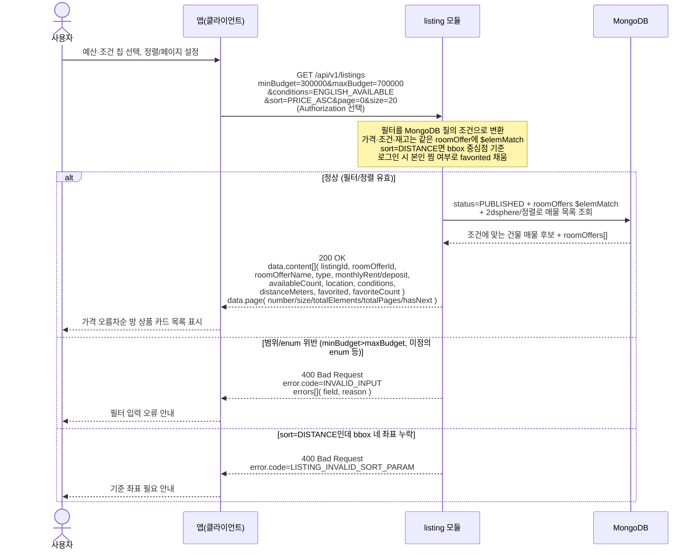

# US-3-1 — 매물 리스트 탐색(필터·정렬·페이지네이션)

> 모듈: 매물 탐색 · 찜 · [유저 스토리](../../../requirements/user-stories.md) · [API 스펙](../../../api/specs/03-listings-favorites.md)

## 흐름 요약

- 비로그인/로그인 모두 `GET /api/v1/listings`로 `listing` 모듈에서 필터·정렬·오프셋 페이지 목록을 조회하며, 성공 시 `listing` 모듈이 MongoDB에서 `status=PUBLISHED` 건물 매물 중 조건에 맞는 `roomOffers[]`를 `$elemMatch`로 찾은 뒤 조건을 만족하는 active roomOffer를 카드 단위로 펼쳐 `200 OK` + `data.content[]`·`data.page`를 받는다.
- 목록 항목 1개는 `Listing + roomOffer` 조합이다. 필터가 없으면 조회 범위 안의 모든 active roomOffer가 내려가고, 필터가 있으면 조건을 만족하는 active roomOffer만 내려간다. 같은 매물 안에 조건을 만족하는 방 상품이 여러 개 있으면 같은 `listingId`가 여러 번 내려갈 수 있다.
- 목록의 `monthlyRent`·`deposit`·`availableCount`·`conditions`는 해당 roomOffer 기준 값이고, 실제 방 상품 상세는 단건 상세의 `roomOffers[]`에서 같은 `roomOfferId`로 확인한다.
- 로그인 시 `listing` 모듈이 각 항목의 `favorited`를 본인 찜 여부로 채우고(인증 선택), 비로그인은 `false`로 고정된다.
- 범위/enum 위반은 `400 INVALID_INPUT` + `errors[]`로, `sort=DISTANCE`인데 bbox 네 좌표가 없으면 `400 LISTING_INVALID_SORT_PARAM`으로 거부한다(검증 실패 분기는 MongoDB 접근 없음).
