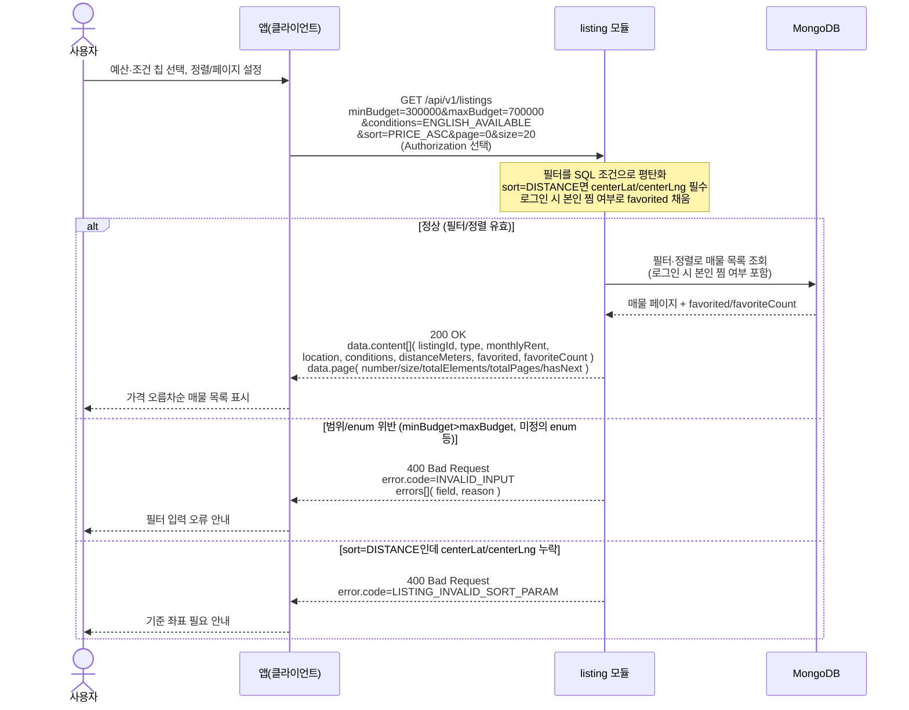

# US-3-1 — 매물 리스트 탐색(필터·정렬·페이지네이션)

> 모듈: 매물 탐색 · 찜 · [유저 스토리](../../../requirements/user-stories.md) · [API 스펙](../../../api/specs/03-listings-favorites.md)

## 흐름 요약

- 비로그인/로그인 모두 `GET /api/v1/listings`로 `listing` 모듈에서 필터·정렬·오프셋 페이지 목록을 조회하며, 성공 시 `listing` 모듈이 MongoDB에서 필터·정렬로 매물 목록을 조회해 `200 OK` + `data.content[]`·`data.page`를 받는다.
- 로그인 시 `listing` 모듈이 각 항목의 `favorited`를 본인 찜 여부로 채우고(인증 선택), 비로그인은 `false`로 고정된다.
- 범위/enum 위반은 `400 INVALID_INPUT` + `errors[]`로, `sort=DISTANCE` 기준 좌표 누락은 `400 LISTING_INVALID_SORT_PARAM`으로 거부한다(검증 실패 분기는 MongoDB 접근 없음).
