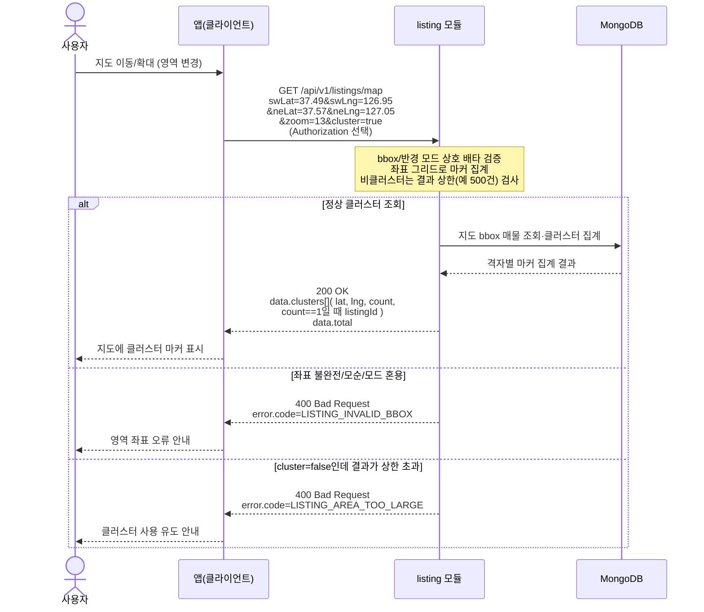

# US-3-2 — 지도(bbox/반경) 검색과 클러스터 집계

> 모듈: 매물 탐색 · 찜 · [유저 스토리](../../../requirements/user-stories.md) · [API 스펙](../../../api/specs/03-listings-favorites.md)

## 흐름 요약

- 지도 패닝 시 `GET /api/v1/listings/map`을 호출해 `listing` 모듈이 MongoDB에서 bbox(또는 center+radius) 영역의 매물을 조회·줌 레벨 기준 클러스터로 집계한다(`200 OK` + `data.clusters[]`/`total`).
- bbox 4좌표 불완전·모순(`swLat>neLat`) 또는 bbox·반경 모드 혼용은 `listing` 모듈이 `400 LISTING_INVALID_BBOX`로 거부한다(검증 실패 분기는 MongoDB 접근 없음).
- 비클러스터(`cluster=false`) 결과가 상한을 초과하면 `400 LISTING_AREA_TOO_LARGE`로 클러스터 전환을 유도한다.
