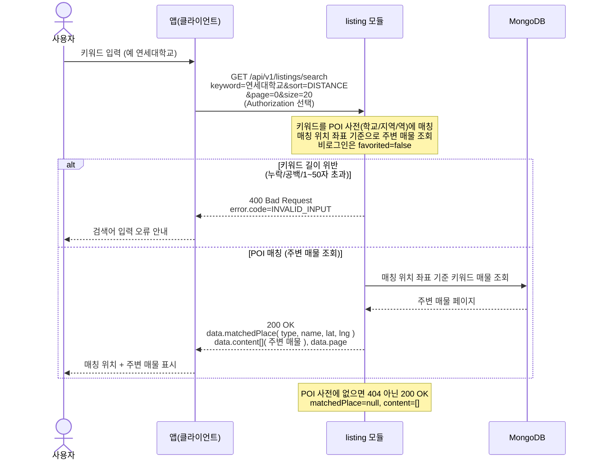

# US-3-3 — 키워드 검색(학교명·지역명·지하철역명)

> 모듈: 매물 탐색 · 찜 · [유저 스토리](../../../requirements/user-stories.md) · [API 스펙](../../../api/specs/03-listings-favorites.md)

## 흐름 요약

- `GET /api/v1/listings/search?keyword=...`로 `listing` 모듈이 학교/지역/역 키워드를 POI 사전에 매칭해 매칭 위치 기준으로 MongoDB에서 주변 매물을 조회하고 `data.matchedPlace`와 `data.content[]`(오프셋 페이지)를 반환한다.
- 키워드 누락/공백/길이(1~50자) 위반은 `listing` 모듈이 `400 INVALID_INPUT`으로 거부한다(검증 실패 분기는 MongoDB 접근 없음).
- POI 매칭이 없으면 에러가 아니라 `200 OK` + `matchedPlace=null`·`content=[]`로 응답한다.
