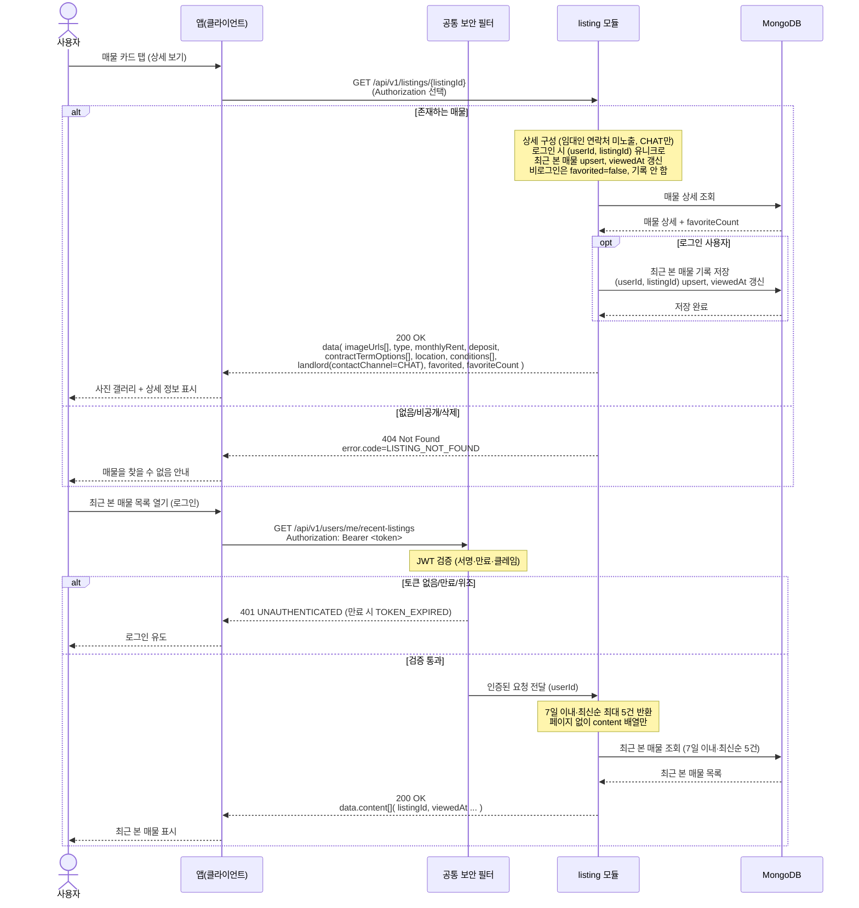

# US-3-4 — 매물 상세 조회 + 최근 본 매물 기록

> 모듈: 매물 탐색 · 찜 · [유저 스토리](../../../requirements/user-stories.md) · [API 스펙](../../../api/specs/03-listings-favorites.md)

## 흐름 요약

- `GET /api/v1/listings/{listingId}`로 `listing` 모듈이 MongoDB에서 상세(`imageUrls[]`·`type`·`monthlyRent`·`deposit`·`contractTermOptions[]`·`location`·`conditions[]`·`landlord`·`favorited`)를 조회하며, 임대인 연락처는 `contactChannel=CHAT`로만 노출한다(인증 선택이라 SEC 없이 `listing` 모듈로 직접 요청).
- 로그인 상태면 `listing` 모듈이 MongoDB에 `(userId, listingId)` 유니크 upsert로 최근 본 매물을 기록(`viewedAt` 갱신)하고, 비로그인은 기록하지 않으며 `favorited=false`다.
- 없음/비공개/삭제 매물은 `404 LISTING_NOT_FOUND`(MongoDB 조회로 부재 확인), 최근 본 매물은 인증 필수 `GET /api/v1/users/me/recent-listings`로 공통 보안 필터(SEC)가 컨트롤러 앞단에서 JWT를 검증한 뒤 `listing` 모듈로 전달하며(토큰 없음/만료/위조면 SEC가 `401`로 차단해 MongoDB 접근 없음), 검증 통과 후 MongoDB에서 7일 이내·최신순 최대 5건만 조회한다.
