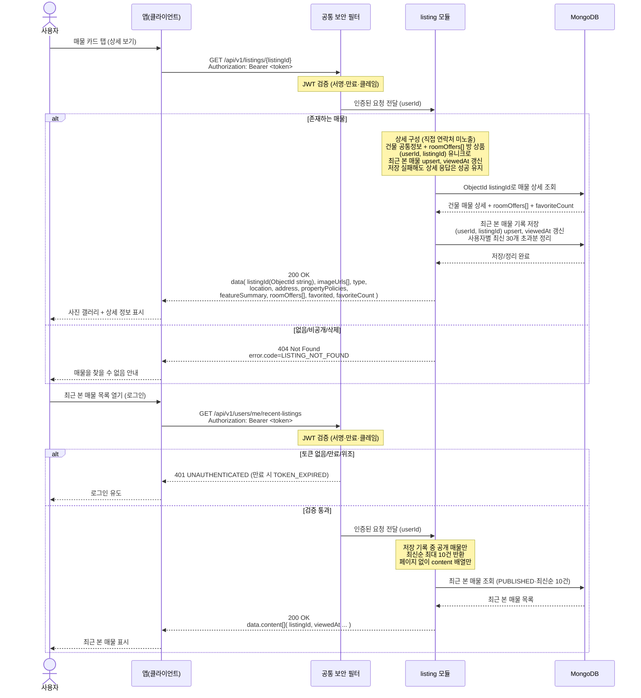

# US-3-4 — 매물 상세 조회 + 최근 본 매물 기록

> 모듈: 매물 탐색 · 찜 · [유저 스토리](../../../requirements/user-stories.md) · [API 스펙](../../../api/specs/03-listings-favorites.md)

## 흐름 요약

- `GET /api/v1/listings/{listingId}`는 인증 필수이며, 공통 보안 필터가 JWT를 검증한 뒤 `userId`를 `listing` 모듈로 전달한다. `listing` 모듈은 MongoDB에서 건물 공통 상세(`imageUrls[]`·`type`·`location`·`address`·`propertyPolicies`·`facilities`)와 방 상품 목록(`roomOffers[]`: 가격·재고·필터 태그)을 조회하고, 상세 응답의 `featureSummary`와 방별 계약/성별/임대방식 호환 필드는 서버에서 조립한다. 직접 연락처는 노출하지 않고 신청·문의는 채팅으로 연결한다.
- 상세 조회가 성공하면 `listing` 모듈이 MongoDB에 `(userId, listingId)` 유니크 upsert로 최근 본 매물을 기록(`viewedAt` 갱신)하고, 사용자별 최신 30개 초과분은 오래된 기록부터 삭제한다. 저장/정리 실패는 상세 조회를 실패시키지 않고 로그로 남긴다.
- 없음/비공개/삭제 매물은 `404 LISTING_NOT_FOUND`(MongoDB 조회로 부재 확인), 최근 본 매물은 인증 필수 `GET /api/v1/users/me/recent-listings`로 공통 보안 필터(SEC)가 컨트롤러 앞단에서 JWT를 검증한 뒤 `listing` 모듈로 전달하며(토큰 없음/만료/위조면 SEC가 `401`로 차단해 MongoDB 접근 없음), 검증 통과 후 MongoDB에서 공개 매물만 최신순 최대 10건 조회한다.
