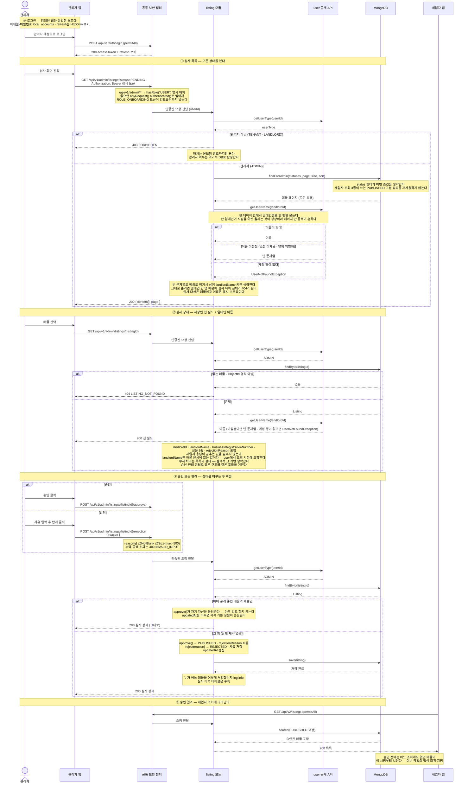

# US-3-7 — 관리자 매물 심사(승인·반려)

> 모듈: 매물 등록 · 탐색 · 찜 · [유저 스토리](../../../requirements/user-stories.md) · [API 스펙](../../../api/specs/03-listings-favorites.md)
>
> 관리자(`ROLE_USER`, `ACTIVE`, `userType=ADMIN`)가 임대인이 올린 매물을 심사하는 흐름이다. **인가가 두 겹**이다 — `SecurityConfig`의 `/api/v1/admin/**` → `hasRole("USER")` 매처가 온보딩 토큰을 걸러 내고, 서비스가 `user` 공개 API로 `userType=ADMIN`을 다시 확인해 아니면 `403 FORBIDDEN`이다. 매물 등록이 임대인 여부를 서비스에서 재검사하는 것과 **완전히 같은 모양**이며, 토큰에는 관리자 여부를 담지 않으므로 **권한 부여·회수가 즉시 반영**된다. **승인·반려 모두 상태를 가리지 않는다** — 잘못 반려한 매물을 되살리는 재승인, 공개 매물을 내리는 사후 반려, 이미 반려한 매물의 사유 정정이 모두 정상 경로다. 관리자의 오판을 되돌릴 수단이 서버에 있어야 하기 때문이며, 제약을 걸면 임대인 수정 API가 나오기 전까지 잘못 처리된 매물이 묶인다. 조회는 세입자 경로(`PUBLISHED` 고정)를 재사용하지 않고 **심사 전용 저장소 메서드**를 쓴다 — 세입자 조회의 안전장치를 풀지 않기 위해서다.

## 왜 이렇게 갈랐나

- **인가를 두 겹으로 둔 이유.** 매처(`hasRole("USER")`)는 경로 단위로만 판단할 수 있어 `userType`을 볼 수 없다. 그렇다고 토큰에 관리자 여부를 실으면 권한을 회수해도 토큰 수명만큼 관리자로 남는다. 그래서 매처는 온보딩 완료까지만 거르고 **판정은 매 요청 DB 조회**로 한다 — 임대인 게이트가 이미 쓰는 방식이다.
- **심사 전용 조회 메서드를 새로 둔 이유.** 세입자용 조회 3종은 저장소에서 `status = PUBLISHED`를 조건 앞머리에 고정해 두었다. 그 자리를 파라미터로 열면 호출자가 상태를 넘기지 않았을 때 비공개 매물이 세입자에게 샐 수 있다. 상태를 받는 경로를 **따로** 만들어 "세입자 경로는 공개 고정, 관리자 경로만 상태를 받는다"를 타입으로 가른다.
- **임대인 이름을 스냅샷하지 않고 조회 시점에 조합하는 이유.** 매물 문서에 임대인 이름을 함께 저장하면 스키마 변경과 마이그레이션, 임대인이 프로필에서 이름을 고칠 때마다의 동기화, 이미 쌓인 문서의 백필이 줄줄이 따라온다. 그런데 심사자가 보려는 것은 **지금 그 계정의 이름**이지 등록 당시의 이름이 아니고, 등록 시점의 이름을 보존해야 할 요구는 어디에도 없다. 그래서 매물에는 `landlordId`만 남기고, 이름은 `user` 공개 API의 `getUserName`으로 **조회할 때마다 애플리케이션 레벨에서 조합**한다 — 매물은 MongoDB, 계정은 MySQL이라 애초에 저장소에서 조인할 수도 없고, `booking`이 예약자 성명을 스냅샷 없이 실시간 조인하는 것과 같은 선택이다. 대신 조합은 실패할 수 있으므로(이름이 빈 계정, 행이 사라진 계정) **부재를 에러가 아니라 키 생략으로** 다룬다. 심사 대상은 매물이고 이름은 표시 보조값이라, 이름 하나 때문에 심사가 멈추는 쪽이 훨씬 나쁘다.
- **그 키 생략이 곧 예외 포획이라는 점은 짚어 둘 값이 있다.** `getUserName`은 이름이 없으면(미설정·탈퇴 익명화 — 탈퇴는 행이 남고 이름만 빈다) 빈 문자열을 주지만, **계정 행 자체가 없으면 `UserNotFoundException`을 던진다**. 이 예외를 그대로 흘리면 심사 목록 전체가 `404 USER_NOT_FOUND`가 되는데, 그 코드는 "매물이 없다"도 "관리자가 없다"도 아니라서 관리자 화면이 해석할 수 없다. 그래서 `listing`이 **그 예외 하나만** 잡아 이름을 비우고 나머지는 그대로 흘린다. 같은 쿼리를 쓰는 `chat`(상대 이름)·`booking`(예약자 성명)은 지금 이 예외를 잡지 않는데, 거기서는 **상대가 없으면 그 대화·예약 자체가 성립하지 않아** 실패가 곧 정답이기 때문이다. 심사는 반대다 — 임대인 계정이 사라져도 그 매물은 여전히 내려야 할지 판단해야 할 대상으로 남는다.
- **그 포획은 심사 트랜잭션 밖에서 일어나야 한다.** 심사 4종은 모두 트랜잭션 안에서 도는데, 그 안에서 잡으면 잡히기도 전에 스프링이 **바깥 트랜잭션을 rollback-only로 표시**한다(참여 트랜잭션의 실패 규칙). 그러면 정상 반환해도 커밋에서 터져 `500`이 나가고, 부재를 조용히 넘기려던 의도가 정확히 뒤집힌다 — 잡았는데도 목록 전체가 죽는다. 그래서 이름 조회만 **트랜잭션을 잠시 밀어 두는**(`NOT_SUPPORTED`) 전용 협력자에 두었다. 실패는 그 조회가 새로 연 트랜잭션 안에서 끝나고, 밀어 뒀던 트랜잭션은 아무 표시 없이 되돌아온다.
- **상태 전이에 제약을 두지 않은 이유.** 심사는 사람이 하는 판단이라 틀릴 수 있는데, 제약을 걸면 **관리자가 자기 오판을 되돌릴 수단이 서버에 없어진다** — 임대인 수정 API가 나오기 전까지 잘못 반려한 매물이 손댈 수 없는 상태로 묶인다. 잘못 반려한 매물의 재승인, 문제가 발견된 공개 매물의 사후 반려, 사유 정정이 모두 정상 경로다. 대신 **이미 공개 중인 매물의 재승인만 아무 일도 하지 않는다** — 결과는 같지만 `updatedAt`이 바뀌면 세입자 목록의 기본 정렬(찜 수 → 최신 수정순)에서 그 매물만 위로 올라가는, 눈에 띄지 않는 부작용이 생긴다.
- **승인·반려를 액션 두 개로 나눈 이유.** 하나의 상태 변경 API였다면 `status` 값에 따라 `reason` 필수 여부가 갈리는 조건부 검증이 되고, 승인 요청에 사유가 실려 와도 타입으로 막을 수 없다. 액션을 나누면 "반려에는 사유가 필요하다"가 요청 타입 자체로 강제된다.
- **관리자가 세입자·임대인 API에 닿지 못하는 이유.** `ADMIN`은 세입자·임대인과 병존하지 않는 제3의 유형이라, 각 모듈의 서비스가 **세입자 또는 임대인만 통과시키는 허용 목록 게이트**를 둔다. 관리자를 콕 집어 거부하지 않으므로 모듈은 `ADMIN`이라는 개념을 알 필요가 없고, 나중에 유형이 늘어도 자동으로 거부된다.
