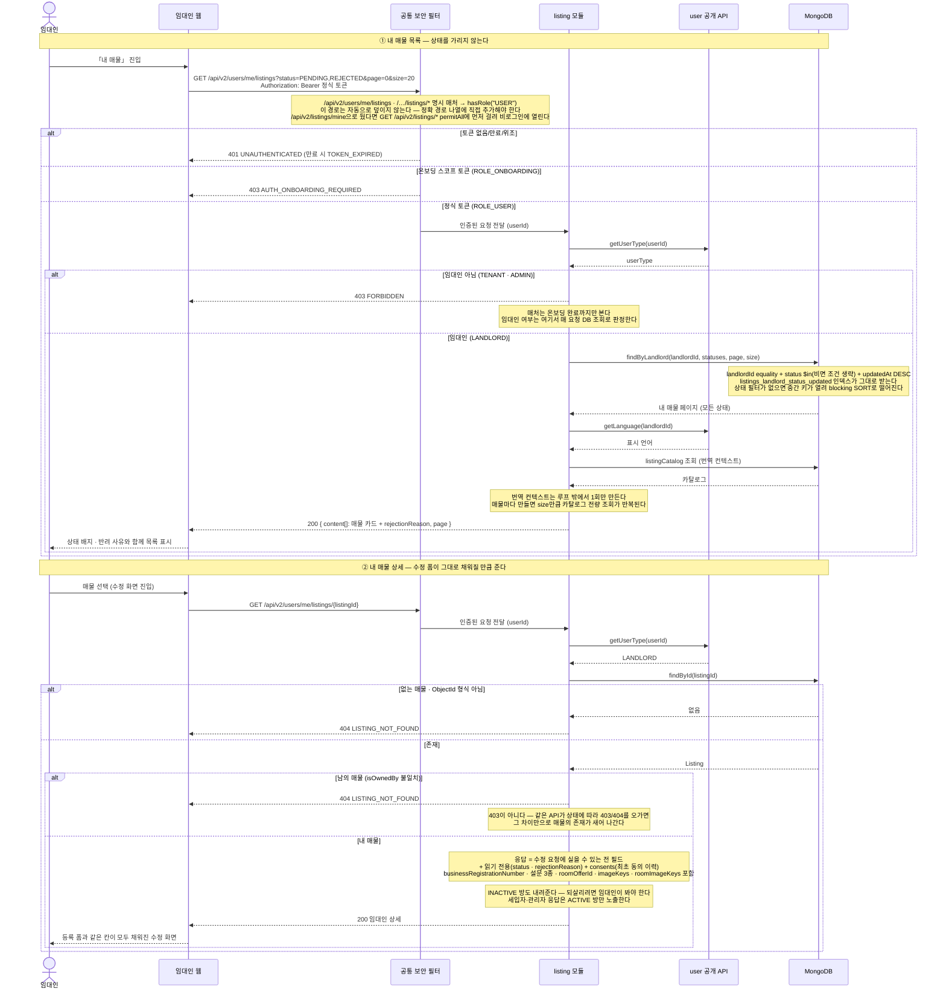

# US-3-8 — 임대인 전용 매물 조회(내 매물 목록 · 상세)

> 모듈: 매물 등록 · 탐색 · 찜 · [유저 스토리](../../../requirements/user-stories.md) · [API 스펙](../../../api/specs/03-listings-favorites.md)
>
> 임대인(`ROLE_USER`, `ACTIVE`, `userType=LANDLORD`)이 자기가 올린 매물을 **상태를 가리지 않고** 보는 흐름이다. **인가가 두 겹**이며 매물 등록(US-3-6)·관리자 심사(US-3-7)와 완전히 같은 모양이다 — `SecurityConfig`의 명시 매처가 `hasRole("USER")`로 온보딩 토큰을 걸러 내고, 서비스가 `user` 공개 API로 `userType=LANDLORD`를 다시 확인해 아니면 `403 FORBIDDEN`이다. 경로가 `/api/v2/users/me/listings`인 것은 취향이 아니라 **제약**이다 — `/api/v2/listings/mine`으로 두면 `GET /api/v2/listings/*`의 `permitAll` 매처에 먼저 걸려 **비로그인에 열린다**. 조회는 세입자 경로(`PUBLISHED` 고정)를 재사용하지 않고 **임대인 전용 저장소 메서드**를 쓴다 — 심사 조회와 같은 이유로 세입자 조회의 안전장치를 풀지 않기 위해서다. 목록은 `status` 다중 필터를 받고 **정렬은 `updatedAt` 내림차순 고정**이며, 상세는 **US-3-9(수정)의 프리필 소스**라 수정 요청에 실을 수 있는 필드를 하나도 빠뜨리지 않는다. **없는 매물과 남의 매물은 모두 `404 LISTING_NOT_FOUND`** 다 — 한 API가 상태에 따라 `403`과 `404`를 오가면 그 차이가 매물의 존재를 누설한다.

## 왜 이렇게 갈랐나

- **경로를 `me` 스코프에 둔 이유.** `/api/v2/listings/mine`은 `GET /api/v2/listings/*`의 `permitAll` 매처가 먼저 잡아 **비로그인에 열린다** — `mine`이 `{listingId}` 자리에 들어가기 때문이다. 매처 순서로 비껴가는 방법도 있지만, 공개 조회 매처 앞에 예외를 하나씩 끼워 넣는 구조는 다음 경로가 추가될 때마다 같은 함정을 반복한다. 내 스코프 조회는 이미 `/api/v2/users/me/favorites`·`/recent-listings`가 쓰는 자리이고, 그 자리에 두면 경로 모양 자체가 "인증이 필요한 내 데이터"를 말한다.
- **임대인 전용 저장소 메서드를 새로 둔 이유.** 세입자용 조회는 저장소에서 `status = PUBLISHED`를 조건 앞머리에 고정해 두었다. 그 자리를 파라미터로 열면 호출자가 상태를 넘기지 않았을 때 비공개 매물이 세입자에게 샌다. 관리자 심사 조회가 같은 판단으로 전용 메서드를 둔 선례를 그대로 따른다 — "세입자 경로는 공개 고정, 임대인·관리자 경로만 상태를 받는다"를 타입으로 가른다.
- **정렬을 열지 않은 이유.** `listings_landlord_status_updated`는 `landlordId` → `status` → `updatedAt DESC` 순서라 **`status`가 equality나 `$in`으로 묶였을 때만** 정렬까지 인덱스가 받는다. 정렬 키를 파라미터로 열면 그 전제가 매 요청 흔들리고, 세입자 목록이 이미 쓰는 `LISTING_INVALID_SORT_PARAM` 계약과 어긋나는 두 번째 정렬 계약이 생긴다. 나중에 여는 것은 additive라 지금 닫아 두는 비용이 낮다.
- **목록과 상세의 무게를 다르게 준 이유.** 목록 항목은 세입자 카드에 `rejectionReason` 하나만 더한다. 임대인이 **자기 매물 목록**에서 자기 사업자등록번호·설문·동의 시각을 볼 이유가 없고, 그 값들은 수정 폼이 쓰는 것이라 상세가 준다. 관리자 목록처럼 항목마다 상세 전체를 담으면 번역 컨텍스트를 매물 수만큼 만들게 되어 카탈로그 전량 조회가 `size`배로 늘어난다.
- **상세가 수정 요청의 거울인 이유.** 수정은 등록 때 보낸 속성을 **그대로 다시 보내는** 전체 교체(PUT)라, 상세가 한 필드라도 빠뜨리면 그 필드가 수정 시 지워진다. 그래서 상세의 계약을 "수정 요청에 실을 수 있는 전 필드 + 읽기 전용 표시값"으로 못박고, 라운드트립에 필요한 `roomOfferId`·`imageKeys`·`roomImageKeys`까지 내려준다. 이 값을 주는 대체 경로가 없다 — 세입자 상세는 비공개 매물에 `404`인 데다 설문·사업자등록번호를 감추고, 관리자 상세는 `ADMIN` 전용이다.
- **소유권 실패를 `404`로 만든 이유.** `booking`·`chat`·`listing`이 모두 존재 비노출 `404`를 쓴다. 남의 매물에 `403`을 주면 "그 id의 매물은 있다"가 응답 코드로 확인되므로, 없는 매물과 남의 매물을 한 코드로 묶는다. 판정은 `Listing#isOwnedBy` 한 곳에서만 한다.
