# US-3-9 — 임대인 매물 수정(PUT /api/v2/listings/{listingId})

> 모듈: 매물 등록 · 탐색 · 찜 · [유저 스토리](../../../requirements/user-stories.md) · [API 스펙](../../../api/specs/03-listings-favorites.md)
>
> 임대인(`ROLE_USER`, `ACTIVE`, `userType=LANDLORD`)이 자기 매물을 고쳐 **다시 심사를 받는** 흐름이다. 요청은 등록(US-3-6)과 **같은 필드를 그대로 다시 보내는 전체 교체**이고 부분 전송이 아니다 — `location`·`address.city`/`district`·`nearbyUniversityCodes`가 주소에서 파생되는 값이라 일부만 보내면 파생값이 모순 상태가 된다. 폼은 US-3-8의 임대인 상세로 프리필한다. 등록 요청과 다른 곳은 **두 곳뿐**이다 — `roomOffers[]`가 `roomOfferId`(`null`이면 신규)와 `status`(`ACTIVE`/`INACTIVE`)를 함께 받고, 사진 키 배열에 **임시 키와 기존 확정 키를 섞어** 보낼 수 있다. 상태는 **전이가 정한다** — `REJECTED`를 고치면 `PENDING`으로 돌아가고, `PUBLISHED`를 고치면 신규 상태 **`UPDATE_PENDING`** 이 되며, 심사를 기다리는 `PENDING`·`UPDATE_PENDING`은 손댈 수 없다(`422 LISTING_NOT_EDITABLE`). **공개 중인 매물을 수정하면 심사가 끝날 때까지 세입자에게 보이지 않는다** — 심사를 거치지 않은 내용이 세입자에게 도달하지 않는다는 심사 제도 자체의 요구이며, 승인되면 찜 수·찜 문서·최근 본 기록이 그대로 복구된다. 읽기와 저장 사이에 관리자가 심사할 수 있으므로 저장은 **읽을 때의 상태를 조건으로 거는 CAS**이고, 어긋나면 `409 LISTING_STATE_CHANGED`다.

```mermaid
sequenceDiagram
    actor L as 임대인
    participant W as 임대인 웹
    participant SEC as 공통 보안 필터
    participant LIST as listing 모듈
    participant USER as user 공개 API
    participant S3 as 이미지 저장소(S3)
    participant DB as MongoDB

    Note over L,DB: ⓪ 프리필 — 수정 폼은 US-3-8 임대인 상세로 채운다<br/>roomOfferId · imageKeys · roomImageKeys가 라운드트립으로 되돌아온다

    Note over L,W: ① 사진 교체 — 새로 넣을 사진만 올린다<br/>업로드 API는 등록과 같고 변경이 없다

    loop 새로 넣을 사진 1장마다
        L->>W: 사진 선택 / 드래그
        W->>SEC: POST /api/v2/listings/images (multipart, file 1개)
        SEC->>LIST: 인증된 요청 전달 (userId)
        LIST->>S3: PutObject uploads/{landlordId}/{uuid}.{ext}
        S3-->>LIST: 저장 완료
        LIST-->>W: 201 { key, url }
    end

    Note over L,W: 유지할 사진은 다시 올리지 않는다<br/>상세가 준 확정 키(listings/…)를 그대로 되돌려 보낸다

    Note over L,DB: ② 수정 제출 — 폼 전체를 1회<br/>제출 전에 「공개 중인 매물은 심사 동안 내려간다」를 경고 모달로 고지한다

    L->>W: 수정 제출
    W->>SEC: PUT /api/v2/listings/{listingId} (application/json)<br/>{ 등록과 같은 전 필드, consents,<br/>imageKeys[](임시+확정 혼합), roomOffers[](roomOfferId · status 포함) }
    Note over SEC: PUT /api/v2/listings/* 명시 매처 → hasRole("USER")<br/>같은 경로의 GET은 permitAll이라 method로 갈린다<br/>없으면 anyRequest().authenticated()로 떨어져 ROLE_ONBOARDING 토큰이 컨트롤러까지 닿는다

    alt 토큰 없음/만료/위조
        SEC-->>W: 401 UNAUTHENTICATED (만료 시 TOKEN_EXPIRED)
    else 온보딩 스코프 토큰 (ROLE_ONBOARDING)
        SEC-->>W: 403 AUTH_ONBOARDING_REQUIRED
    else 정식 토큰 (ROLE_USER)
        SEC->>LIST: 인증된 요청 전달 (userId)
        LIST->>USER: getUserType(userId)
        USER-->>LIST: userType

        alt 임대인 아님 (TENANT · ADMIN)
            LIST-->>W: 403 FORBIDDEN
            Note over LIST: 역할 재검사 실패 — 저장소도 S3도 부르지 않는다
        else 임대인 (LANDLORD)
            LIST->>DB: findById(listingId)

            alt 없는 매물 · ObjectId 형식 아님 · 남의 매물
                DB-->>LIST: 없음 또는 다른 임대인의 문서
                LIST-->>W: 404 LISTING_NOT_FOUND
                Note over LIST: 소유권 실패도 404다 — 403과 섞으면 존재가 누설된다<br/>판정은 Listing#isOwnedBy 한 곳
            else 내 매물
                DB-->>LIST: Listing (읽은 시점의 status를 기억해 둔다)
                Note over LIST: 전이 판정은 도메인이 한다 — nextStatusAfterEdit()<br/>REJECTED → PENDING · PUBLISHED → UPDATE_PENDING<br/>PENDING · UPDATE_PENDING → 거절

                alt 심사 대기 중 (PENDING · UPDATE_PENDING)
                    LIST-->>W: 422 LISTING_NOT_EDITABLE
                    Note over LIST: 제자리 덮어쓰기라 되돌릴 구본이 없다<br/>같은 이유로 수정 신청 취소도 없다
                else 수정 가능 (REJECTED · PUBLISHED)
                    Note over LIST: 사진 키 검증 — S3를 부르기 전에 끝난다<br/>uploads/{내 landlordId}/… → 임시 키(복사 대상)<br/>listings/{listingId}/cover/… · /rooms/{roomOfferId}/… → 그 자리의 허용 집합에 있어야 유지<br/>커버↔방 · 방↔방 교차 금지 · 신규 방(roomOfferId=null)은 임시 키만<br/>허용 집합 대조가 소유권 검사를 겸한다 — 남의 매물 확정 키는 여기서 걸린다
                    Note over LIST: roomOffers는 순서 있는 전량 제출이다<br/>방을 내리는 것은 요청에서 빼는 게 아니라 status=INACTIVE로 보내는 것<br/>요청에서 id가 통째로 빠진 방은 안전망으로 INACTIVE 전환 후 맨 뒤에 보존<br/>하드 삭제는 예약·채팅의 roomOfferId 참조를 끊으므로 하지 않는다
                    LIST->>DB: listingCatalog 코드 대조 · universities 반경 2km 재파생
                    DB-->>LIST: 카탈로그 · 인근 대학 코드

                    alt 동의 2종이 모두 true가 아님
                        LIST-->>W: 422 LISTING_REQUIRED_AGREEMENT_MISSING
                        Note over LIST: 등록과 같은 게이트·같은 코드다<br/>다만 저장 값은 승계한다 — version·agreedAt을 덮어쓰면<br/>최초 동의 시각이라는 감사 기록이 사라진다
                    else 입력 검증 실패
                        LIST-->>W: 400 INVALID_INPUT · LISTING_IMAGE_KEY_NOT_FOUND<br/>LISTING_IMAGE_REQUIRED · LISTING_UNKNOWN_CATALOG_CODE
                        Note over LIST: 저장 후 ACTIVE 방이 0이 되는 요청도 400이다<br/>상태만 PUBLISHED인데 목록·상세엔 안 보이는 유령 매물을 막는다
                        Note over L,DB: ↑ 복사도 저장도 없다 — 공개 중인 매물이 그대로 남는다
                    else 검증 통과
                        LIST->>S3: CopyObject × 임시 키만<br/>uploads/… → listings/{listingId}/cover/… · /rooms/{roomOfferId}/…
                        Note over LIST: 유지 키는 복사하지 않는다 — 이미 제자리에 있다<br/>확정 키는 임시 키의 uuid 파일명을 그대로 옮기므로 재확정 충돌이 없다

                        alt 원본 없음 (오타 · 7일 만료) · 저장소 장애
                            S3-->>LIST: NoSuchKey · 오류
                            LIST->>S3: DeleteObject × 이번에 복사한 분
                            LIST-->>W: 400 LISTING_IMAGE_KEY_NOT_FOUND · 502 UPSTREAM_ERROR
                            Note over L,S3: 옛 확정본은 건드리지 않는다 — 공개 중인 사진이 사라지면 안 된다
                        else 복사 성공
                            Note over LIST: 승계 — id · landlordId · schemaVersion · createdAt · favoriteCount · consents · rentalType<br/>재파생 — location · address.city/district · nearbyUniversityCodes · imageUrls · 다국어 8종<br/>전이가 정함 — status · rejectionReason(무조건 null) · updatedAt
                            Note over LIST: rejectionReason 은 건드리지 않는다<br/>재심사 대기 중에도 임대인·관리자가 이전 반려 맥락을 본다<br/>지우는 것은 승인뿐
                            LIST->>DB: saveIfStatus(listing, 읽은 시점의 status) — CAS

                            alt 기대 상태 불일치 (그 사이 관리자가 승인·반려)
                                DB-->>LIST: 매칭 0건
                                LIST->>S3: DeleteObject × 이번에 복사한 분
                                LIST-->>W: 409 LISTING_STATE_CHANGED
                                Note over LIST: 옛 확정본은 하나도 지우지 않는다<br/>문서가 바뀌지 않았으므로 그대로가 정본이다
                                W-->>L: 최신 상태로 다시 불러와 재시도하도록 안내
                            else 저장 성공
                                DB-->>LIST: 저장된 문서 (PENDING · UPDATE_PENDING)
                                LIST->>S3: DeleteObject × 임시본 (실패해도 7일 만료가 치운다)
                                LIST->>S3: DeleteObject × 교체돼 참조를 잃은 확정 키 (OLD 빼기 NEW)
                                Note over LIST: 저장이 성공한 뒤라야 그 키를 아무도 참조하지 않는다<br/>저장 전에 지우면 CAS·검증 실패 시 공개 중인 사진이 사라진다<br/>deleteQuietly라 실패해도 예외를 던지지 않는다 — 그만큼 고아가 남는다<br/>INACTIVE 방·묘비 방의 사진은 문서에 남으므로 지워지지 않는다
                                LIST-->>W: 200 OK<br/>data( status, rejectionReason=null, imageUrls[](확정 URL) … )
                                W-->>L: 수정 접수 + 관리자 심사 대기 안내
                            end
                        end
                    end
                end
            end
        end
    end

    Note over L,DB: ③ 수정 결과 — PUBLISHED였다면 세입자 조회에서 사라진다

    participant T as 세입자 앱
    T->>SEC: GET /api/v2/listings (permitAll)
    SEC->>LIST: 요청 전달
    LIST->>DB: search(PUBLISHED 고정)
    DB-->>LIST: 수정 중인 매물은 없음
    LIST-->>T: 200 목록 (그 매물 제외)
    Note over T,DB: 「상태가 정확히 PUBLISHED인가」를 묻는 지점이 한꺼번에 아니오가 된다 —<br/>목록·지도·상세·추천·찜 목록·최근 본 매물·찜 등록/해제·신규 예약·매물 문의<br/>진행 중인 예약 카드만 매물·방 상태를 보지 않는 표시 전용 조회로 계속 렌더된다<br/>관리자가 승인하면 그 지점들이 동시에 예로 돌아오고 찜 수·찜 문서·최근 본 기록도 그대로 복구된다
```

## 왜 이렇게 갈랐나

- **수정본을 따로 보관하지 않는 이유.** 문서 본문을 제자리에서 덮어쓰고 `status`만 바꾼다. 세입자에게 매물을 보여주는 경로는 예외 없이 "상태가 정확히 `PUBLISHED`인가"를 묻고 그 질문이 코드 여덟 곳에 박혀 있어, 상태 한 값만 바꾸면 살아 있는 경로 전체에서 **동시에** 빠지고 승인 시 동시에 돌아온다. 노출 차단은 만들어야 할 기능이 아니라 **그 여덟 곳을 건드리지 않으면 저절로 얻어지는 결과**다. 수정본을 문서 안에 보관하는 안은 그 여덟 곳을 전부 고치고, 사진 네임스페이스를 하나 더 만들고, 세입자 응답의 기존 `status` 필드에 새 값을 흘려보내야 하는데 마지막 항목은 **스토어 심사 중에는 고칠 수 없는** 구버전 앱 호환 문제가 된다.
- **시설 8종의 `NONE`도 등록과 같은 규칙이다.** 「해당 없음」을 보내려면 `["NONE"]` 하나만 싱고, 다른 코드와 섮으면 `400 INVALID_INPUT`이다. 검증은 등록·수정이 공유하는 조립 지점 한 곳에 있어 두 경로가 갈라질 수 없다.
- **`UPDATE_PENDING`이라는 이름을 고른 이유.** `_PENDING` 접미가 "관리자 행동 대기"라는 뜻을 최초 `PENDING`과 잇고, `UPDATE_` 접두가 grep·로그에서 둘을 가른다. `REVISION_PENDING`은 보관본이 없는데 이름이 보관본을 암시해 거짓말이 된다.
- **`PENDING`·`UPDATE_PENDING`에서 수정을 막는 이유.** 심사 중인 본문을 다시 덮어쓰면 관리자가 방금 읽은 화면과 저장된 문서가 어긋난다. 제자리 덮어쓰기라 되돌릴 구본이 없어 **수정 신청 취소도 구조적으로 불가능**하며, 이는 결함이 아니라 이 설계가 지불하는 값이다. 상태가 바뀌면 나중에는 성공하는 선행조건 위반이라 `409`가 아니라 `422`다 — 이 저장소의 `409`는 전부 중복형이다.
- **저장을 CAS로 건 이유.** 수정 경로는 조회 → 검증 → **S3 확정 복사(네트워크, 다수 객체)** → 저장이라 읽기와 쓰기 사이가 수백 ms다. 그 사이 관리자가 승인하면 문서 전체를 교체하는 저장이 승인을 소리 없이 지우거나 임대인의 수정이 통째로 증발한다. 읽은 시점의 상태를 조건으로 걸면 어느 쪽도 조용히 사라지지 않고 `409`로 드러나며, 복구는 재조회 후 재시도다. 낙관적 락 버전 필드는 기존 문서에 그 필드가 없어 로드 시 신규 문서로 오인되므로 백필 없이는 쓸 수 없다. 같은 CAS를 관리자 심사 경로에도 함께 건다.
- **방을 하드 삭제하지 않는 이유.** `roomOfferId`는 예약·채팅이 참조하는 식별자라 지우면 그 참조가 영구히 끊긴다. 대신 `status=INACTIVE`로 내리고, 명시 필드라 **되살릴 수도 있다**. 요청에서 id가 통째로 빠지는 것은 클라이언트 결함이거나 삭제 의도인데 둘 다 하드 삭제로 처리하면 안 되므로, 안전망으로 `INACTIVE` 전환 후 배열 맨 뒤로 밀어 보존만 한다. 다만 전 방을 `INACTIVE`로 보낼 수 있게 되었으므로 **저장 후 `ACTIVE` 방이 0이면 `400`** 으로 막는다 — 그러지 않으면 상태만 `PUBLISHED`인데 어떤 목록에도 나오지 않는 유령 매물이 만들어진다.
- **사진 키를 섞어 받는 이유.** 유지할 사진까지 다시 올리게 하면 같은 파일이 저장소에 두 벌 생기고 임대인은 매번 전량 업로드를 기다린다. 그래서 상세가 준 확정 키를 그대로 되돌려 받되 **그 자리에서 온 키만** 허용한다 — 확정 키의 경로(`cover/` 대 `rooms/{roomOfferId}/`)가 이미 역할을 담고 있어 다른 자리에 넣으면 저장 경로가 역할을 거짓말하게 된다. 방 사진을 대표사진으로 승격하려면 다시 업로드해야 하고 그 비용은 감수한다. 신규 방은 `roomOfferId`가 아직 없어 확정 키가 존재할 수 없으므로 임시 키만 받는다.
- **교체된 사진을 저장 성공 뒤에 지우는 이유.** 그 시점에는 옛 키를 아무도 참조하지 않아 삭제가 안전하다. 반대로 저장 **전에** 지우면 CAS 실패나 검증 실패 때 공개 중인 매물의 사진이 사라진다 — 등록이 "복사 → 저장 → 실패 시 되돌리기"를 계약으로 못박은 것과 같은 이유다. 아예 안 지우는 안은 코드가 0줄이지만 만료 규칙이 `uploads/` 전용이라 `listings/` 아래 고아를 줄일 장치가 없고, 승인 시점에 지우는 안은 심사 API가 사진 수명주기를 알게 되어 결합이 늘어난다.
- **`consents`를 요청에서 다시 받되 저장은 승계하는 이유.** 동의는 수정 시에도 받아야 하는 값이라 요청 계약에서 뺄 수 없고, 게이트도 등록과 같은 코드로 다시 건다. 반면 문서의 동의 값은 "**등록 시점** 동의"로 계약돼 있어 `agreedAt`을 갱신하면 최초 동의 시각이라는 감사 기록이 사라진다. 결과적으로 게이트는 매번 작동하지만 문서에 실제로 가해지는 변경은 없다.
- **`rejectionReason`을 수정이 건드리지 않는 이유.** 반려 사유는 **수정으로 지워지지 않는다.** 고쳐서 다시 올린 매물이 사유를 그대로 들고 `PENDING`으로 간다 — 임대인은 심사를 기다리는 동안 무엇을 고치라고 했는지 다시 볼 수 있고, 재심사하는 관리자는 이 매물이 전에 왜 반려됐는지 안다. 「지금 고쳐야 한다(`REJECTED`)」와 「고쳐서 재심사 중(`PENDING`)」은 **상태가 이미 구분**하므로 값이 남아도 혼동되지 않는다. 지우는 것은 **승인 시점 하나뿐**이다. 임대인이 요청으로 이 값을 바꿀 수는 없다(요청 본문에 칸이 없다).
- **전체 교체로 받는 이유.** 주소를 바꾸면 좌표·행정구역·인근 대학 코드가 함께 재파생되어야 하는데, 부분 전송을 허용하면 그 파생값이 요청에 없는 채로 남아 문서가 모순 상태가 된다. 전체 교체라 등록 폼에 필드가 늘면 수정 폼에도 넣어야 하고 빠뜨리면 그 필드가 지워진다는 비용이 따르지만, 중첩 요청 타입을 등록과 공유해 그 위험을 좁힌다.
- **진행 중인 예약 카드만 예외로 살려 둔 이유.** 예약 카드의 매물명·사진·금액은 예약 자체에 저장돼 있지 않고 매번 매물에 물어본다. 그 조회가 빈 값이면 카드가 오류도 `404`도 아닌 **조용한 빈 칸**이 되고, 그런 화면이 세입자·임대인 양쪽에 걸쳐 있다. 그래서 표시 전용 조회를 따로 두어 매물 상태와 방 상태를 둘 다 보지 않게 하되, **신규 예약 생성은 기존 `PUBLISHED` 고정 조회를 그대로 쓴다** — 같은 메서드를 넓히면 심사 중인 매물에 새 예약이 들어온다. 이 조회는 매물을 찾는 데 쓸 수 없다. 매물과 방 식별자를 이미 쥐고 있어야 하고 그 출처는 요청자에게 스코프된 예약 행뿐이라, 돌려주는 값도 그 사람이 예약할 때 이미 본 값이다.
