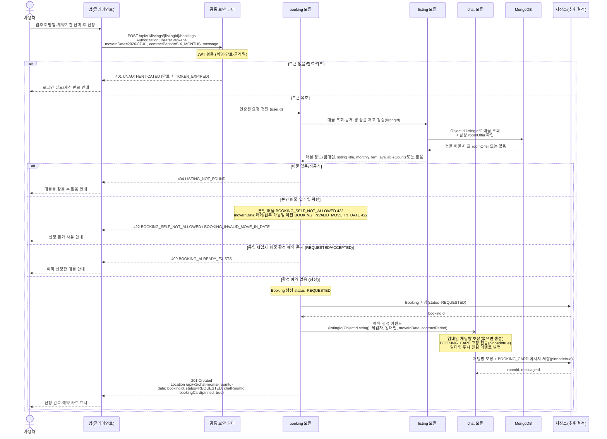

# US-4-1 — 매물 신청(예약 생성) 및 예약 카드 자동 전송

> 모듈: 신청 · 문의 (인앱 채팅) · [유저 스토리](../../../requirements/user-stories.md) · [API 스펙](../../../api/specs/04-booking-inquiry-chat.md)

## 흐름 요약

- 보호 엔드포인트이므로 **공통 보안 필터(SEC)** 가 컨트롤러 앞단에서 `Authorization: Bearer <token>`의 JWT(서명·만료·클레임)를 검증한 뒤 인증된 요청(userId)을 **booking 모듈**로 전달한다. 토큰이 없거나 만료/위조면 필터가 `401 UNAUTHENTICATED`(만료 시 `TOKEN_EXPIRED`)로 막는다.
- 세입자가 `POST /api/v1/listings/{listingId}/bookings`로 `moveInDate`·`contractPeriod`를 보내면 **booking 모듈**이 **listing 모듈**에 매물 조회·공개 검증을 동기 호출(`->>`)해 임대인·대표 방 상품 가격·재고 정보를 받은 뒤 `Booking`을 `REQUESTED`로 **저장소(추후 결정)**에 생성한다. `listingId`는 MongoDB ObjectId 문자열이며, 매물 조회와 `roomOffers[]` 재고 확인은 listing 모듈이 MongoDB에서, 예약 저장은 booking 모듈이 저장소(추후 결정)에서 각자 자기 데이터를 읽고 쓴다.
- 정상 시 booking 모듈이 `예약 생성 이벤트`(async `-)`)를 발행해 **chat 모듈**이 임대인 채팅방을 **저장소(추후 결정)**에 보장하고 `BOOKING_CARD`를 고정 전송·푸시 알림을 발행하며, booking 모듈은 `201 Created` + `Location: /api/v1/chat-rooms/{roomId}`와 `bookingId`·`chatRoomId`·`bookingCard(pinned=true)`를 반환한다.
- 매물 부재·비공개는 `404 LISTING_NOT_FOUND`, 본인 소유 매물 신청은 `422 BOOKING_SELF_NOT_ALLOWED`, 입주일 위반은 `422 BOOKING_INVALID_MOVE_IN_DATE`, 동일 세입자-매물 활성 예약은 `409 BOOKING_ALREADY_EXISTS`로 차단된다. 이들 권한·비즈니스 규칙 판단은 필터가 아니라 booking 모듈의 몫이며, 차단된 경로에서는 저장소(추후 결정)에 도메인 상태를 쓰지 않는다.
