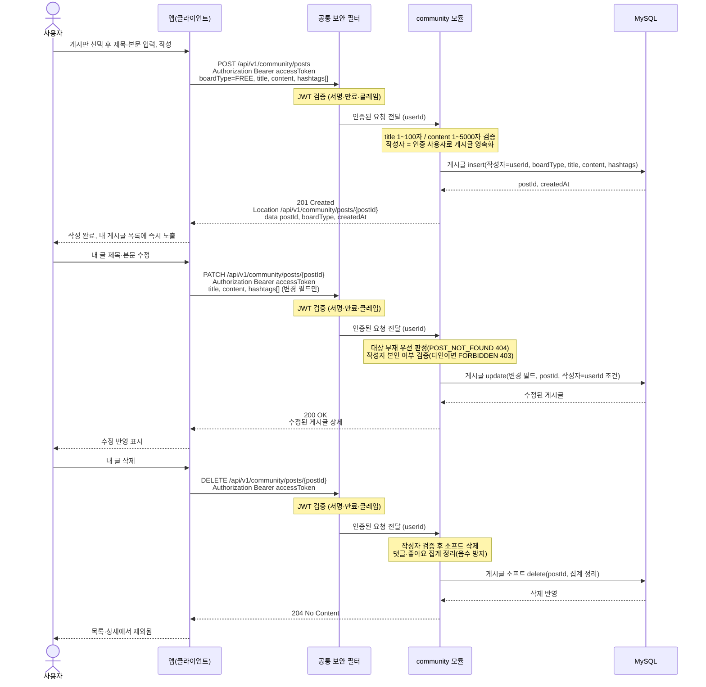

# US-5-1 — 게시글 작성 · 수정 · 삭제

> 모듈: 커뮤니티 (게시판 · 동네친구) · [유저 스토리](../../../requirements/user-stories.md) · [API 스펙](../../../api/specs/05-community.md)

## 흐름 요약

- 작성·수정·삭제는 모두 인증 필수이며, 공통 보안 필터(SEC)가 컨트롤러 앞단에서 JWT(서명·만료·클레임)를 검증한 뒤 인증된 요청(userId)을 community 모듈로 전달한다. 토큰이 없거나 만료·위조면 필터가 401(UNAUTHENTICATED / TOKEN_EXPIRED)로 막는다.
- 작성은 community 모듈의 POST /api/v1/community/posts로 boardType·title·content를 보내 MySQL에 게시글을 insert한 뒤 201(postId)과 Location 헤더를 받는다.
- 수정(PATCH)·삭제(DELETE)는 community 모듈이 대상 부재(POST_NOT_FOUND 404)를 먼저 판정한 뒤 작성자 소유권을 강제하며, 타인이면 FORBIDDEN 403을 반환한다. 통과하면 MySQL에 게시글 update/소프트 delete를 반영한다.
- 삭제는 community 모듈에서 소프트 삭제(204)로 처리되어 목록·상세에서 제외되고 집계가 음수가 되지 않는다.
