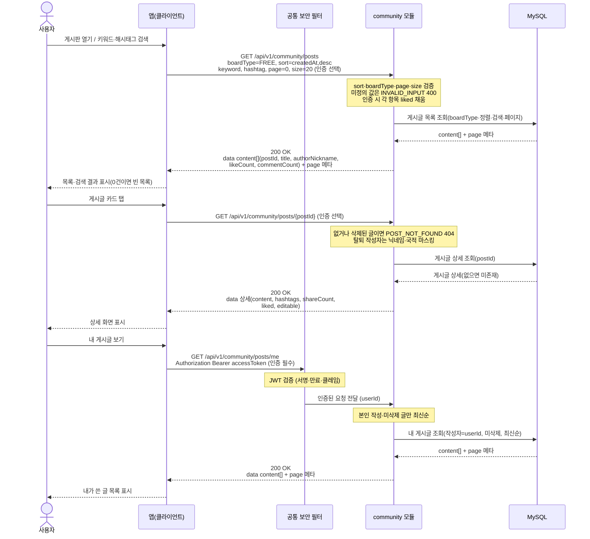

# US-5-2 — 게시글 목록 · 상세 · 검색 · 내 게시글

> 모듈: 커뮤니티 (게시판 · 동네친구) · [유저 스토리](../../../requirements/user-stories.md) · [API 스펙](../../../api/specs/05-community.md)

## 흐름 요약

- 목록·검색은 community 모듈의 GET /api/v1/community/posts에 boardType·sort(createdAt,desc / likeCount,desc)·keyword·hashtag를 보내 MySQL에서 목록을 조회해 200 페이지 객체를 받으며, 잘못된 정렬·페이지 값은 INVALID_INPUT 400으로 거부한다. 인증 선택이므로 공통 보안 필터(SEC)를 거치지 않고 C->>COMM으로 직접 호출한다.
- 상세 GET /api/v1/community/posts/{postId}는 인증 선택으로 SEC 없이 직접 호출되며, community 모듈이 MySQL에서 게시글을 조회해 없거나 삭제된 글이면 POST_NOT_FOUND 404, 정상이면 200 상세를 반환한다.
- 내 게시글 GET /api/v1/community/posts/me는 인증 필수로, 공통 보안 필터(SEC)가 컨트롤러 앞단에서 JWT를 검증한 뒤 인증된 요청(userId)을 community 모듈로 전달하며, 토큰이 없거나 만료·위조면 필터가 401(UNAUTHENTICATED / TOKEN_EXPIRED)로 막고, 통과하면 community 모듈이 MySQL에서 본인 글만 조회해 200으로 반환한다.
