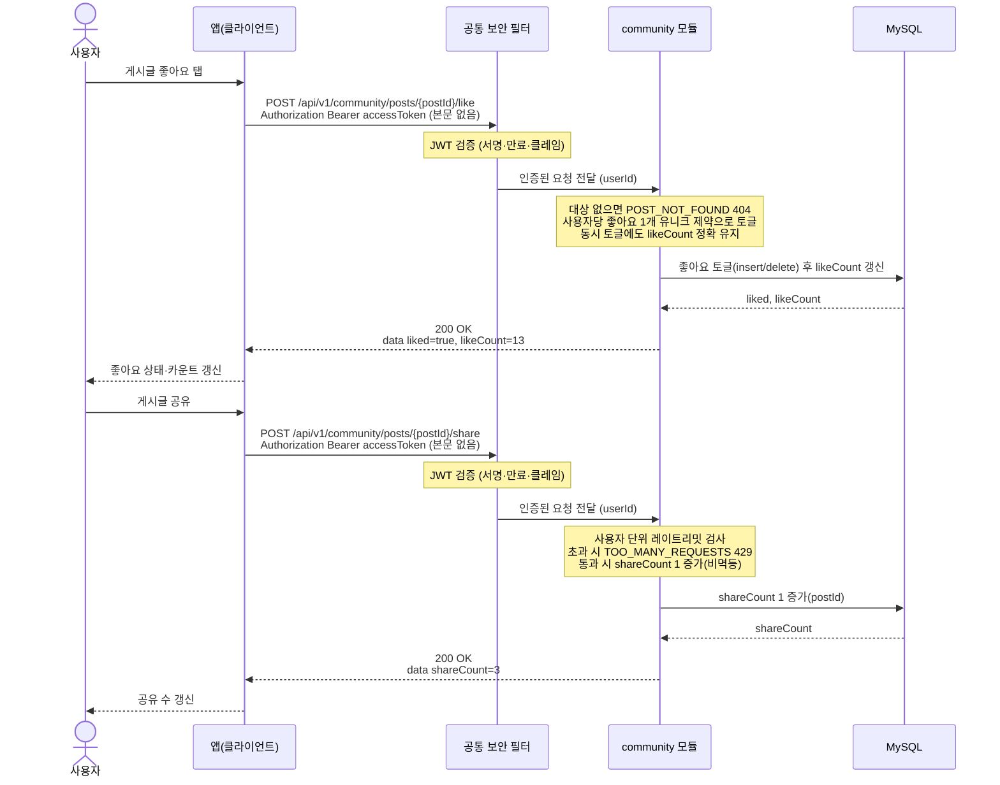

# US-5-3 — 좋아요 토글 · 공유 카운트

> 모듈: 커뮤니티 (게시판 · 동네친구) · [유저 스토리](../../../requirements/user-stories.md) · [API 스펙](../../../api/specs/05-community.md)

## 흐름 요약

- 두 API 모두 인증 필수이며, 공통 보안 필터(SEC)가 컨트롤러 앞단에서 JWT(서명·만료·클레임)를 검증한 뒤 인증된 요청(userId)을 community 모듈로 전달한다. 토큰이 없거나 만료·위조면 필터가 401(UNAUTHENTICATED / TOKEN_EXPIRED)로 막는다.
- 좋아요는 community 모듈의 POST /api/v1/community/posts/{postId}/like로 MySQL에서 좋아요를 토글(insert/delete)하고 likeCount를 갱신하며, 사용자당 1개 유니크 제약 아래 200으로 현재 liked·likeCount를 반환한다.
- 공유는 community 모듈의 POST /api/v1/community/posts/{postId}/share로 MySQL의 shareCount를 1 증가(비멱등)시키고 200을 반환하되, 레이트리밋 초과 시 TOO_MANY_REQUESTS 429로 도배를 막는다.
- community 모듈에서 대상이 없으면 POST_NOT_FOUND 404다.
