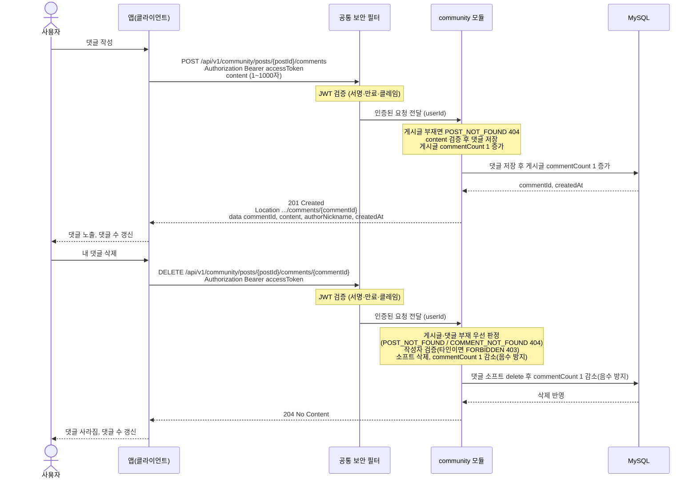

# US-5-4 — 댓글 작성 · 삭제

> 모듈: 커뮤니티 (게시판 · 동네친구) · [유저 스토리](../../../requirements/user-stories.md) · [API 스펙](../../../api/specs/05-community.md)

## 흐름 요약

- 댓글 작성·삭제는 모두 인증 필수이며, 공통 보안 필터(SEC)가 컨트롤러 앞단에서 JWT(서명·만료·클레임)를 검증한 뒤 인증된 요청(userId)을 community 모듈로 전달한다. 토큰이 없거나 만료·위조면 필터가 401(UNAUTHENTICATED / TOKEN_EXPIRED)로 막는다.
- 댓글 작성은 community 모듈의 POST /api/v1/community/posts/{postId}/comments로 content를 보내 MySQL에 댓글을 저장하고 게시글 commentCount를 1 증가시킨 뒤 201(commentId)과 Location 헤더를 받는다.
- 삭제는 DELETE .../comments/{commentId}로 community 모듈이 게시글·댓글 부재(POST_NOT_FOUND / COMMENT_NOT_FOUND 404)를 먼저 판정한 뒤 작성자 소유권을 강제하며, 타인이면 FORBIDDEN 403이다.
- 삭제 성공 시 community 모듈이 MySQL에 댓글 소프트 삭제를 반영하고 204를 반환하며 commentCount를 1 감소(음수 방지)시킨다.
