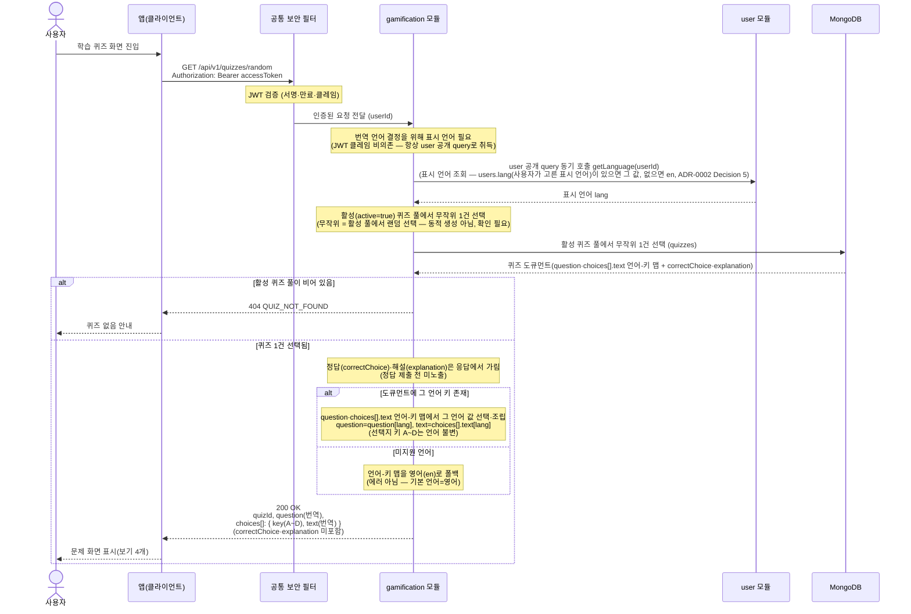

# US-6-1 — 랜덤 퀴즈 조회

> 모듈: 게이미피케이션 (퀴즈) · [유저 스토리](../../../requirements/user-stories.md) · [API 스펙](../../../api/specs/06-gamification.md)

## 흐름 요약

- `GET /api/v1/quizzes/random`으로 gamification 모듈이 **활성(`active=true`) 퀴즈 풀에서 무작위 1건**을 골라 사용자 표시 언어로 번역된 문제만 응답한다(공통 보안 필터(SEC)가 컨트롤러 앞단에서 JWT를 검증한 뒤 모듈로 전달). 요청마다 무작위 1건을 서빙하며 **무제한 반복·무상태**다 — 제출 기록·포인트·`quizDate`·오늘/일일 개념이 없다.
- 모듈은 MongoDB `quizzes` 카탈로그 컬렉션의 활성 풀에서 무작위 1건을 선택한다(진단 `diagnosisQuestions`와 동일한 문서 카탈로그 패턴). `active` 불리언이 랜덤 풀을 게이트한다. 활성 풀이 비어 있으면 `404 QUIZ_NOT_FOUND`로 응답한다.
- 응답은 `{ quizId, question(번역), choices[]{ key(A~D), text(번역) } }`이다. `question`·choices의 `text`는 `quizzes` 도큐먼트의 인라인 언어-키 맵(`{"en":..,"ja":..,"ko":..}`)에서 사용자 언어 값을 골라 채운 표시 문자열이고, 선택지 키 `A~D`는 **언어 불변**(채점은 키 기준)이다. **정답(`correctChoice`)·해설(`explanation`)은 이 조회 응답에 포함하지 않는다** — 정답 제출(US-6-2) 시점에만 노출된다.
- 표시 언어는 `user`가 보유하며 **`users.lang`(사용자가 고른 표시 언어)이 있으면 그 값, 없으면 `en`**으로 정한다([ADR-0029](../../../adr/0029-diagnosis-i18n-strategy.md) 개정(#141)). gamification 모듈은 JWT 클레임에 의존하지 않고 **항상 `user`의 공개 query(`getLanguage`)를 동기 호출**해 표시 언어(`lang`)를 취득한다(즉시 결과가 필요한 조회 → ADR-0002 Decision 5). 해당 언어 키가 없으면 **영어(`en`)로 폴백**한다(에러 아님; 기본 언어=영어).
- (확인 필요) "무작위"는 활성 풀에서의 **랜덤 선택**을 뜻하며 동적 생성이 아니다.
- `/api/v1/quizzes/**`는 `hasRole("USER")`(ACTIVE)로 게이팅하고 응용 계층에서 `userType=TENANT`를 검사한다 — 비-ACTIVE는 `403 AUTH_ONBOARDING_REQUIRED`, 세입자가 아니면 `403 FORBIDDEN`으로 거부한다.
