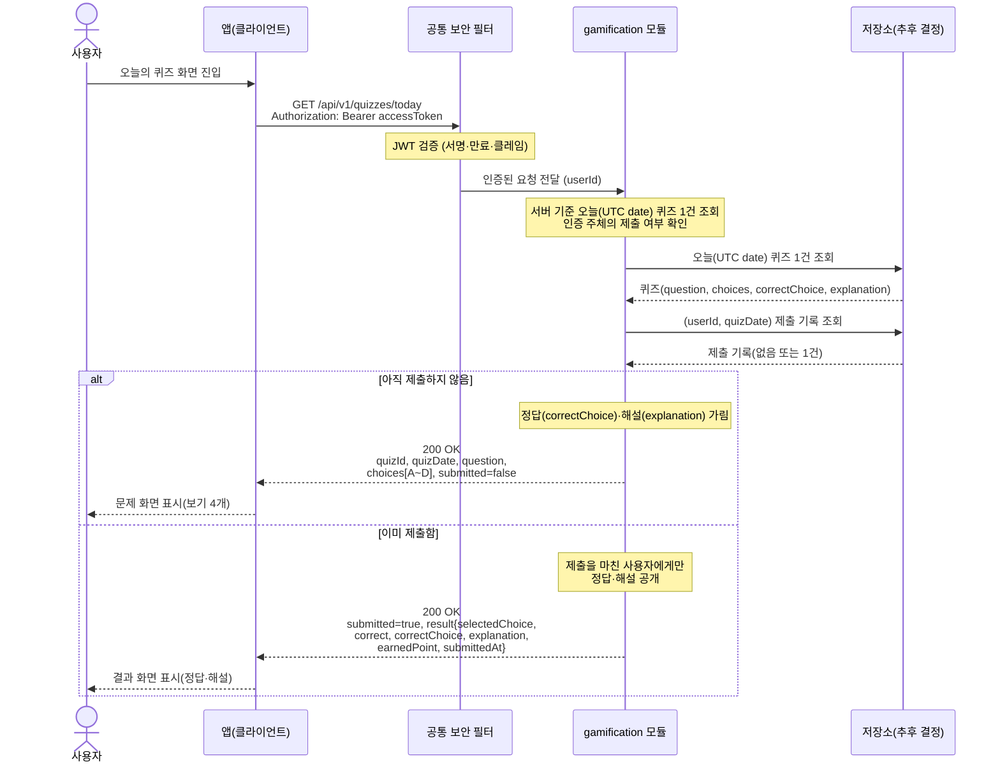

# US-6-1 — 오늘의 퀴즈 조회

> 모듈: 게이미피케이션 (퀴즈 · 포인트) · [유저 스토리](../../../requirements/user-stories.md) · [API 스펙](../../../api/specs/06-gamification.md)

## 흐름 요약

- `GET /api/v1/quizzes/today`로 gamification 모듈이 서버 기준 오늘(UTC date)의 4지선다 퀴즈 1건과 인증 주체의 제출 여부(`submitted`)를 함께 응답한다(공통 보안 필터(SEC)가 컨트롤러 앞단에서 JWT를 검증한 뒤 모듈로 전달).
- 모듈은 저장소(추후 결정)에서 오늘 퀴즈 1건과 `(userId, quizDate)` 제출 기록을 조회해 제출 여부를 판정한다.
- 미제출이면 정답·해설을 가린 문제만(`submitted=false`), 이미 제출했으면 직전 제출 결과(`result`)를 포함해 `200 OK`로 응답한다.
- 정답(`correctChoice`)·해설(`explanation`)·`result`는 제출을 마친 사용자에게만 노출된다.
