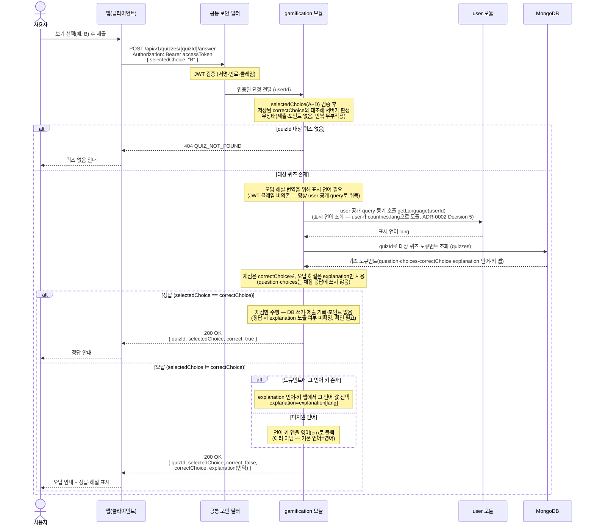

# US-6-2 — 퀴즈 정답 제출 및 즉시 피드백

> 모듈: 게이미피케이션 (퀴즈) · [유저 스토리](../../../requirements/user-stories.md) · [API 스펙](../../../api/specs/06-gamification.md)

## 흐름 요약

- `POST /api/v1/quizzes/{quizId}/answer`에 `selectedChoice`(A~D)를 보내면 gamification 모듈이 MongoDB `quizzes`에서 `quizId`로 퀴즈 도큐먼트를 읽어(랜덤 조회와 동일한 단건 도큐먼트 읽기) 저장된 `correctChoice`와 대조해 서버가 판정하고 `200 OK`로 즉시 피드백한다. 채점에는 `correctChoice`, 오답 해설에는 `explanation`만 사용한다(`question`·`choices`는 채점 응답에 쓰지 않는다)(공통 보안 필터(SEC)가 컨트롤러 앞단에서 JWT를 검증한 뒤 모듈로 전달). **무상태 채점** — 제출 기록·포인트 적립·저장이 전혀 없고, 같은 요청을 반복해도 부작용이 없다(멱등·재생 가능). `201 Created`/`Location`이 아니다.
- 정답이면 `{ quizId, selectedChoice, correct: true }`만 응답한다. 오답이면 `{ quizId, selectedChoice, correct: false, correctChoice, explanation(번역) }`을 응답한다 — 오답 사유(`explanation`)는 사용자 표시 언어로 번역한다.
- 오답 해설 번역을 위해 gamification 모듈은 `user`의 공개 query(`getLanguage`)를 동기 호출해 표시 언어(`lang`)를 취득하고(ADR-0002 Decision 5), `quizzes` 도큐먼트의 `explanation` 언어-키 맵에서 그 언어 값을 고른다. 해당 언어 키가 없으면 **영어(`en`)로 폴백**한다(에러 아님). 선택지 키 `A~D`는 **언어 불변**이며 채점은 키 기준으로 한다.
- 오류 경계: `selectedChoice`가 A~D가 아니면 `400 INVALID_INPUT`, JSON 파싱 실패 등은 `400 MALFORMED_REQUEST`, `quizId`에 해당하는 퀴즈가 없으면 `404 QUIZ_NOT_FOUND`로 반환한다(하루 1회 제한·중복 제출 개념이 없으므로 `409`/`422`는 없다).
- (확인 필요) 정답일 때에도 `explanation`을 함께 반환할지 여부는 미확정이다 — 현재는 정답 응답에 `explanation`을 포함하지 않는다.
- `/api/v1/quizzes/**`는 `hasRole("USER")`(ACTIVE)로 게이팅하고 응용 계층에서 `userType=TENANT`를 검사한다 — 비-ACTIVE는 `403 AUTH_ONBOARDING_REQUIRED`, 세입자가 아니면 `403 FORBIDDEN`으로 거부한다.
