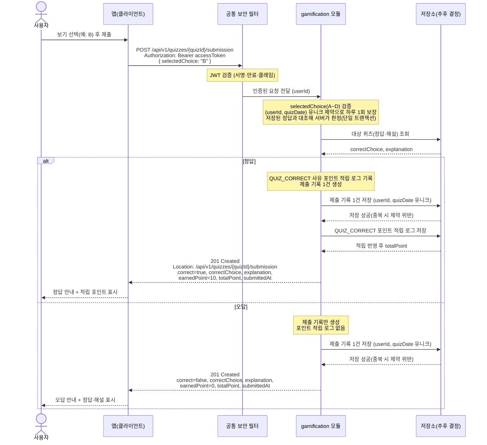

# US-6-2 — 퀴즈 정답 제출 및 즉시 피드백

> 모듈: 게이미피케이션 (퀴즈 · 포인트) · [유저 스토리](../../../requirements/user-stories.md) · [API 스펙](../../../api/specs/06-gamification.md)

## 흐름 요약

- `POST /api/v1/quizzes/{quizId}/submission`에 `selectedChoice`(A~D)를 보내면 gamification 모듈이 저장소(추후 결정)의 정답과 대조해 판정하고 `201 Created`로 즉시 피드백한다(공통 보안 필터(SEC)가 컨트롤러 앞단에서 JWT를 검증한 뒤 모듈로 전달).
- 정답이면 `correct=true`·`earnedPoint=10`과 함께 제출 기록 1건과 `QUIZ_CORRECT` 적립 로그 1건이 저장소(추후 결정)에 저장되고, 오답이면 `earnedPoint=0`으로 제출 기록만 저장된다.
- `(userId, quizDate)` 유니크 제약으로 하루 1회·동시 중복 제출을 차단하며 채점·적립은 같은 모듈의 단일 트랜잭션으로 처리해 포인트가 1회만 적립된다.
