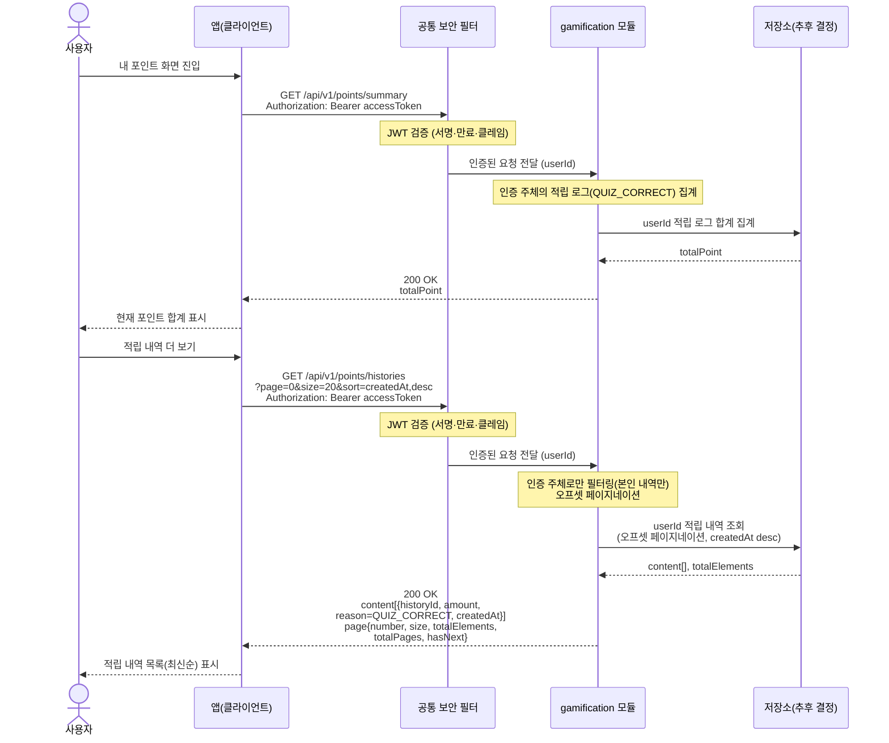

# US-6-3 — 내 포인트 합계 및 적립 내역 조회

> 모듈: 게이미피케이션 (퀴즈 · 포인트) · [유저 스토리](../../../requirements/user-stories.md) · [API 스펙](../../../api/specs/06-gamification.md)

## 흐름 요약

- `GET /api/v1/points/summary`로 gamification 모듈이 저장소(추후 결정)에서 인증 주체의 적립 로그를 집계한 현재 포인트 합계(`totalPoint`, 포인트 정수)를 `200 OK`로 응답한다(공통 보안 필터(SEC)가 컨트롤러 앞단에서 JWT를 검증한 뒤 모듈로 전달).
- `GET /api/v1/points/histories`(오프셋 페이지네이션)로 저장소(추후 결정)에서 본인 적립 내역(`historyId`/`amount`/`reason=QUIZ_CORRECT`/`createdAt`)을 최신순으로 조회해 받으며 `page` 메타가 함께 내려온다.
- 모든 조회는 gamification 모듈 내에서 인증 주체로만 필터링되어 타인의 내역은 반환되지 않는다.
