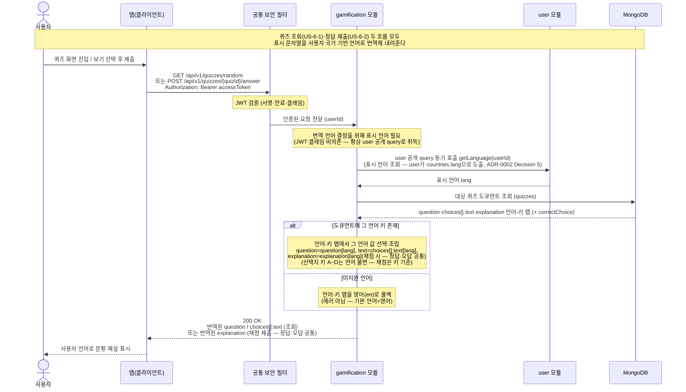

# US-6-3 — 사용자 국가 기반 퀴즈 문항·해설 번역 제공

> 모듈: 게이미피케이션 (퀴즈) · [유저 스토리](../../../requirements/user-stories.md) · [API 스펙](../../../api/specs/06-gamification.md)

## 흐름 요약

- 퀴즈 조회(US-6-1)와 정답 제출(US-6-2) **두 흐름 모두**에서 gamification 모듈은 표시 문자열을 사용자 국가 기반 언어로 번역해 내려준다 — 조회 응답의 `question`·`choices[].text`, 채점 응답의 `explanation`(정답·오답 공통)이 대상이다.
- 표시 언어는 `user`가 보유한다(`countries.lang`). gamification 모듈은 JWT 클레임에 의존하지 않고 **항상 `user`의 공개 query(`getLanguage`)를 동기 호출**해 표시 언어(`lang`)를 취득한다(즉시 결과가 필요한 조회 → ADR-0002 Decision 5). 이를 위해 모듈 의존 `gamification → user`를 추가한다.
- 번역 문자열은 별도 컬렉션 없이 **같은 `quizzes` 도큐먼트에 임베드**하되 **언어 코드를 키로 하는 맵**으로 둔다 — 예: `question: { "en": ..., "ja": ..., "ko": ... }`, `choices: [ { "key": "A", "text": { "en": ..., "ja": ... } } ]`, `explanation: { "en": ..., "ko": ... }`. 서버가 그 `lang` 값으로 표시 문자열을 조립한다(진단 `diagnosisQuestions`의 인라인 언어-키 맵 패턴과 동일).
- 해당 언어 키가 없으면 **영어(`en`)로 폴백**한다(에러 아님; 기본 언어=영어). `Accept-Language` 헤더에 의존하지 않는다.
- 선택지 키 `A~D`는 **언어와 무관하게 동일**(언어 불변)하며, 채점은 이 키를 기준으로 한다(번역 여부와 무관).
