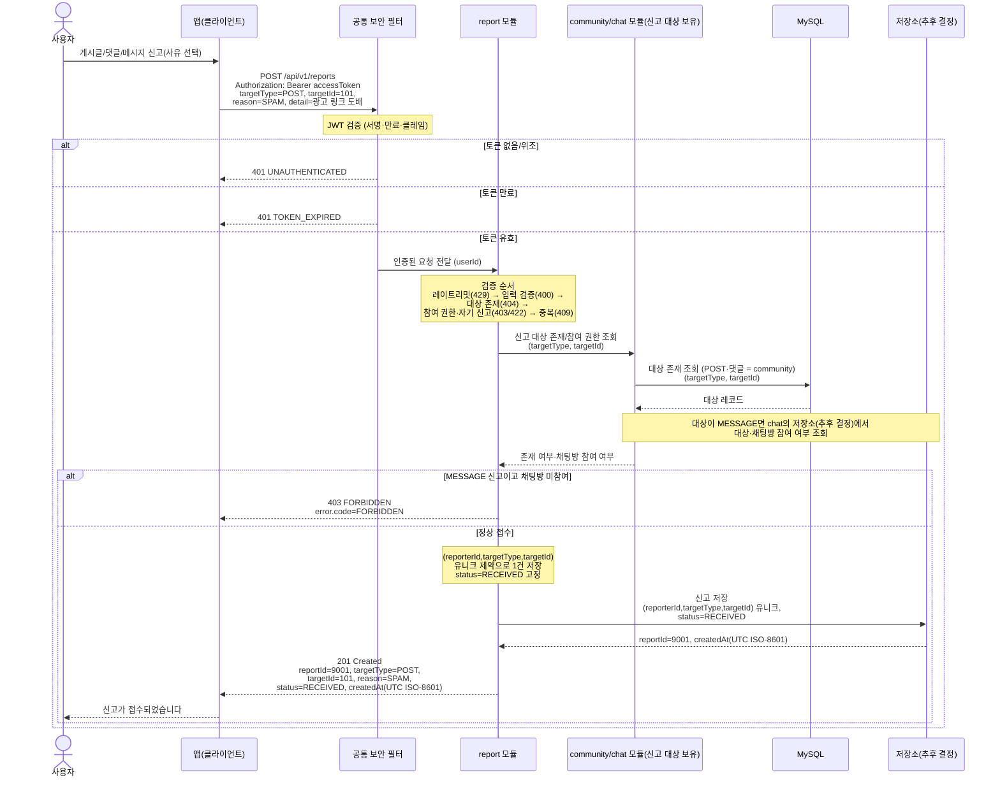

# US-7-1 — 콘텐츠 신고 접수

> 모듈: 신고 처리 · [유저 스토리](../../../requirements/user-stories.md) · [API 스펙](../../../api/specs/07-reports.md)

## 흐름 요약

- 사용자가 콘텐츠와 사유를 선택하면 앱은 `POST /api/v1/reports`로 `targetType`/`targetId`/`reason`을 전송하며, `공통 보안 필터(SEC)`가 컨트롤러 앞단에서 JWT(서명·만료·클레임)를 검증한 뒤 `userId`와 함께 `report 모듈`로 전달한다(토큰 없음/위조 시 `401 UNAUTHENTICATED`, 만료 시 `401 TOKEN_EXPIRED`로 필터가 차단).
- `report 모듈`은 레이트리밋→입력 검증→대상 존재→참여 권한·자기 신고→중복 순으로 평가하며, 대상 존재·참여 권한 검증은 대상을 보유한 모듈이 자기 저장소에서 확인한다 — 게시글·댓글 대상은 `community`가 **MySQL**에서, 메시지 대상은 `chat`이 **저장소(추후 결정)**에서 조회하며, `MESSAGE` 신고는 채팅방 참여자가 아니면 `403 FORBIDDEN`을 반환한다.
- 정상 접수 시 `report 모듈`이 `저장소(추후 결정)`에 `(reporterId, targetType, targetId)` 유니크 제약으로 1건만 저장하고 `status=RECEIVED`로 `201 Created`를 응답한다(응답에 `reporterId`/`detail` 미노출).
