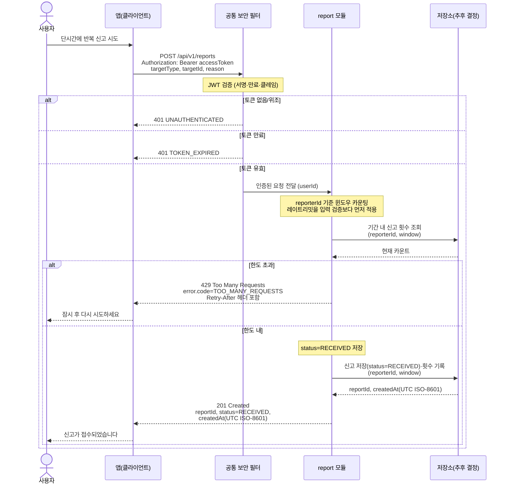

# US-7-2 — 신고 도배(레이트리밋) 방어

> 모듈: 신고 처리 · [유저 스토리](../../../requirements/user-stories.md) · [API 스펙](../../../api/specs/07-reports.md)

## 흐름 요약

- 앱이 `POST /api/v1/reports`를 호출하면 `공통 보안 필터(SEC)`가 컨트롤러 앞단에서 JWT를 검증한 뒤 `userId`와 함께 `report 모듈`로 전달하며(토큰 없음/위조 시 `401 UNAUTHENTICATED`, 만료 시 `401 TOKEN_EXPIRED`로 필터가 차단), `report 모듈`은 `저장소(추후 결정)`에서 `reporterId` 기준 기간 내 신고 횟수를 조회해 윈도우 카운팅을 평가한다.
- 한도를 초과하면 입력 검증보다 먼저 `429 TOO_MANY_REQUESTS`와 `Retry-After` 헤더를 반환해 도배를 차단한다.
- 한도 내라면 `report 모듈`이 `저장소(추후 결정)`에 신고를 `status=RECEIVED`로 저장하고 기간 내 횟수를 기록한 뒤 `201 Created`로 접수한다.
