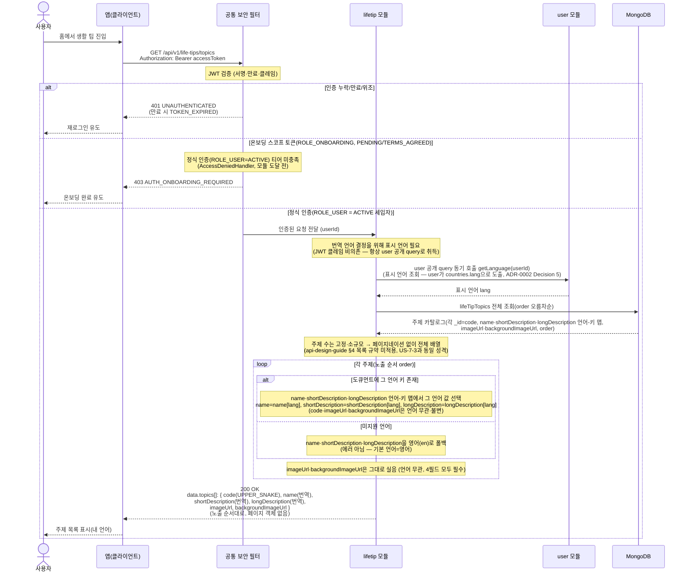

# US-8-1 — 생활 팁 주제 목록 조회 (국가 기반 번역)

> 모듈: 생활 팁 (주제별 생활 정보) · [유저 스토리](../../../requirements/user-stories.md) · [API 스펙](../../../api/specs/08-life-tips.md)

## 흐름 요약

- 홈 진입점에서 `GET /api/v1/life-tips/topics`로 `lifetip 모듈`이 생활 팁 주제 전체를 노출 순서대로 반환한다. 공통 보안 필터(SEC)가 컨트롤러 앞단에서 JWT를 검증한 뒤 모듈로 전달한다. 이 엔드포인트는 **정식 인증(ROLE_USER = ACTIVE 세입자)** 티어다 — 온보딩 미완료(PENDING/TERMS_AGREED, ROLE_ONBOARDING) 토큰은 SEC(AccessDeniedHandler)가 모듈 도달 전에 `403 AUTH_ONBOARDING_REQUIRED`, 인증 누락/만료/위조는 EntryPoint가 `401 UNAUTHENTICATED`(만료 시 `TOKEN_EXPIRED`)로 처리한다(진단 보호 엔드포인트와 동일 게이트). 등록 국가→언어를 도출하려면 온보딩으로 국가·언어가 확정된 ACTIVE 세입자여야 하므로 대상은 ROLE_USER=ACTIVE로 한정한다.
- 번역 언어 결정을 위한 표시 언어는 `user`가 보유한다(`countries.lang`). `lifetip` 모듈은 JWT 클레임에 의존하지 않고 **항상 `user`의 공개 query(`getLanguage`)를 동기 호출**해 표시 언어(`lang`)를 취득한다(즉시 결과가 필요한 조회 → ADR-0002 Decision 5). 이를 위해 모듈 의존 `lifetip → user`를 추가한다(`Accept-Language` 헤더·토큰 클레임 미사용).
- 모듈은 **MongoDB `lifeTipTopics` 컬렉션**에서 주제 전체를 `order` 오름차순으로 조회한다. 각 주제는 언어 무관 식별 `code`(`_id`, UPPER_SNAKE)와 노출 순서 `order`, 표시 텍스트 `name`·`shortDescription`·`longDescription`(각각 인라인 언어-키 맵), 언어 무관 불변 이미지 `imageUrl`·`backgroundImageUrl`(절대 CDN URL 문자열)을 갖는다. 서버가 사용자 언어 값(`name[lang]`·`shortDescription[lang]`·`longDescription[lang]`)으로 표시 텍스트를 채우고, 해당 언어 키가 없으면 **영어(`en`)로 폴백**한다(에러 아님). `imageUrl`·`backgroundImageUrl`은 언어 선택(`pickLabel`)을 타지 않고 그대로 싣는다(주제의 4필드는 모두 필수·NOT NULL이라 "이미지 없는 주제" 경계 케이스가 없다 — 사진 유무로 nullable인 `LifeTip.imageUrl`과 구분).
- 응답 `data.topics[]`는 `{ code, name, shortDescription, longDescription, imageUrl, backgroundImageUrl }`이며, 주제 수는 고정·소규모라 **페이지네이션 없이 전체 배열**을 한 번에 반환한다(api-design-guide §4 목록 규약 미적용, US-7-3과 동일 성격). `code`·`imageUrl`·`backgroundImageUrl`은 언어와 무관하게 동일(불변)하고 표시 텍스트(`name`·`shortDescription`·`longDescription`)만 언어별이다. `code`는 US-8-2에서 특정 주제의 팁을 지정하는 path 키로 쓰인다. 홈 화면 주제 카드는 `imageUrl`+`shortDescription`, 주제 상세 상단은 `backgroundImageUrl`+`longDescription`으로 그리며, 6필드가 이 한 응답에 함께 실려 앱이 목록에서 받은 주제 객체를 상세 화면까지 들고 간다.
